# QCD Thermodynamics with an Improved Lattice Action

Claude Bernard, James E. Hetrick   
Department of Physics, Washington University, St. Louis, MO 63130, USA   
Thomas DeGrand, Matthew Wingate   
Department of Physics, University of Colorado, Boulder, CO 80309, USA   
Carleton DeTar   
Department of Physics, University of Utah, Salt Lake City, UT 84112, USA   
Steven Gottlieb   
Department of Physics, Indiana University, Bloomington, IN 47405, USA   
Urs M. Heller   
SCRI, Florida State University, Tallahassee, FL 32306-4052, USA   
Kari Rummukainen   
Fakultät für Physik, Universität Bielefeld, D-33615, Bielefeld, Germany   
Doug Toussaint   
Department of Physics, University of Arizona, Tucson, AZ 85721, USA   
Robert L. Sugar   
Department of Physics, University of California, Santa Barbara, CA 93106, USA   
(MILC Collaboration)   
October 9, 2018

# Abstract

We have investigated QCD with two favors of degenerate fermions using a Symanzikimproved lattice action for both the gauge and fermion actions. Our study focuses on the deconfinement transition on an $N _ { t } = 4$ lattice. Having located the thermal transition, we performed zero temperature simulations nearby in order to compute hadronic masses and the static quark potential. We find that the present action reduces lattice artifacts present in thermodynamics with the standard Wilson (gauge and fermion) actions. However, it does not bring studies with Wilson-type quarks to the same level as those using the KogutSusskind formulation.

# 1 Introduction

An understanding of the high temperature behavior of QCD is desirable in addressing problems such as heavy ion collisions and the evolution of the early universe. It is believed that, at a temperature between $1 4 0 - 2 0 0$ MeV (where pions are produced copiously), hadronic matter undergoes a transition to a plasma of quarks and gluons. This phenomenon is intrinsically nonperturbative, and Monte Carlo lattice simulation provides the best theoretical tool with which to study it.

Most lattice studies have used KogutSusskind (KS) fermions because of their exact U(1) chiral symmetry at finite lattice spacing. The full SU(2) chiral symmetry is recovered in the continuum limit. Although in contrast Wilson fermions explicitly break chiral symmetry, the continuum limit of the different discretizations is expected to be the same. One advantage of simulating with two flavors of Wilson quarks versus two flavors of KS fermions is that the updating algorithm is exact in the former case but has finite time step errors in the latter. The price to be paid is that the explicit chiral symmetry breaking gives rise to an additive mass renormalization; thus, the location of the chiral limit is not known a priori.

Even more troublesome for dynamical Wilson fermions is the presence of lattice artifacts which qualitatively affect physics at large lattice spacing. In Refs. [1] and [2] it was found that the deconfinement transition becomes very steep for intermediate values of the hopping parameter, $\kappa$ . In fact, on an $N _ { t } = 6$ lattice the transition appears to be first order for a range of intermediate hopping parameters and smooth otherwise.

The lattice community has worked very hard recently to construct actions which have fewer lattice artifacts than the standard discretizations of the continuum action. One philosophy is to add operators to the action which cancel $\mathcal { O } ( a ^ { n } )$ terms in the Taylor expansion of spectral observables. It is plausible that an action which converges to the continuum action faster in the $a  0$ limit would be free of the artificial first order behavior. We adopt this improvement program, attributed to Symanzik, in the present work.

An alternative approach is to search for an action which lies on or near the renormalized trajectory of some renormalization group transformation. Since all irrelevant couplings are zero along the renormalized trajectory, actions there have no scaling violations, i.e. are quantum perfect. Such an action was approximated by Iwasaki [3] and has being used to study QCD thermodynamics with two flavors of unimproved Wilson fermions [4]. Although it is still an open question to what extent this action lies on a renormalized trajectory, the results of Ref. [4] show improvement over standard Wilson thermodynamics.

In this paper we report on our simulation of finite temperature lattice QCD with two flavors of $\mathcal O ( a )$ Symanzik-improved fermions and $\scriptstyle { \mathcal { O } } ( a ^ { 2 } )$ Symanzik-improved glue. We describe the action we used in Section 2. In Section 3 we give the details of our simulations, and we present our results in Section 4. Finally, we give our conclusions in Section 5.

# 2 Action

When one expands a lattice operator in a Taylor series about zero lattice spacing $a$ , one recovers its relevant (or marginal) continuum operator plus higher dimensional irrelevant operators proportional to powers of $a$ . Symanzik suggested that by selecting a favorable combination of lattice operators in the lattice action, one might have cancellations of the irrelevant operators up to some order in the lattice spacing [5]. Lüscher and Weisz have applied this philosophy to $\mathrm { S U } ( N )$ gauge theories. They imposed an on-shell improvement condition whereby discretization errors are eliminated order-by-order in $a$ from physical observables and constructed an $\scriptstyle { \mathcal { O } } ( a ^ { 2 } )$ improved gauge action [6]. Furthermore, they computed the coefficients of the operators in the action through one-loop order in lattice perturbation theory [7]. This improvement condition does not provide a unique action. The choice which is the most efficient in terms of computational effort adds a $1 \times 2$ rectangle and a 6-link "twisted" loop to the Wilson plaquette action. (See Fig. 1.)

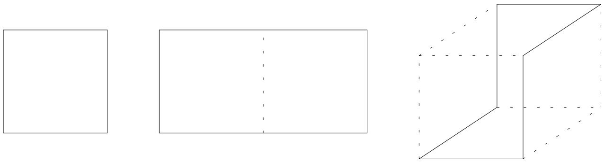  
Figure 1: The three Wilson loops in the one-loop Symanzik improved gauge action that we used.

It is well-known now that lattice perturbation theory in the bare coupling $g _ { 0 }$ is not trustworthy. The $a ^ { 2 }$ in the vertex of the tadpole graph is cancelled by the ultraviolet divergence of the gluon loop. Therefore, hidden in the higher order terms of the expansion in $a$ are tadpole graphs which give an effective $a ^ { 0 } \sum _ { n } c _ { n } g ^ { 2 n }$ contribution. A standard way to deal with this problem is to define a mean link $u _ { 0 }$ and replace $U _ { \mu } \to U _ { \mu } / u _ { 0 }$ [8, 9]. This introduces a "boosted" coupling constant $g ^ { 2 } = g _ { 0 } ^ { 2 } / u _ { 0 } ^ { 4 }$ .

Here we combine these two ideas, Symanzik improvement of the action and "tadpole improvement" of lattice perturbation theory. Our gauge action for this work is as derived in Ref. [10],

$$
\begin{array} { r c l } { S _ { g } } & { = } & { \beta \displaystyle \sum _ { \mathrm { p l a q } } \frac { 1 } { 3 } \mathrm { \mathrm { \mathrm { R e } } } \mathrm { \mathrm { T r } } \left( 1 - U _ { \mathrm { p l a q } } \right) } \\ & { + } & { \beta _ { 1 } \displaystyle \sum _ { \mathrm { r e c t } } \frac { 1 } { 3 } \mathrm { \mathrm { R e } } \mathrm { \mathrm { T r } } \left( 1 - U _ { \mathrm { r e c t } } \right) } \\ & { + } & { \beta _ { 2 } \displaystyle \sum _ { \mathrm { t w i s t } } \frac { 1 } { 3 } \mathrm { \mathrm { \mathrm { R e } } \mathrm { \mathrm { T r } } \left( 1 - U _ { \mathrm { t w i s t } } \right) } , } \end{array}
$$

where $\beta$ $\begin{array} { r } { \beta = \frac { 6 } { g ^ { 2 } u _ { 0 } ^ { 4 } } \frac { 5 } { 3 } ( 1 - 0 . 1 0 2 0 g ^ { 2 } + \mathcal { O } ( g ^ { 4 } ) ) ) } \end{array}$ , and

$$
\begin{array} { r c l } { { \beta _ { 1 } = - { \displaystyle \frac { \beta } { 2 0 u _ { 0 } ^ { 2 } } } \left[ 1 + 0 . 4 8 0 5 \left( \frac { g ^ { 2 } } { 4 \pi } \right) \right] } } & { { = } } & { { - { \displaystyle \frac { \beta } { 2 0 u _ { 0 } ^ { 2 } } } \left( 1 - 0 . 6 2 6 4 ~ \ln ( u _ { 0 } ) \right) } } \\ { { \beta _ { 2 } = - { \displaystyle \frac { \beta } { u _ { 0 } ^ { 2 } } } ~ 0 . 0 3 3 2 5 ~ \left( \frac { g ^ { 2 } } { 4 \pi } \right) } } & { { = } } & { { { \displaystyle \frac { \beta } { u _ { 0 } ^ { 2 } } } ~ 0 . 0 4 3 3 5 ~ \ln ( u _ { 0 } ) . } } \end{array}
$$

The subscripts "plaq", "rect", and "twist" refer to the $1 \times 1$ plaquette, the planar $1 \times 2$ rectangle, and the $x , y , z , - x , - y , - z ^ { _ { \prime \prime } }$ loop, respectively. Following Ref. [9] we have chosen to define the mean link $u _ { 0 }$ through

$$
u _ { 0 } \equiv \Big ( \frac { 1 } { 3 } \mathrm { R e } \mathrm { T r } \langle U _ { \mathrm { p l a q } } \rangle \Big ) ^ { 1 / 4 } ,
$$

and the strong coupling constant is defined through the perturbative expansion of the plaquette [11]

$$
\frac { g ^ { 2 } } { 4 \pi } \equiv - \frac { \ln \left( \frac { 1 } { 3 } \ : \mathrm { R e } \ : \mathrm { T r } \ : \langle U _ { \mathrm { p l a q } } \rangle \right) } { 3 . 0 6 8 3 9 } .
$$

In the Monte Carlo simulations, we tune $u _ { 0 }$ in the action to be consistent with the fourth root of the average plaquette. This procedure is discussed in more depth in Section 3.

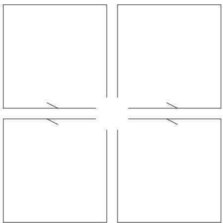  
Figure 2: The clover term in the Sheikholeslami-Wohlert action.

The Wilson fermion action has errors of $\mathcal O ( a )$ . The Symanzik improvement program can be extended to improving this action too. In the $a \to 0$ limit, the $\mathcal O ( a )$ term in the action is proportional to ${ \overline { { \psi } } } D ^ { 2 } \psi$ and can be removed by adding a next-nearest neighbor operator to the action [12], or, after an isospectral transformation of the fermion fields, by adding a magnetic interaction [13]. Thus, the tree-level Symanzik improved action is

$$
S _ { f } ~ = ~ S _ { W } - \frac { \kappa } { u _ { 0 } ^ { 3 } } \sum _ { x } \sum _ { \mu < \nu } \bigg [ \overline { { { \psi } } } ( x ) ~ i \sigma _ { \mu \nu } F _ { \mu \nu } \psi ( x ) \bigg ] ,
$$

where $S _ { W }$ is the usual Wilson fermion action, and

$$
i F _ { \mu \nu } = \frac { 1 } { 8 } ( f _ { \mu \nu } - f _ { \mu \nu } ^ { \dagger } ) .
$$

$f _ { \mu \nu }$ is the clover-shaped combination of links (see Figure 2). As with the gauge action, the links here are also tadpole improved. Note that one factor of $u _ { 0 }$ is absorbed into the hopping parameter.

Both these gauge and fermion actions have been used widely, e.g. in studies of finite temperature SU(3) [14, 15] and quenched spectroscopy [16, 17, 18]. At least one group is in the progress of using this action to calculate spectroscopy on unquenched configurations [19]. Therefore, we believe our choice of action to be well-justified and useful for comparison to other work.

Of course, further progress is being made in refining the Symanzik improvement program. One can attempt to set the coefficients of the higher dimension operators nonperturbatively by demanding that, for example, Ward identities be satisfied up to some order in the lattice spacing [20]. Also, fermion actions which are constructed to have errors of $\mathcal { O } ( a ^ { 3 } )$ to $\mathcal { O } ( a ^ { 4 } )$ are currently being tested [21, 22].

# 3 Simulation details

Our finite temperature simulations were on an $8 ^ { 3 } \times 4$ lattice. At fixed $\beta$ $= 6 . 4$ , 6.6, 6.8, 7.0, 7.2, 7.3, and 7.4) we varied $\kappa$ in small increments across the crossover. Our microcanonical time step was such that the acceptance rate was between $6 0 – 8 0 \%$ ; typically $\Delta t = 0 . 0 3$ , but for the stronger gauge coupling (lighter quark mass) runs $\Delta t = 0 . 0 1$ . We accumulated over 1000 trajectories at points close to the crossover. For the updating, we used the standard hybrid molecular dynamics (HMD) algorithm [23] followed by a Monte Carlo accept/reject step (hybrid Monte Carlo, or HMC) [24]. The calculation of the "clover" contribution to the HMD equations of motion is tedious but straightforward.1 The even-odd preconditioning technique developed for standard Wilson fermions [26] is also implemented for the improved Wilson fermion action [27].

Our companion zero temperature runs were performed on an $8 ^ { 3 } \times 1 6$ lattice at five $( \beta , \kappa )$ points along the crossover, as well as at five other points neighboring the crossover line. Some of these runs were extended in order to be able to extract the heavy quark potential from Wilson loop expectation values. As with the finite temperature runs, we tried to maintain a Monte Carlo acceptance rate around $6 0 – 8 0 \%$ , so our time step varied from $\Delta t = 0 . 0 0 5$ to 0.03. Measurements of hadron correlators and Wilson loops were taken every 10 trajectories.

The large majority of our simulations were performed on the IBM SP2 at the Cornell Theory Center, and two finite temperature simulations were run on a cluster of IBM RS/6000's at the Supercomputer Computations Research Institute of Florida State University.

We used the conjugate gradient (CG) matrix inversion algorithm to compute $( M ^ { \dagger } M ) ^ { - 1 }$ with a maximum residue of $1 0 ^ { - 6 }$ during the HMC updating. For the spectroscopy calculations, where we wish to invert $M$ , we found the stablized biconjugate gradient (biCGstab) algorithm to be twice as efficient as CG [28].

We tuned $u _ { 0 }$ so that it agreed with the fourth root of the space-like plaquettes that we measured. It might have been preferable to do this on $T = 0$ configurations, however, the heavy cost of repeatedly equilibrating a $N _ { t } = 1 6$ lattice forced us to perform this tuning procedure on the $N _ { t } = 4$ configurations. In the next section we will show that the difference in the two ways of tuning $u _ { 0 }$ is small. This tuning procedure would be dangerous if the system underwent a first order phase transition, but, we will also show that the plaquette varies smoothly across the transition. Let us remark that this tuning procedure is a prescription. $u _ { 0 }$ may be defined in a number of ways since it is an estimate of the higher order tadpole contributions to perturbation theory calculations. Therefore, while one might argue that tuning $u _ { 0 }$ strictly on a zero temperature lattice would better estimate the tadpole contributions, our method is well-defined and self-consistent.

# 4 Results

# 4.1 Thermodynamics

The first task was to locate the thermal crossover line $\kappa _ { T } ( \beta )$ . To this end we measured the expectation values of the Polyakov loop, the plaquette, the quark condensate $\langle \psi \psi \rangle$ , and the number of CG matrix inversion iterations as we generated the $8 ^ { 3 } \times 4$ configurations.

In pure gauge theory the Polyakov loop is an order parameter for the deconfinement transition: $\langle P \rangle = 0$ in the confined phase because the free energy for a single color triplet charge is infinite, while in the deconfined phase the test charge can be screened, so the free energy is finite and $\langle P \rangle \neq 0$ . For unquenched QCD, the Polyakov loop is not an order parameter since it is nonzero even in the hadronic phase, but it does increase dramatically at the transition. In this work, we identify the thermal crossover as the place where the derivative of $\langle \mathrm { R e } P \rangle$ is greatest. Figure 3 shows $\langle { \mathrm { R e } } \ P \rangle$ versus the hopping parameter $\kappa$ for the seven values of fixed coupling $\beta$ ; Figure 4 shows only the runs where the crossover is at the lowest 3 values of $M _ { \mathrm { P S } } / M _ { \mathrm { V } }$ . Although the crossover becomes steeper at stronger coupling, there is no evidence of a first order transition.

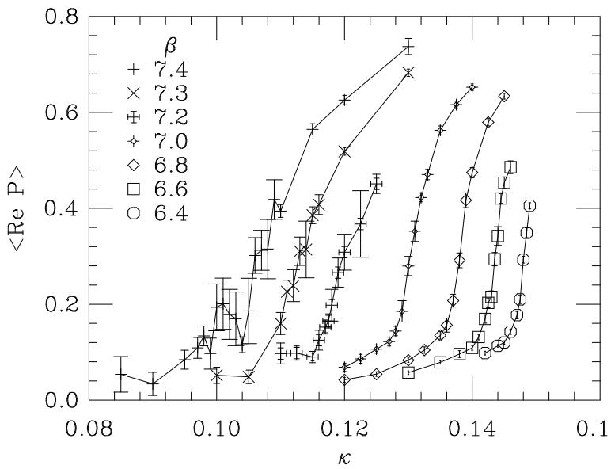  
Figure 3: Polyakov loop vs. hopping parameter  all $\beta$ s.

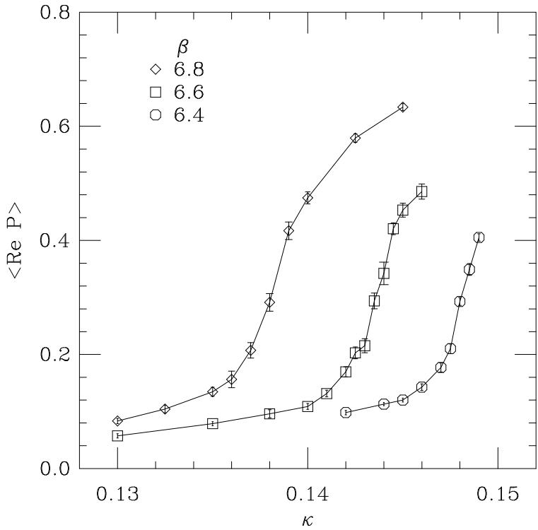  
Figure 4: Polyakov loop vs. hopping parameter  for the 3 lowest $\beta$ 's.

In continuum QCD with massless quarks, one expects to see a restoration of the spontaneously broken chiral symmetry at high temperatures. The order parameter for this transition is the chiral condensate $\langle \psi \psi \rangle$ . Since Wilson fermions break chiral symmetry explicitly, the meaning of $\langle \psi \psi \rangle$ at $\kappa \neq \kappa _ { c }$ is not so clear. Besides the usual multiplicative renormalization one must make a subtraction to compensate for the additive renormalization of the quark mass. A properly subtracted $\langle \Psi \Psi \rangle$ can be defined through an axial vector Ward identity [29]. However, since our study did not include calculation of screening propagators, we can only look at the unrenormalized $\langle \psi \psi \rangle$ . In spite of these problems, Figure 5 shows a drop in $\langle \psi \psi \rangle$ at the crossover identified by $\langle { \mathrm { R e } } \ P \rangle$ .

Since we use the plaquette (in the space-space planes) to self-consistently tune $u _ { 0 }$ , we must ensure that it varies smoothly across the thermal crossover. Figures 6 and 7 show that this is the case. In fact, the plaquette on the zero temperature lattices agrees within errors with the plaquette at finite temperatures on the confined side of the crossover. The dashed vertical lines in those figures simply mark the location of the crossover, $\kappa _ { T } ( \beta )$ . The large errors on the deconfined side are due to the smaller sample sizes where running at lower quark mass is expensive.

As the thermal crossover line $\kappa _ { T } ( \beta )$ approaches the critical line $\kappa _ { c } ( \beta )$ , the number of iterations needed to invert the fermion matrix per time step, $N _ { \mathrm { i t e r } }$ , peaks at the thermal crossover. The reason is that as one approaches $\kappa _ { T } ( \beta )$ from the confined side (varying $\kappa$ with $\beta$ fixed) the zero modes at $\kappa _ { c } ( \beta )$ become more influential, while there are no zero modes in the deconfined phase. Figure 8 shows the peaks in $N _ { \mathrm { i t e r } }$ are at the same locations as the crossovers indicated by the Polyakov loop.

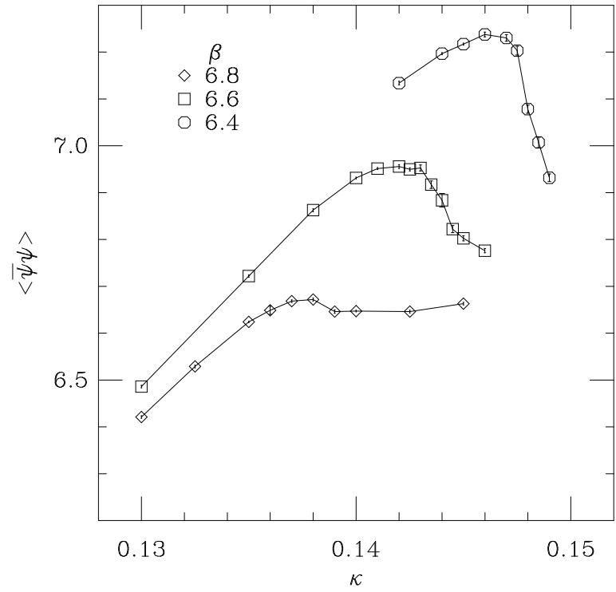  
Figure 5: $\langle \psi \psi \rangle$ vs. hopping parameter.

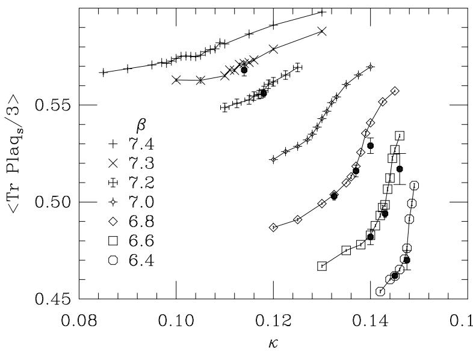  
Figure 6: Space-space plaquette vs. hopping parameter  all $\beta$ 's. The shaded octagons mark the zero temperature values.

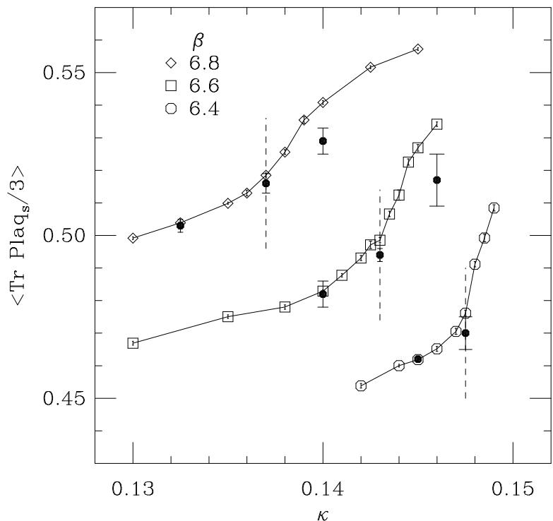  
Figure 7: Space-space plaquette vs. hopping parameter  for the 3 lowest $\beta$ 's. The shaded octagons mark the zero temperature values. The dashed lines indicate our determination of $\kappa _ { T } ( \beta )$ and emphasize the agreement between the space-like plaquettes measured on zero temperature and finite temperature lattices at the crossover.

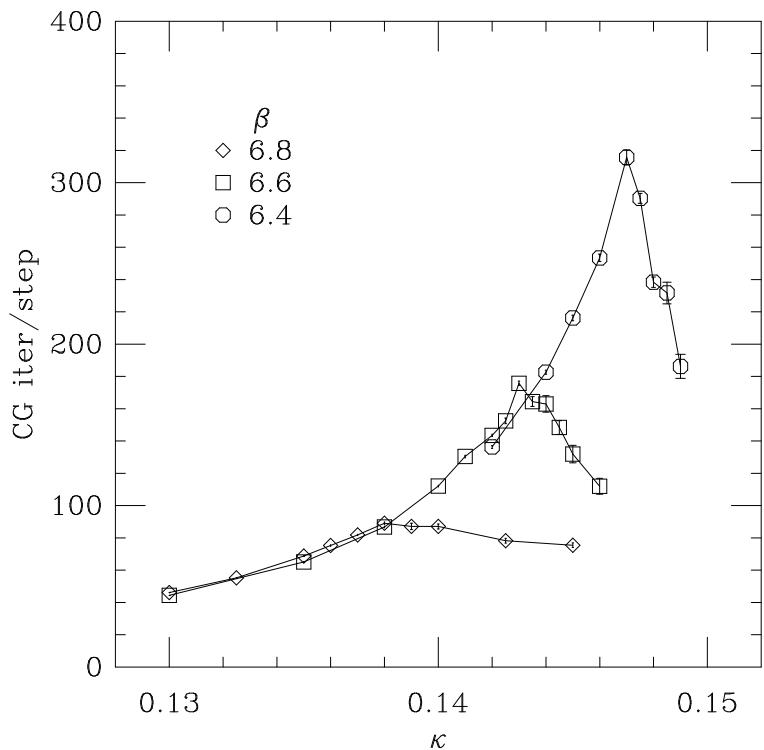  
Figure 8: Conjugate gradient matrix inversions vs. hopping parameter.

# 4.2 Spectrum

For a number of reasons, it is useful to evaluate some zero temperature quantities at the parameters of our thermodynamic simulations. The light hadron spectrum is essential in determining the chiral limit for Wilson-like fermions.

The spectroscopy was an entirely straightforward lattice computation which used Gaussiansmeared source wavefunctions and point-like sink wavefunctions. We performed correlated fits to a single exponential and selected the best fits based on a combination of smallest chi-squared per degree of freedom and largest confidence level. Propagators are separated by 10 HMC trajectories.

Our calculations of the hadron spectrum for our zero temperature simulations are summarized in Table 1, and the phase diagram (Fig. 9) illustrates the location of the $T = 0$ runs with respect to the thermal crossover and critical lines, $\kappa _ { T } ( \beta )$ and $\kappa _ { c } ( \beta )$ respectively. An anomaly in Table 1 is the small data set for $\beta = 6 . 4$ , $\kappa = 0 . 1 4 7 5$ . Naturally we would prefer to have more configurations with which to compute hadron correlators. Unfortunately the cost of running at those parameters is high.

Table 1: Masses of the pseudoscalar and vector mesons and the nucleon on an $8 ^ { 3 } \times 1 6$ lattice. Points marked by as asterisk lie on the $N _ { t } ~ = ~ 4$ crossover. The # column lists the number of propagators used to compute spectroscopy.   

<table><tr><td>β</td><td>κ</td><td>U0</td><td>#</td><td>aMps</td><td>aMv</td><td>aMN</td><td>MPS/MV</td><td>MN /MV</td></tr><tr><td>6.40</td><td>0.145</td><td>0.826</td><td>81</td><td>0.931(4)</td><td>1.351(18)</td><td>2.14(3)</td><td>0.689(10)</td><td>1.58(3)</td></tr><tr><td>*6.40</td><td>0.1475</td><td>0.828</td><td>30</td><td>0.664(8)</td><td>1.26(6)</td><td>1.63(11)</td><td>0.527(26)</td><td>1.29(11)</td></tr><tr><td>6.60</td><td>0.140</td><td>0.834</td><td>64</td><td>1.173(4)</td><td>1.481(9)</td><td>2.30(3)</td><td>0.792(6)</td><td>1.55(2)</td></tr><tr><td>*6.60</td><td>0.143</td><td>0.841</td><td>144</td><td>0.927(4)</td><td>1.280(8)</td><td>1.958(18)</td><td>0.724(6)</td><td>1.530(15)</td></tr><tr><td>6.60</td><td>0.146</td><td>0.855</td><td>40</td><td>0.468(15)</td><td>1.04(13)</td><td>1.34(5)</td><td>0.45(6)</td><td>1.29(17)</td></tr><tr><td>6.80</td><td>0.1325</td><td>0.842</td><td>79</td><td>1.494(3)</td><td>1.700(7)</td><td>2.651(13)</td><td>0.879(4)</td><td>1.56(1)</td></tr><tr><td>*6.80</td><td>0.137</td><td>0.849</td><td>120</td><td>1.187(3)</td><td>1.421(6)</td><td>2.190(10)</td><td>0.835(4)</td><td>1.541(10)</td></tr><tr><td>6.80</td><td>0.140</td><td>0.857</td><td>43</td><td>0.885(8)</td><td>1.182(16)</td><td>1.75(4)</td><td>0.749(12)</td><td>1.48(4)</td></tr><tr><td>*7.20</td><td>0.118</td><td>0.864</td><td>143</td><td>1.915(3)</td><td>1.994(3)</td><td>3.110(5)</td><td>0.960(2)</td><td>1.560(3)</td></tr><tr><td>*7.30</td><td>0.114</td><td>0.8695</td><td>30</td><td>2.043(4)</td><td>2.106(5)</td><td>3.297(11)</td><td>0.970(3)</td><td>1.614(6)</td></tr></table>

While in Figure 3 we do not see the same first-order jump in $\langle \mathrm { R e } ~ P \rangle$ that we did with the standard Wilson actions, we would like to make the comparison more convincing. After all, we cannot know a priori the relation between the bare parameters for the standard action $\left( \beta _ { W } , \kappa _ { W } \right)$ and those for the improved action $( \beta _ { I } , \kappa _ { I } )$ ; it could happen that a small change in $\kappa _ { W }$ corresponds to a much larger change in the quark mass than does a similar change in $\kappa _ { I }$ , giving us the illusion that the crossover is broader for the improved action.

Using measurements of the pseudoscalar mass near the crossover region, we can interpolate in order to estimate $( a M _ { \mathrm { P S } } ) ^ { 2 }$ as a function of $1 / \kappa$ for both actions. In particular, we look at the thermal crossover for improved and unimproved $N _ { t } = 4$ Wilson actions at comparable $M _ { \mathrm { P S } } / M _ { \mathrm { V } }$ . Data from Ref. [30] suggests that we compare $\beta _ { W } = 4 . 9 4$ , $\kappa _ { W } = 0 . 1 8$ where $M _ { \mathrm { P S } } / M _ { \mathrm { V } } = 0 . 8 3 6 ( 5 )$

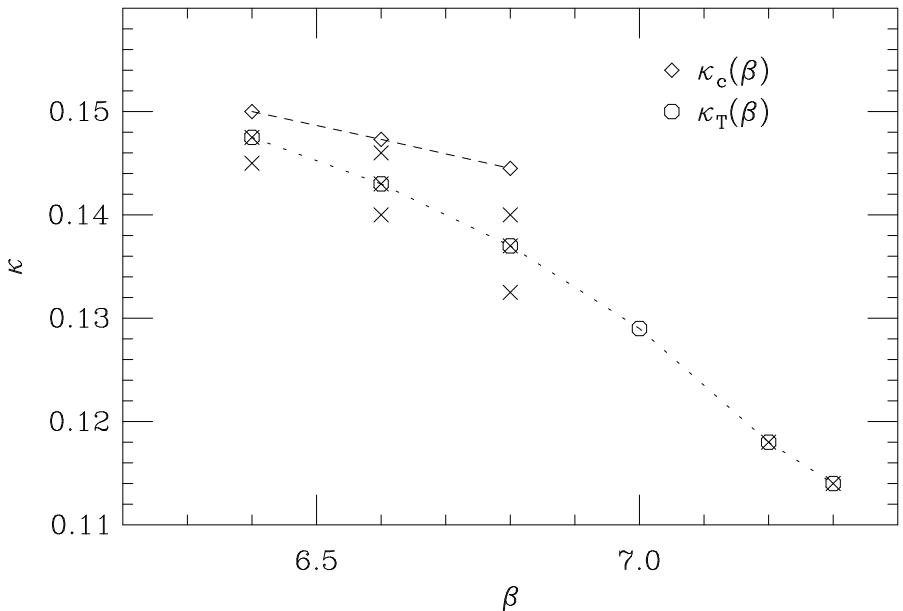  
Figure 9: Phase diagram for the Symanzik-improved action. Octagons represent the $N _ { t } = 4$ thermal crossover, and diamonds indicate estimates of the locations of vanishing pion mass. Zero temperature simulations were performed at the crosses. Dashed and dotted lines are merely to guide the eye.

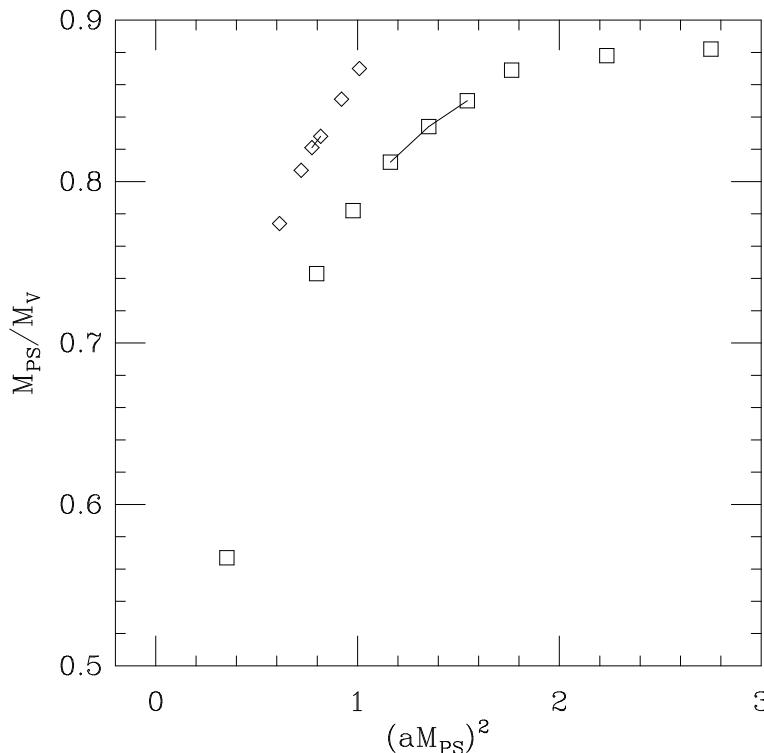  
Figure 10: Pseudoscalar/vector meson mass ratio vs. the lattice pseudoscalar mass squared. The diamonds correspond to $\beta _ { W } = 4 . 9$ simulations with the unimproved Wilson action, and the squares denote our $\beta _ { I W } = 6 . 8$ simulations with the improved action. The solid lines indicate the region of the thermal crossover.

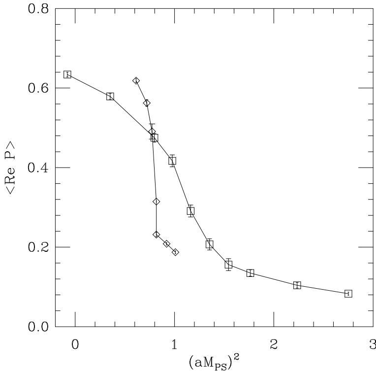  
Figure 11: Polyakov loop as a function of $( a M _ { \mathrm { P S } } ) ^ { 2 }$ for fixed $\beta$ . Squares: $\beta = 6 . 8$ improved Wilson fermions, Diamonds: $\beta = 4 . 9$ unimproved Wilson fermions. Both have similar $M _ { \mathrm { P S } } / M _ { \mathrm { V } }$ at the crossover.

to our $\beta _ { I W } = 6 . 8 0$ , $\kappa _ { I W } = 0 . 1 3 7$ where $M _ { \mathrm { P S } } / M _ { \mathrm { V } } = 0 . 8 3 5 ( 4 )$ . The data we use for comparison to ours are the unimproved $\beta _ { W } = 4 . 9$ data provided in Refs. [1, 31]. We interpolated the pseudoscalar meson mass using a linear least squares fit to a quadratic in $1 / \kappa$ around the crossover region for the unimproved Wilson data. Due to the smaller data sample, we interpolated $( a M _ { \mathrm { P S } } ) ^ { 2 }$ linearly in $1 / \kappa$ for our improved Wilson data. Figure 10 is a plot of $M _ { \mathrm { P S } } / M _ { \mathrm { V } }$ vs. $( a M _ { \mathrm { P S } } ) ^ { 2 }$ for both actions. The crossover occurs at similar $M _ { \mathrm { P S } } / M _ { \mathrm { V } }$ as indicated by the solid lines in the graph.

Having eliminated bare quantities, we can plot the thermodynamic observables against the pseudoscalar mass squared. Figure 11 demonstrates that the crossover is indeed smoother for improved action than the Wilson action.

# 4.3 Heavy Quark Potential

In addition to computing hadronic masses, we used Wilson loop data to measure the heavy (or static) quark potential $V ( \vec { r } )$ :

$$
V ( \vec { r } ) ~ = ~ - ~ \operatorname * { l i m } _ { t \to \infty } ~ \frac { 1 } { t } ~ \ln W ( \vec { r } , t ) .
$$

A standard ansatz for the form of the potential is

$$
V ( r ) ~ = ~ V _ { 0 } + \sigma r - \frac { e } { r } - f \biggl ( G _ { L } ( r ) - \frac { 1 } { r } \biggr ) ,
$$

Table 2: Fits to the heavy quark potential along the $N _ { t } = 4$ crossover $n _ { f } = 2$ improved Wilson fermions).   

<table><tr><td>β</td><td>K</td><td>#</td><td>rmin − rmax</td><td>t</td><td>aVo</td><td>a{2</td><td>b</td><td>f</td><td>ro/a</td></tr><tr><td>6.40</td><td>0.1475</td><td>30</td><td>1.41-4.47</td><td>2</td><td>1.0(3)</td><td>0.41(8)</td><td>0.7(2)</td><td>5.6(6)</td><td>1.52(4)</td></tr><tr><td>6.60</td><td>0.1430</td><td>108</td><td>1.41-6.93</td><td>2</td><td>0.65(9)</td><td>0.42(3)</td><td>0.34(8)</td><td>3.21(24)</td><td>1.77(2)</td></tr><tr><td>6.80</td><td>0.1370</td><td>95</td><td>1.41-6.93</td><td>2</td><td>0.70(6)</td><td>0.346(15)</td><td>0.38(5)</td><td>2.45(18)</td><td>1.913(13)</td></tr><tr><td>7.20</td><td>0.1180</td><td>117</td><td>1.41-5.66</td><td>2</td><td>0.65(2)</td><td>0.253(6)</td><td>0.33(2)</td><td>1.06(8)</td><td>2.287(13)</td></tr></table>

where $V _ { 0 }$ , $\sigma$ , $e$ , and $f$ are fit parameters, and $G _ { L }$ is the lattice Coulomb potential. In practice, this fit is performed for a fixed $t$ ; that is, the potential is estimated through an effective potential,

$$
V _ { t } ( \vec { r } ) ~ = ~ - ln { \left[ { \frac { W ( \vec { r } , t + 1 ) } { W ( \vec { r } , t ) } } \right] } ,
$$

such that

$$
W ( r , t ) \ \sim \ \exp ( - V _ { t } ( r ) t )
$$

The parameter $r _ { 0 }$ is defined to be the length such that

$$
r _ { 0 } ^ { 2 } F ( r _ { 0 } ) \ = \ 1 . 6 5 ,
$$

with

$$
F ( r ) \ = \ \frac { \partial V } { \partial r } ,
$$

which corresponds to $r _ { 0 } = 0 . 4 9$ fm from potential models. Sommer showed this to be a useful quantity with which to set the lattice scale [32]. In this work we calculated the force by taking numerical differences of the potential. Our analysis proceeds as in Ref. [33]. Errors are estimated by bootstrapping the data, and occasionally increased to account for differences in the choice of $t$ . We present our fits to the potential for the zero temperature simulations along the $N _ { t } = 4$ crossover with improved Wilson fermions in Table 2.

For comparison, we performed the same calculation with two flavors of Kogut-Susskind fermions for three parameter sets along the $N _ { t } = 4$ crossover. Our fits are given in Table 3. Meson masses were taken from Table 1 of Ref. [34]. In addition, we measured the potential at one point along the $N _ { t } = 6$ KS crossover. That fit also appears in Table 3. The generation and spectroscopy of those configurations are discussed in Ref. [35].

# 4.4 Scaling tests

In Sections 4.1 and 4.2 we showed that thermodynamics with the improved action does not have the same artificial first order behavior that unimproved Wilson thermodynamics does. However, in order to make physical predictions which can be compared with results from Kogut-Susskind thermodynamics, we must make use of the spectrum and potential computations described in the preceding two sections.

Table 3: Fits to the heavy quark potential along the $N _ { t } = 4 ( ^ { * } 6 )$ crossovers $n _ { f } = 2$ Kogut-Susskind fermions).   

<table><tr><td>β</td><td>amq</td><td>#</td><td>rmin - max</td><td>t</td><td>aVo</td><td>a{2</td><td>b</td><td>f</td><td>ro/a</td></tr><tr><td>5.2875</td><td>0.025</td><td>55</td><td>1.41-6.93</td><td>2</td><td>0.80(10)</td><td>0.30(3)</td><td>0.46(10)</td><td>1.46(20)</td><td>1.99(4)</td></tr><tr><td>5.3200</td><td>0.050</td><td>67</td><td>2.24-6.93</td><td>2</td><td>0.68(22)</td><td>0.29(4)</td><td>0.2(3)</td><td>5.7(1.1)</td><td>2.17(11)</td></tr><tr><td>5.3750</td><td>0.100</td><td>90</td><td>1.00-5.66</td><td>3</td><td>0.62(8)</td><td>0.288(23)</td><td>0.26(7)</td><td>0.56(12)</td><td>2.20(4)</td></tr><tr><td>*5.415</td><td>0.0125</td><td>280</td><td>2.24-6.71</td><td>3</td><td>0.76(2)</td><td>0.130(5)</td><td>0.36(2)</td><td>1.0(2)</td><td>3.14(5)</td></tr></table>

In Figure 12 we plot the ratio $T _ { c } / M _ { \mathrm { V } }$ as a function of the pseudoscalar/vector meson mass ratio $M _ { \mathrm { P S } } / M _ { \mathrm { V } }$ . Extrapolation to the physical pion/rho mass ratio is necessary in order to make a prediction for $T _ { c }$ . The fact that $T _ { c } / M _ { \mathrm { V } }$ is independent of $N _ { t }$ for the Kogut-Susskind action leads one to believe that this quantity is scaling at lattice spacing $a = 1 / ( 4 T _ { c } )$ . Clearly, this statement is not true for the unimproved Wilson action. The $N _ { t } = 4$ unimproved Wilson points show a large dependence on the quark mass, and disagree significantly with the corresponding $N _ { t } = 6$ points at $M _ { \mathrm { P S } } / M _ { \mathrm { V } } < 0 . 8$ . In addition, since $T _ { c } / M _ { \mathrm { V } }$ is consistently lower for the improved action than the unimproved action at equal lattice spacing, the discretization errors in the latter must be appreciable. The improved Wilson point at $M _ { \mathrm { P S } } / M _ { \mathrm { V } } = 0 . 5 3$ appears to have some slight agreement with the Kogut-Susskind data, but with a large error. Finally, we remark that one expects $T _ { c } / M _ { \mathrm { V } }  0$ in the infinite quark mass limit since the vector meson mass diverges there, so ultimately we want to simulate at as small $M _ { \mathrm { P S } } / M _ { \mathrm { V } }$ as possible in order to extrapolate to $M _ { \pi } / M _ { \rho } = 0 . 1 8$ reliably.

In order to look at $T _ { c }$ scaled by quantities which are nominally independent of the quark mass, we use $\sqrt { \sigma }$ and $r _ { 0 }$ from our potential fits mentioned in Sec. 4.3. In Figure 13 the rise in $T _ { c } / \sqrt { \sigma }$ and $r _ { 0 } T _ { c }$ as $M _ { \mathrm { P S } } / M _ { \mathrm { V } } \to 1$ is presumably due to $T _ { c }$ approaching the pure SU(3) transition temperature as the quarks decouple. The $N _ { t } = 4$ quenched $T _ { c } / \sqrt { \sigma }$ from Ref. [36] appears as an arrow in Fig. 13 and supports this presumption. The disagreement between the Kogut-Susskind and improved Wilson actions is more apparent in Fig. 13 than in Fig. 12. The error in $\sqrt { \sigma }$ is large, but both $T _ { c } / \sqrt { \sigma }$ and $r _ { 0 } T _ { c }$ are lower for our improved action than for the KS action. In fact, the small error in $r _ { 0 }$ reveals the presence of quark mass dependences even at $M _ { \mathrm { P S } } / M _ { \mathrm { V } } = 0 . 5 3$ .

The quark mass effect can be identified further in the scaling plot of $T _ { c } / \sqrt { \sigma }$ vs. $a \sqrt { \sigma }$ (Fig. 14). Since $a = 1 / ( 4 T _ { c } )$ for all of the $N _ { t } = 4$ data, the spread in $a \sqrt { \sigma }$ for the improved action is caused by the increase in the deconfinement temperature as the quarks become infinitely heavy. One should contrast to this the observation that the 3 $N _ { t } = 4$ KS points lie on top of each other. The higher $N _ { t }$ points for both KS and quenched actions show their relative independence on lattice spacing. The conclusion one should draw from Figs. 13 and 14 is that in the case of the improved Wilson data, any attempt at extrapolation to physical quark mass is premature.

In Figure 15 we plot $r _ { 0 } \sqrt { \sigma }$ vs. $a / r _ { 0 }$ . While $r _ { 0 }$ and $\sqrt { \sigma }$ scale together within the error bars, the variation in $a / r _ { 0 }$ for the improved action along the crossover is another manifestation of the scaling violations between the critical temperature and the gluonic observables. A plot against $a \sqrt { \sigma }$ looks qualitatively the same, but with larger errors.

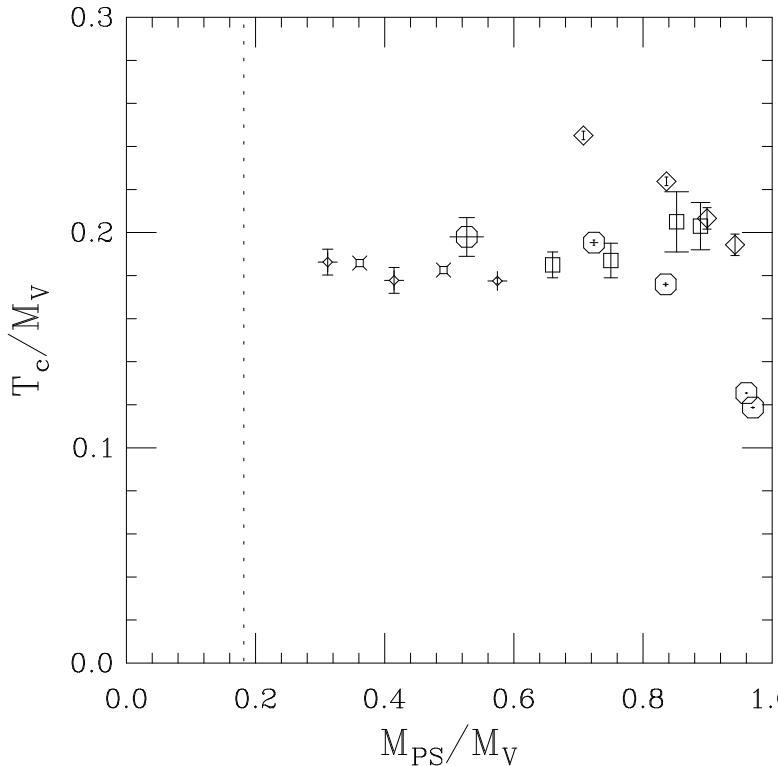  
Figure 12: Critical temperature divided by vector meson mass vs. pseudoscalar/vector meson mass ratio. Our data for $N _ { t } = 4$ improved Wilson actions are the octagons. Diamomds: $N _ { t } = 4$ unimproved Wilson; Square: $N _ { t } = 6$ unimproved Wilson; Fancy diamonds and squares: $N _ { t } = 4 , 6$ KogutSusskind (KS), respectively [2].

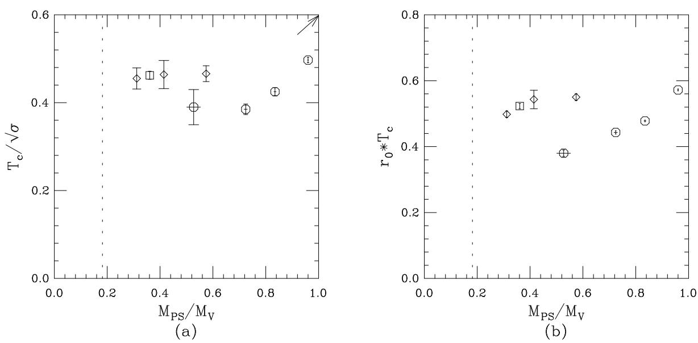  
Figure 13: Critical temperature scaled by (a) the square root of the string tension and (b) the inverse Sommer parameter vs. pseudoscalar/vector meson mass ratio. Octagons: $N _ { t } = 4$ improved Wilson; Diamonds: $N _ { t } = 4$ KS; Square: $N _ { t } = 6$ KS. The arrow in (a) shows the $N _ { t } = 4$ quenched $T _ { c } / \sqrt { \sigma }$ from Ref. [36].

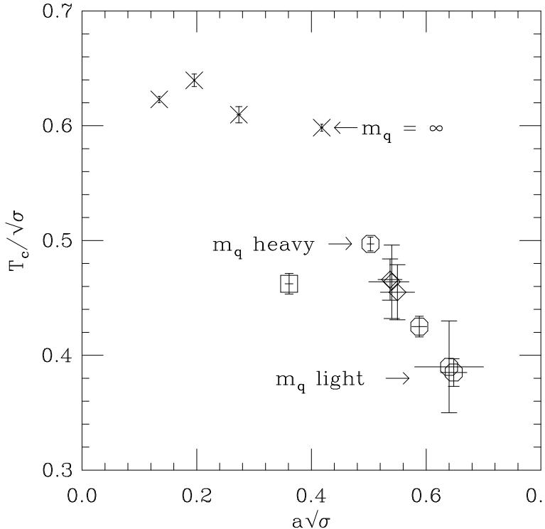  
Figure 14: Critical temperature scaled by the square root of the string tension (left) vs. the lattice spacing in units of $1 / \sqrt { \sigma }$ . Octagons: $N _ { t } = 4$ improved Wilson; Diamonds: $N _ { t } = 4$ KS; Square: $N _ { t } = 6$ KS; Crosses: Quenched SU(3) from Ref. [36].

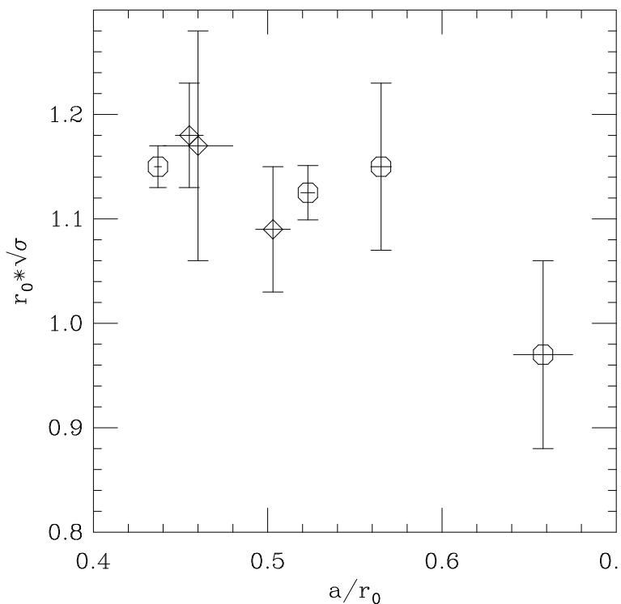  
Figure 15: The dimensionless quantity $r _ { 0 } \sqrt { \sigma }$ vs. the lattice spacing in units of $r _ { 0 }$ . Octagons: $N _ { t } = 4$ improved Wilson, Diamonds: $N _ { t } = 4$ KS.

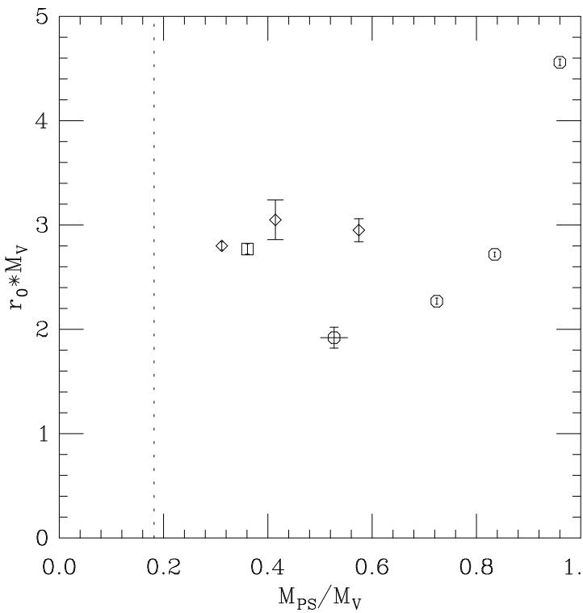  
Figure 16: Vector meson mass times $r _ { 0 }$ vs. pseudoscalar/vector meson mass ratio. Octagons: $N _ { t } = 4$ improved Wilson, Diamonds: $N _ { t } = 4$ KS, Square: $N _ { t } = 6$ KS.

A graph of the vector meson mass times $r _ { 0 }$ (Fig. 16) shows nice behavior for the Kogut— Susskind simulations, disagreement between KS and clover, and the rise in $M _ { \mathrm { V } }$ toward infinity at large $M _ { \mathrm { P S } } / M _ { \mathrm { V } }$ . Again, we do not show $M _ { \mathrm { V } } / \sqrt { \sigma }$ vS. $M _ { \mathrm { P S } } / M _ { \mathrm { V } }$ since it is qualitatively the same, but with larger error bars. If we were so bold as to argue that the improved Wilson data could be extrapolated to physical $M _ { \pi } / M _ { \rho }$ using the points $M _ { \mathrm { P S } } / M _ { \mathrm { V } } \leq 0 . 8$ , then we would conclude $M _ { \mathrm { V } } / \sqrt { \sigma }$ for our action is less than for the KogutSusskind action. This would not be too surprising given similar trends in scaling violations for quenched QCD spectroscopy as presented in Figure 2 of Ref. [18], for example. At finite lattice spacing, $M _ { \rho } / \sqrt { \sigma }$ computed with KS valence quarks lie above the $a = 0$ extrapolation, while unimproved Wilson quark calculations give a value less than the continuum number. The addition of the clover term significantly reduces this scaling violation; however, the lattice value of $M _ { \rho } / \sqrt { \sigma }$ still lies below its continuum value. Of course, in the absence of clear scaling between $M _ { \mathrm { V } }$ and $\sqrt { \sigma }$ (and $r _ { 0 }$ ), such arguments in this work are speculative.

# 5 Conclusions

This is the first large scale simulation of unquenched QCD with improved Wilson fermions of which we are aware. We find that the Symanzik improvement program, at this level, fulfills its promise in that a serious lattice artifact, the spurious first-order transition at intermediate hopping parameters, has been removed. The thermal crossover does become progressively steeper as one decreases the quark mass, but it is smooth in the sense that the Polyakov loop and the plaquette are single-valued for all $( \beta , \kappa )$ at which we computed.

However, improvement at this order is no panacea. It is still very costly to invert the fermion matrix near and below $M _ { \mathrm { P S } } / M _ { \mathrm { V } } \approx 0 . 5$ . Since the critical temperature and the vector meson mass show a significant dependence on the quark mass, extrapolation to $M _ { \pi } / M _ { \rho }$ is not trustworthy. Furthermore, disagreement is evident in $T _ { c } / \sqrt { \sigma }$ and $M _ { \mathrm { V } } r _ { 0 }$ between our improved Wilson action and the unimproved KogutSusskind formulation, even at comparable $M _ { \mathrm { P S } } / M _ { \mathrm { V } }$ .

One cannot yet use this disagreement to cast doubt on the KogutSusskind results because the scaling behavior of the improved Wilson action has not been sufficiently tested. Simulations with smaller lattice spacing, perhaps $N _ { t } = 6$ , would give a more concrete picture of the extent of scaling violations in this action.

Before beginning such an expensive undertaking, however, let us speculate as to the shortcomings of the present action in the context of thermodynamics. In the high temperature phase, thermodynamic quantities are dominated by high momentum contributions. Therefore, one must not only improve the effects of the finite lattice spacing, but also the dispersion relation at all momenta. Although the gauge action we used has a dispersion relation closer to the continuum than the plaquette action, the clover term does not change the fermionic dispersion relation from that of the unimproved Wilson action. The work with an improved gauge action but standard Wilson fermions by Ref. [4] shows improvement similar to ours: viz. removal of the jump-discontinuity in the Polyakov loop. A detailed comparison of the critical temperature from their action versus ours and the standard Wilson and KS actions remains to be made.

Therefore, it is plausible that improvement of the gauge action is responsible for the removal of the artificial first-order behavior at intermediate values of the Wilson hopping parameter. However, improvement of the fermion action probably plays a role in the closer agreement to the KS results for $T _ { c } / M _ { \mathrm { V } }$ , as was found in studies of quenched spectroscopy. Persistent quark mass dependence and apparent disagreement between our results and KS results for $T _ { c }$ scaled by quark potential parameters indicate that further improvement in the fermionic sector is warranted. One might consider using Wilson-type fermions with an improved dispersion relation in the next large scale thermodynamics study.

# Acknowledgments

This work was supported by the U.S. Department of Energy under contracts DE-AC02-76CH-0016, DE-FG03-95ER-40894, DE-FG03-95ER-40906, DE-FG05-85ER250000, DE-FG05-96ER40979, DE2FG02-91ER-40628, DE-FG02-91ER-40661, and National Science Foundation grants NSF-PHY93- 09458, NSF-PHY96-01227, NSF-PHY91-16964. Simulations were carried out at the Cornell Theory Center, the Supercomputer Computations Research Institute at Florida State University, and at the San Diego Supercomputer Center.

One of us (MW) would like to extend thanks to A. Hasenfratz for several helpful discussions and to N. Christ, F. Karsch, and A. Ukawa for thoughtful comments at the Lattice '96 symposium. We also thank Craig McNeile and Tom Blum for critical readings of the manuscript.

# References

[1] C. Bernard, T. DeGrand, C. DeTar, S. Gottlieb, A. Hasenfratz, L. Kärkkäinen, D. Toussaint, and R.L. Sugar, Phys. Rev. D49 (1994) 3574.   
[2] C. Bernard, M. Ogilvie, T. DeGrand, C. DeTar, S. Gottlieb, A. Krasnitz, R.L. Sugar, and D. Toussaint, Phys. Rev. D46 (1992) 4741; T. Blum, T. DeGrand, C. DeTar, S. Gottlieb, A. Hasenfratz, L. Kärkkäinen, D. Toussaint, and R.L. Sugar, Phys. Rev. D50 (1994) 3377.   
[3] Y. Iwasaki, Nucl. Phys. B258 (1985) 141; Y. Iwasaki, Tsukuba report UTHEP-118, (1983), unpublished.   
[4] Y. Iwasaki, K. Kanaya, S. Kaya, and T. Yoshié, Phys. Rev. Lett. 78 (1997) 179.   
[5] K. Symanzik, in "Recent Developments in Gauge Theories," eds. G. 't Hooft, et al. (Plenum, New York, 1980) 313; in "Mathematical Problems in Theoretical Physics," eds. R. Schrader et al. (Springer, New York, 1982); Nucl. Phys. B226 (1983) 187, 205.   
[6] P. Weisz, Nucl. Phys. B212 (1983) 1; M. Lüscher and P. Weisz, Comm. Math. Phys. 97 (1985) 59.   
[7] M. Lüscher and P. Weisz, Phys. Lett. 158B (1985) 250.   
[8] G. Parisi, in High Energy Physics - 1980, Proceedings of the XXth International Conference, Madison, Wisconsin, edited by L. Durand and L.G. Pondrom (American Institute of Physics, New York, 1981).   
[9] G.P. Lepage and P.B. Mackenzie, Phys. Rev. D48 (1993) 2250.   
[10] M. Alford, W. Dimm, G.P. Lepage, G. Hockney, and P.B. Mackenzie, Phys. Lett. 361B (1995) 87.   
[11] P. Weisz and R. Wohlert, Nucl. Phys. B236 (1984) 397.   
[12] H.W. Hamber and C.M. Wu, Phys. Lett. 133B (1983) 351.   
[13] B. Sheikholeslami and R. Wohlert, Nucl. Phys. B259 (1985) 572.   
[14] B. Beinlich, F. Karsch, and E. Laermann, Nucl. Phys. 462 (1996) 415.   
[15] B. Beinlich, F. Karsch, and A. Piekert, Bielefeld preprint BI-TP 96/24, hep-1at/9608141.   
[16] R. Kenway, UKQCD Collaboration, Nucl. Phys. (Proc. Suppl.) 53 (1997) 206.   
[17] S. Collins, R.G. Edwards, U.M. Heller, and J. Sloan, Nucl. Phys. (Proc. Suppl.) 53 (1997) 877.   
[18] S. Collins, R.G. Edwards, U.M. Heller, and J. Sloan, to appear in the proceedings of "MultiScale Phenomena and Their Simulation", Bielefeld, Germany 1996, hep-1at/9611022.   
[19] R.G. Edwards, private communication.   
[20] M. Lüscher, S. Sint, R. Sommer, P. Weisz, and U. Wolff, hep-1at/9609035.   
[21] M. Alford, T.R. Klassen, and G.P. Lepage, hep-lat/9611010.   
[22] W. Wetzel, Phys. Lett. B136 (1984) 407; T. Eguchi and N. Kawamoto, Nucl. Phys. B430 (1984) 609; H.R. Fiebig and R.M. Woloshyn, Phys. Lett. B385 (1996) 273; R. Lewis and R.M. Woloshyn, TRIUMF preprint TRIPP-9660, hep-1at/9610027.   
[23] S. Gottlieb, W. Liu, D. Toussaint, R.L. Renken, and R.L. Sugar, Phys. Rev. D35 (1987) 2531.   
[24] S. Duane, A.D. Kennedy, B.J. Pendleton, and D. Roweth, Phys. Lett. 195 (1987) 216.   
[25] X-Q. Luo, Comp. Phys. Comm. 94 (1996) 119; K. Jansen and C. Liu, DESY Report DESY96-042 (1996) hep-1at/9603008.   
[26] T. DeGrand and P. Rossi, Comp. Phys. Comm. 60 (1990) 211.   
[27] C.R. Allton, et al. (UKQCD Collaboration), Nucl. Phys. B407 (1993) 331.   
[28] For a recent review of matrix inversion algorithms in the field, see A. Frommer, Nucl. Phys. (Proc. Suppl.) 53 (1997) 120.   
[29] M. Bochicchio, et al., Nucl. Phys. B262 (1985) 331.   
[30] K.M. Bitar, et al., Phys. Rev. D43 (1991) 2396.   
[31] The Wilson meson masses were provided by K.M. Bitar, et al., hep-lat/9602010; and private communication.   
[32] R. Sommer, Nucl. Phys. B411 (1994) 839.   
[33] U.M. Heller, K.M. Bitar, R.G. Edwards, and A.D. Kennedy, Phys. Lett. B335 (1994) 71.   
[34] T. Blum, L. Kärkkäinen, D. Toussaint, and S. Gottlieb, Phys. Rev. D51 (1995) 5153.   
[35] C. Bernard, T. Blum, T.A. DeGrand, C. DeTar, S. Gottlieb, A. Krasnitz, R.L. Sugar, and D. Toussaint, Phys. Rev. D48 (1993) 4419.   
[36] G. Boyd, J. Engels, F. Karsch, E. Laermann, C. Legeland, M. Lütgemeier, and B. Petersson, Phys. Rev. Lett. 75 (1995) 4169.