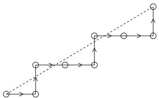
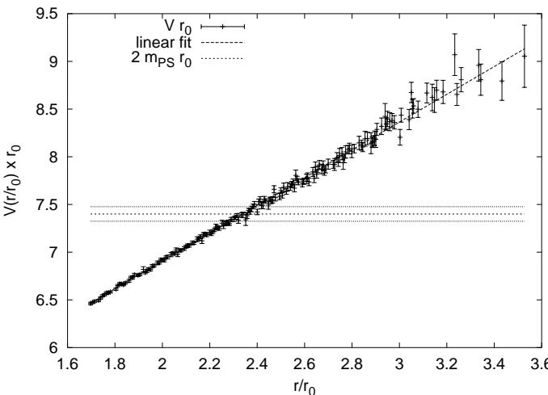
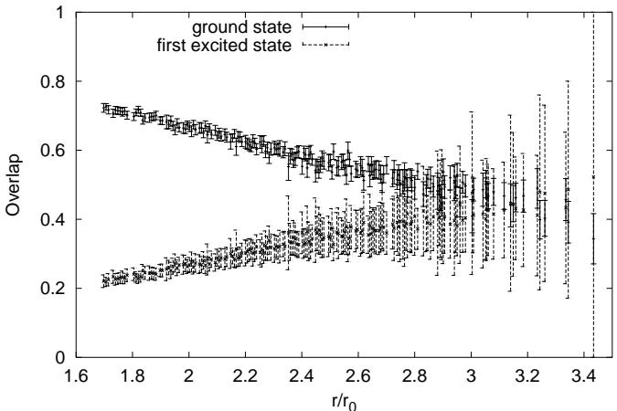
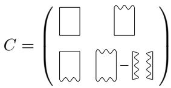
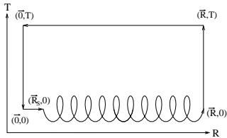
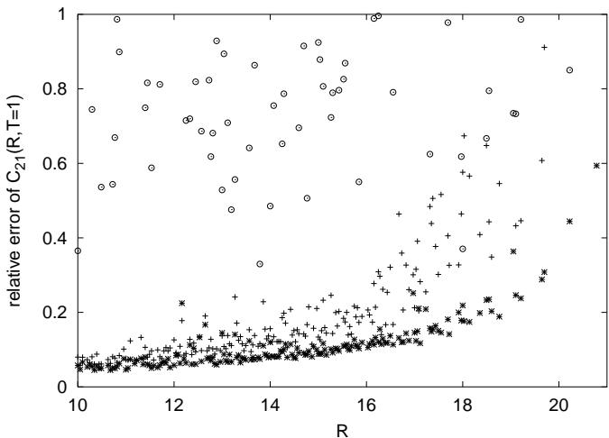
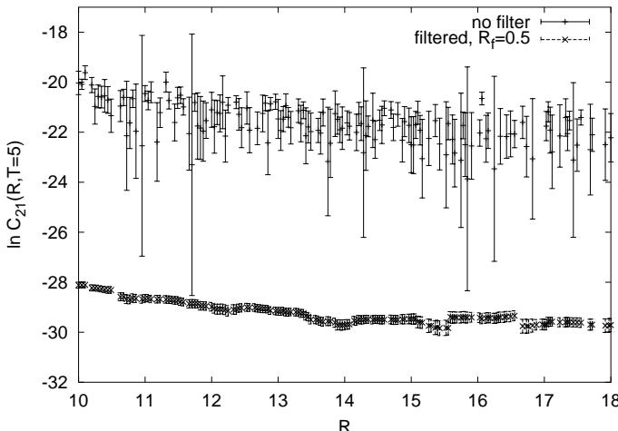

# A high precision study of the $Q Q$ potential from Wilson loops in the regime of string breaking

Bram Bolder $^ { a }$ , Thorsten Struckmann $b$ Gunnar S. Bali $c$ , Norbert Eicker $^ { a }$ , Thomas Lippert $^ { a }$ , Boris Orth $^ a$ , Klaus Schilling $^ { a , b }$ , and Peer Ueberholz $^ { a }$ $^ { a }$ Fachbereich Physik, Bergische Universität, Gesamthochschule Wuppertal GauBstraBe 20, 42097 Wuppertal, Germany $^ { b }$ NIC, Forschungszentrum Jülich, 52425 Jülich and DESY, 22603 Hamburg, Germany $_ c$ Department of Physics and Astronomy, The University of Glasgow, Glasgow G12 8QQ, Scotland

(SESAM - TXL Collaboration)

For lattice QCD with two sea quark flavours we compute the static quark antiquark potential $V ( R )$ in the regime where string breaking is expected. In order to increase statistics, we make full use of the lattice information by including all lattice vectors $\mathbf { R }$ to any given separation $R = | \mathbf { R } |$ in the infrared regime. The corresponding paths between the lattice points are constructed by means of a generalized Bresenhamalgorithm as known from computer graphics. As a result, we achieve a determination of the unquenched potential in the range 0.8 to 1.5 fm with hitherto unknown precision. Furthermore, we demonstrate some error reducing methods for the evaluation of the transition matrix element between twoand four-quark states.

it appears overly costly to achieve the required statistical accuracy of the generalized Wilson loops which incorporate light quark-antiquark pairs in the initial or final states [11]. The reason is that one is prevented from exploiting the translational symmetry, since this would require computation of light propagators $P ( y , x )$ on any source point location, $x$ (see e.g. Refs. [11,12]). In Refs. [13,14] stochastic estimator methods with maximal variance reduction (so-called all-to-all methods) were applied to cope with the fluctuations on the multichannel correlator matrix, but failed so far to provide sufficient accuracy in the infrared regime.

On the other hand, if one scrutinizes existing QCD potential data from Wilson loops [16] for colour screening one will notice that the errors become substantial in the region of interest, $r \simeq 1 . 2 ~ \mathrm { f m ^ { 1 } }$ . Thus, there is room for suspicion that QCD colour screening has so far escaped detection simply for the lack of adequate precision of large Wilson loops.

# I. INTRODUCTION

Confinement of quarks is an issue of prime importance in the understanding of strong interaction physics. While the study of the static quark-antiquark potential from simulations of quantum chromodynamics has been pushed to rather high accuracy in quenched QCD and allows today for a precise determination of the string tension, the search for evidence of string breaking from Wilson loops in simulations of the full QCD vacuum has been futile so far. It seems that the linear rise of the static potential continues to prevail even in presence of vacuum polarization by quark loops [16].

The common explanation for this unexpected finding is that present studies cannot really resolve the asymptotic time behaviour of the Wilson loops and that a multichannel analysis including light fermion operators is required to achieve sufficient ground state overlap in the available time range [7]. In fact, a fully fledged multichannel approach has been demonstrated to be a viable technique to realize breaking of the string between adjoint sources in pure gauge theories or fundamental colour sources in Higgs models [810]. In the case of full QCD, however,

The main purpose of the present note is to improve on this point by pushing for a high precision 'classical' Wilson loop calculation at large separations in $N _ { f } = 2$ QCD. This is achieved by squeezing maximal information out of each vacuum configuration through rotational invariance and comprehensive utilization of all possible $R$ -values on the lattice. As a result of our "all- $R$ approach" (ARA) we are able to present a long range static potential from Wilson loops in unprecedented accuracy.

In section $\mathrm { I I }$ we shall describe how we go about in the build-up of nonplanar loops to any given $\mathbf { R }$ . Section III contains our potential analysis from ARA which is used on top of existing signal enhancement techniques, such as conventional APE smearing [15] and translational averaging. As a first step in the direction of a two channel investigation of string breaking we study in section IV the noise reduction effect from ARA on the transition correlator between static and static-light quark states, $\bar { Q } Q$ and $Q Q \bar { q } q$ , respectively.

# II. LOOP CONSTRUCTION

Our aim is to increase statistics in the regime of colour screening, i.e. for large quark antiquark separations, $R$ . Obviously, on such a length scale, a given QCD vacuum configuration contains plenty of information that can be exploited for self averaging and thus for error reduction: firstly, one can realize, on a hypercubic lattice, a fairly dense set of $R$ values; secondly, for a given large value of $R = \left| \mathbf { R } \right|$ , there are many different three-vector realizations $\mathbf { R }$ on the lattice.

We wish to make use of this fact by a systematic construction of off-axis Wilson loops, $W ( R , T )$ , in the range $R _ { \mathrm { m i n } } ~ \le ~ R ~ \le ~ R _ { \mathrm { m a x } }$ , with $R _ { \mathrm { m i n } } ~ = ~ 1 0 ~ \approx ~ 1 . 7 R _ { 0 }$ and $R _ { \mathrm { m a x } } = 1 2 \sqrt { 3 } \approx 3 . 5 R _ { 0 }$ , where $R _ { 0 }$ is the Sommer radius (in lattice units) that amounts to $r _ { 0 } \approx 0 . 5$ fm [16]. The construction proceeds by choosing all possible vectors, $\mathbf { R }$ , with integer components $C _ { \mathrm { m i n } }$ , $C _ { \mathrm { m i d } }$ , and $C _ { \mathrm { m a x } }$ (in any order of appearance) that obey the inequalities,

$$
R _ { \operatorname* { m i n } } ^ { 2 } \le R ^ { 2 } = C _ { \operatorname* { m i n } } ^ { 2 } + C _ { \operatorname* { m i d } } ^ { 2 } + C _ { \operatorname* { m a x } } ^ { 2 } \le R _ { \operatorname* { m a x } } ^ { 2 } ~ ,
$$

where $| C _ { \mathrm { m i n } } | \leq | C _ { \mathrm { m i d } } | \leq | C _ { \mathrm { m a x } } |$

Subsequently, the set of solutions to the constraint eq. (1) is sorted according to the correponding values of $R$ . In Table I we display the large number of possible $R$ values and vectors, $\mathbf { R }$ , obtained in this way, with the additional restriction, $| C _ { \mathrm { m a x } } | ~ \le ~ 1 2$ . So far, only $\mathbf { R }$ vectors with $( \vert C _ { \mathrm { m a x } } \vert , \vert C _ { \mathrm { m i d } } \vert , \vert C _ { \mathrm { m i n } } \vert )$ being multiples of $( 1 , 0 , 0 ) , ( 1 , 1 , 0 ) , ( 1 , 1 , 1 ) , ( 2 , 1 , 0 ) , ( 2 , 1 , 1 )$ or $( 2 , 2 , 1 )$ have been considered [1720]. Within the investigated regime, $1 0 \leq R \leq 1 2 { \sqrt { 3 } }$ , we achieve a gain factor of more than eight in terms of the spatial resolution in $R$ (from 21 to 175 different values). Moreover, the number of different $\mathbf { R }$ vectors that yield the same distance, $R$ , is increased by an average gain factor of more than four! Accordingly, we find the ARA to reduce the statistical errors on potential values by factors around two.

We shall briefly discuss the construction of the gauge transporters connecting the quark and antiquark locations, $\mathbf { R } _ { Q }$ and ${ \bf R } _ { \bar { Q } } = { \bf R } _ { Q } + { \bf R }$ , that appear within the ARA nonplanar Wilson loops. In order to achieve a large overlap with the physical ground state we would like to construct lattice paths that follow as close as possible the straight line connecting $\mathbf { R } _ { \bar { Q } }$ with $\mathbf { R } _ { Q }$ . This task can be accomplished by a procedure which is known as the Bresenham algorithm [21] in computer graphics. There one wishes to map a straight continuous line between two points, say 0 and $\mathbf { C } = ( C _ { \mathrm { m a x } } , C _ { \mathrm { m i n } } )$ , onto discrete pixels on a 2-d screen. Then one has to find the explicit sequence of pixel hoppings in max- and min-directions such that the resulting pixel set mimicks best the continuum geodesic between points 0 and $\mathbf { C }$ . The Bresenham prescription is simply to move in max-direction unless a step in min-direction brings you closer to the geodesic from $\mathbf { 0 }$ to $\mathbf { C }$ , where we assume $| C _ { \mathrm { m a x } } | \geq | C _ { \mathrm { m i n } } |$ . It can easily be embodied into a fast algorithm based on local decision making only (see Fig. 1), by means of a characteristic lattice function $\chi$ that incorporates the aspect ratio $C _ { \mathrm { m a x } } / C _ { \mathrm { m i n } }$ .

TABLE I. The number of different solutions to eq. (1) obtained by ARA for the interval $1 0 \leq R \leq 1 2 { \sqrt { 3 } }$ , $| R _ { i } | \leq 1 2$ .   

<table><tr><td></td><td>#R values</td><td>#R vectors</td><td>#R vectors/R-entry</td></tr><tr><td>standard</td><td>21</td><td>302</td><td>14.4</td></tr><tr><td>ARA</td><td>175</td><td>11486</td><td>65.6</td></tr></table>

  
FIG. 1. Illustration of a path construction by the Bresenham algorithm, for $\mathbf { C } = ( 5 , 3 )$ .

The algorithm in two dimensions looks like this:

$\mathsf { c m a x } 2 : = 2 ^ { \ast } \mathsf { c m a x }$   
cmin2 := 2\*cmin   
chi := cmin2 -cmax   
FOR i $: = 1$ TO cmax DO step in max-direction IF chi $\geq 0$ THEN chi $\therefore =$ chi - cmax2 step in min-direction ENDIF chi $: =$ chi + cmin2   
ENDDO

The generalisation to three dimensions is achieved by combining two of these 2d-algorithms with different $\chi$ 's for max-mid and max-min in just one loop over the maxdirection.

In order to convey an idea about the statistics gain inherent in such a systematic approach we have listed the number of $\mathbf { R }$ vectors constructed in this manner in Table I. Note that for plane or space diagonal separations, we average over the two or six equivalent paths, respectively.

# III. THE STATIC POTENTIAL AT LARGE $R$

We base our analysis on 184 vacuum configurations, separated by one autocorrelation length, on $L _ { \sigma } ^ { 3 } L _ { \tau } ~ =$ $2 4 ^ { 3 } \times 4 0$ lattices of $N _ { f } ~ = ~ 2$ QCD at $\beta ~ = ~ 5 . 6$ and $\kappa _ { s e a } = . 1 5 7 5$ (corresponding to $m _ { \pi } / m _ { \rho } = . 7 0 4 ( 5 ) $ produced by the T $\chi$ L-collaboration on an APE 100 tower at INFN. These parameter values correspond to the biggest lattice volume at our disposal, $L _ { \sigma } a \approx 2$ fm. In order to minimize finite-size effects and possible violations of rotational symmetry on the $L _ { \sigma } = 2 4$ torus, $C _ { \mathrm { m a x } }$ has been restricted to $| C _ { \mathrm { m a x } } | \leq 1 2$ . The lattice constant $a$ was determined from the Sommer radius $r _ { 0 } = R _ { 0 } a \approx 0 . 5$ fm [16], as obtained in our previous investigation [20], $R _ { 0 } = 5 . 8 9 ( 3 )$ .

Before entering the Wilson loop analysis the configurations are smoothened by spatial APE- or link smearing [15],

$$
\mathrm { l i n k }  \alpha \times \mathrm { l i n k + s t a p l e s ~ } ,
$$

followed up by a projection back into the gauge group [17], with 26 such iterative replacements and the parameter value, $\alpha = 2 . 3$ .

The potential values have been obtained by means of single and double exponential fits to smeared ARA Wilson loop data $W ( R , T )$ within the range, $T _ { \mathrm { m i n } } \leq T \leq 8$ . We shall quote statistical errors that are obtained by jackknifing. At the large $R$ values that are of interest in view of screening effects, the quality of the statistical signal did not allow to include $T$ values larger than 8.

  
FIG. 2. The estimate on the static potential as obtained from Wilson loops at $\kappa = 0 . 1 5 7 5$ and $\beta = 5 . 6$ on $2 4 ^ { 3 } \times 4 0$ lattices, extracted from a single exponential fit to Wilson loops for $4 \leq T \leq 8$ .

In Fig. 2 we display estimates on the potential in the range $1 . 7 \leq r / r _ { 0 } \leq 3 . 5$ obtained from a single exponential fit with $T _ { \mathrm { m i n } } ~ = ~ 4$ (they agree with results from a double exponential fit with $T _ { \mathrm { m i n } } ~ = ~ 1$ ). Note that for $r > 2 . 4 r _ { 0 }$ the data are to be interpreted as strict upper limits on the potential. The slope is in agreement with the string tension, $K = \sigma a ^ { 2 } = 0 . 0 3 7 2 ( 8 ) = 1 . 1 3 9 ( 4 ) R _ { 0 } ^ { - 2 }$ as quoted in Ref. [20] from a fit to data obtained at smaller $r < 2 . 0 4 r _ { 0 }$ : Around the separation $r _ { c } \approx 2 . 3 r _ { 0 }$ the potential energy crosses the expected threshold for string breaking, $2 m _ { P S } a = 1 . 2 5 6 ( 1 3 )$ , which is indicated by a horizontal error band. The errors quoted are statistical and are well below $1 . 5 \ \%$ for $r / r _ { 0 } \le 3$ . We find the data to follow perfectly a straight line: a flattening of the Wilson loop potential is not visible within the accessible $T$ range and present statistical errors.

To complement this result, we computed the overlaps with the ground and first excited states by means of twoexponential fits, as displayed in Fig. 3. Again our two data sets exhibit linear dependencies on $r$ , with nearly opposite slopes such that their sum turns out to be close to one. The remainder does only slightly depend on $r$ and is of order $1 0 ~ \%$ .

We conclude that Wilson loop operators are definitely not very well suited to uncover string breaking. To achieve the required overlap with four-quark states one has to introduce them explicitely into the calculation, in form of a coupled channel analysis. As a first step in such a program, we shall explore in the remaining part of this letter a number of signal enhancement techniques based on ARA, in application to the transition matrix element between two- and four-quark states.

  
FIG. 3. The ground and first excited state overlaps (top and lower data sets, respectively) plotted versus the quark-antiquark separation, as obtained from Wilson loops. The data result from two-exponential fits in the region $1 \leq T \leq 8$ .

# IV. NOISE ON THE TRANSITION OPERATOR

In a two-channel approach one extends the Wilson loop vacuum expectation value, $C _ { 1 1 }$ , to a $2 \times 2$ correlation matrix $C$ as pictogrammed in Fig. 4. The task is then to solve the generalized eigenvalue problem [22],

$$
C ( t + \tau ) \mathbf { u } _ { i } = \lambda _ { i } ( \tau ) C ( t ) \mathbf { u } _ { i } \ ,
$$

where the eigenvalues connect to the two energy levels $E _ { i }$ at large enough $t$ :

$$
\begin{array} { r } { \lambda _ { i } ( \tau ) = \exp \left( - E _ { i } \tau \right) . } \end{array}
$$

Unless $C$ happens to be diagonal, the physical states $\mathbf { u } _ { 0 }$ and $\mathbf { u } _ { 1 }$ are mixtures of two- and four-quark states. It is obvious that the energy levels are insensitive to changes in the normalization of the wavefunctions, $\mathbf { u } _ { i }$ . Thus, in addition to spatial APE link smearing, source smearing techniques as known from spectrum calculations are applicable (see Fig. 5) and will be tested.

  
FIG. 4. The two channel correlation matrix $C$ . Wiggly lines correspond to light quark propagators, solid lines to products of gauge links.

While the noise level on $C _ { 1 1 }$ could be greatly reduced by applying ARA on top of standard volume self averaging (VSA), the quark propagators $P ( y , x )$ (wiggly lines) entering the remaining components of the correlation matrix $C$ prevent the direct use of VSA that requires matrix inversions on all possible source points, $x$ . Pennanen and Michael have tested noisy estimator techniques on $P$ for curing this problem but did not succeed to reach the accuracy necessary to solve eq. (3) [14]. This motivates us to explore noise controlling strategies based on ARA rather than VSA on the transition matrix element $C _ { 2 1 } ( R , T )$ . One should keep in mind that ARA can be put to work at little extra cost since one inversion on a single source $x$ renders $P ( y , x )$ for all sink positions $y$ .

  
FIG. 5. The source smeared transition matrix element $C _ { 2 1 }$ .

In addition to APE link smearing, we have explored source smearing as illustrated by the diagram, Fig. 5. This is applied to the light propagator source, $\chi _ { x }$ , and consists of iterative replacement (as in previous heavylight spectrum analyses [23,24]),

$$
\chi _ { x }  \chi _ { x } + \alpha \sum _ { i = \pm 1 } ^ { \pm 3 } \chi _ { x + \hat { \imath } } ^ { \mathrm { p a r a l l . t r a n s p o r t e d } } \ ,
$$

which is repeated 50 times, with weight factor, $\alpha = 4 . 0$ . The source is put to zero subsequently outside the volume $| \mathbf { r } _ { s } - \mathbf { x } | \le R _ { q } a$ , with $R _ { q } = 5$ . Note that quark propagators are computed without link smearing throughout this work.

Fig. 6 shows the $R$ -dependence of the relative errors on $C _ { 2 1 } ( R , T = 1 )$ throughout the stringbreaking region and illustrates the performance of various signal enhancement tools that are added on top of ARA: (a) the circles correspond to no source or link smearing; (b) crosses refer to local sources and smeared links; (c) stars refer to smeared quark sources and smeared gauge sinks.

  
FIG. 6. Relative errors on $C _ { 2 1 } ( R , T = 1 )$ vS. $R$ with ARA. String breaking is expected around $R = 1 3$ . Open circles: no link or source smearing; upright crosses: link smearing only; stars: smeared source and smeared gauge links.

Obviously link smearing helps a lot but leaves us still with errors of order $5 0 \ \%$ in the region $R \leq 1 8$ . It turns out that smearing is capable of cutting down noise amplitudes further. We find an additional reduction of more than a factor two, to a $2 0 \ \%$ level at $T = 1$ .

Unfortunately, such accuracy does not suffice, as it cannot be sustained at larger $T$ values, where one wishes to analyse $C$ at the end of the day. Given the dense set of $R$ -values available from ARA and in view of the fact that $B ( R ) = \ln [ C _ { 2 1 } ( R , T ) ]$ is a smooth function of $R$ , there is opportunity to further improve by filtering the sequence, $\{ B ( R _ { i } ) \}  \{ B _ { f } ( R _ { i } ) \}$ . We have chosen a filter that weighs each individual jackknife sample with the fluctuation calculated on the entire data set,

$$
B _ { f } ( R _ { i } ) = N _ { i } ^ { - 1 } \sum _ { | R _ { j } - R _ { i } | \leq R _ { f } } \sigma _ { j } ^ { - 2 } B ( R _ { j } ) ,
$$

with normalization

$$
N _ { i } = \sum _ { | R _ { j } - R _ { i } | \leq R _ { f } } \sigma _ { j } ^ { - 2 } .
$$

We found best results with filter radius $R _ { f } = 0 . 5$ . Let us now consider the transition matrix element at $T = 5$ .

The effect of filtering is illustrated in Fig. 7 where we confront the signals from ARA plus link and source smearings, $\{ B ( R _ { i } ) \}$ , (upper sequence with large error bars) with the filtered one, $\{ B _ { f } ( R _ { i } ) \}$ , (lower data sequence). In order to display the systematics of windowing, we have refrained from thinning the latter sequence as one should in actual applications. We find a striking noise reduction through filtering within the large distance regime, $1 0 \leq R \leq 1 8$ : at $T = 3$ and $T = 5$ we encounter errors of less than $1 0 \ \%$ and $2 0 \ \%$ , respectively.

  
FIG. 7. The signal for $\ln C _ { 2 1 }$ at $T = 5$ . The filtered data have been vertically shifted by $^ { - 8 }$ to avoid cluttering. String breaking is expected around $R = 1 3$ .

# V. SUMMARY AND CONCLUSIONS

Exploiting the dense set of $R$ values available at large quark-antiquark separations on the lattice we succeeded in improving the precision of the $Q Q$ potential from Wilson loops in the string breaking regime by a factor of two with respect to standard methods. This enables us to analyse Wilson loop data well beyond the point where string breaking is expected and corroborates previous conjectures that Wilson loops do not bear enough overlap with $Q Q q { \bar { q } }$ states for uncovering string breaking within the $T$ -range available at present.

The success of our all $R$ approach to the Wilson loops in the string breaking regime has encouraged us to carry out a feasibility study on error control of the transition correlator, $C _ { 2 1 }$ . By additional use of source smearing and filtering techniques, we arrive at reasonable signalto-noise ratios for $\ln C _ { 2 1 }$ .

For the final chord in a full two-channel analysis of $Q Q$ and $Q Q q { \bar { q } }$ states one would have to consider the correlator $C _ { 2 2 }$ which contains both, a connected and a disconnected contribution: the former can be tackled with our present techniques and we expect sufficient accuracy with a factor of $T _ { m a x }$ more effort than for $C _ { 2 1 }$ ; the latter relates to the situation of $B \overline { { B } }$ pairs at large separations.

From a previous $B B$ study [25] one would anticipate that the $\langle B \overline { { B } } \rangle$ correlator is dominated in our $R$ -range and for our purposes by $\langle B \rangle \langle { \overline { { B } } } \rangle$ . This is currently being investigated.

# ACKNOWLEDGMENTS

We appreciate useful discussions with S. Güsken und M. Peardon during early stages of this research. K.S. thanks F. Niedermayer for an interesting discussion. This work was supported by DFG Graduiertenkolleg "Feldtheoretische und Numerische Methoden in der Statistischen und Elementarteilchenphysik". G.B. acknowledges support from DFG grants Ba 1564/3-1, 1564/3-2 and 1564/3-3 as well as EU grant HPMF-CT-1999-00353. The HMC productions were run on an APE100 at INFN Roma. We are grateful to our colleagues F. Rapuano and G. Martinelli for the fruitful T $\chi$ L-collaboration. Analysis was performed on the CRAY T3E system of ZAM at Research Center Jülich.

[1] U. M. Heller et al., [HEMCGC Collaboration], Phys. Lett. B335, 71 (1994).   
[2] U. Glässner et al. [SESAM Collaboration], Phys. Lett. B383, 98 (1996).   
[3] G. S. Bali et al. [SESAM Collaboration], Nucl. Phys. B Proc. Suppl. 63, 209 (1998).   
[4] S. Aoki et al. [CP-PACS Collaboration], Nucl. Phys. B Proc. Suppl. 73, 216 (1999).   
[5] C.R. Allton et al. [UKQCD Collaboration], Phys. Rev. D60, 034507 (1999), J. Garden [UKQCD Collaboration], Nucl. Phys. B Proc. Suppl. 83-84, 165 (2000).   
[6] C. Bernard et al. [MILC Collaboration], hep-lat/0002028.   
[7] S. Güsken, Nucl. Phys. B Proc. Suppl. 63, 16 (1998).   
[8] F. Knechtli and R. Sommer, [ALPHA collaboration], Phys. Lett. B440, 345 (1998).   
[9] O. Philipsen and H. Wittig, Phys. Rev. Lett. 81, 4056 (1998), Erratum ibid. 83,2684 (1999).   
10] P. W. Stephenson, Nucl. Phys. B550, 427 (1999).   
11] K. Schilling, Nucl. Phys. B Proc. Suppl. 83-84, 140 (2000).   
12] G. S. Bali, hep-ph/0001312, submiited to Phys. Rept.   
13] C. DeTar et al., Nucl. Phys. B Proc. Suppl. 83-84, 310 (2000).   
14] P. Pennanen and C. Michael [UKQCD Collaboration], hep-lat/0001015.   
15] M. Albanese et al., Phys. Lett. B192, 163 (1987).   
16] R. Sommer, Nucl. Phys. B411, 839 (1994).   
17] G. S. Bali and K. Schilling, Phys. Rev. D46, 2636 (1992).   
18] G. S. Bali and K. Schilling, Phys. Rev. D47, 661 (1993).   
19] G. S. Bali, K. Schilling and A. Wachter, Phys. Rev. D56, 2566 (1997).   
[20] G. Bali, B. Bolder, N. Eicker, Th. Lippert, B. Orth, P. Ueberholz, K. Schilling, T. Struckmann [SESAM - TXL Collaboration], hep-lat/0003012, Phys. Rev. D, in print.   
[21] see e. g. J.D. Foley et al., Computer Graphics: Principles and Practice, Addison Wesley Publ. Company 1996 London.   
[22] M. Lüscher et al., Nucl. Phys. B339, 222 (1990).   
[23] S. Güsken, Nucl. Phys. B Proc. Suppl. 17, 361 (1990).   
[24] N. Eicker et al. [SESAM collaboration], Phys. Rev. D59, 014509 (1999).   
[25] P. Pennanen et al., Nucl. Phys. B Proc. Suppl. 83-84, 200 (2000).