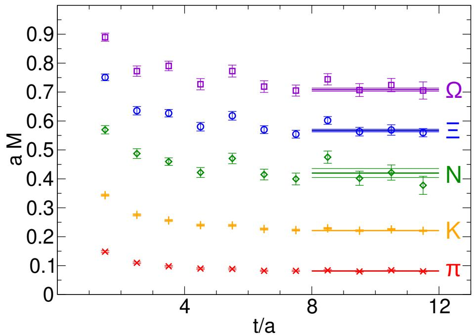
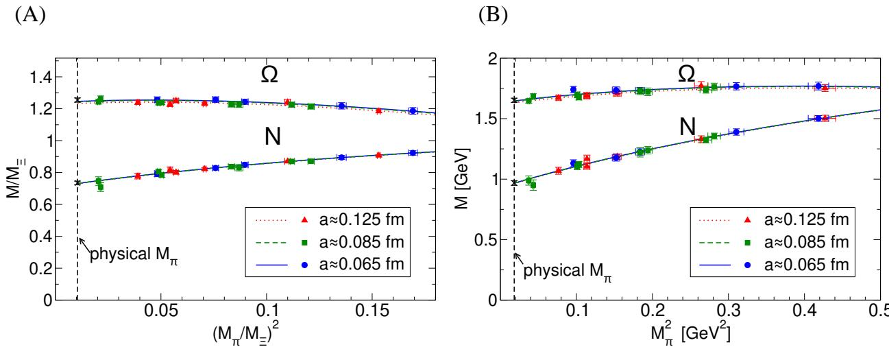
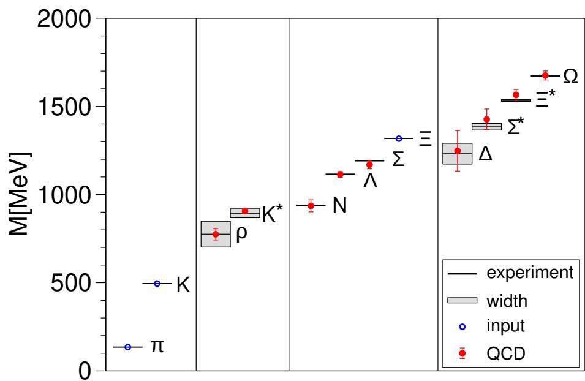
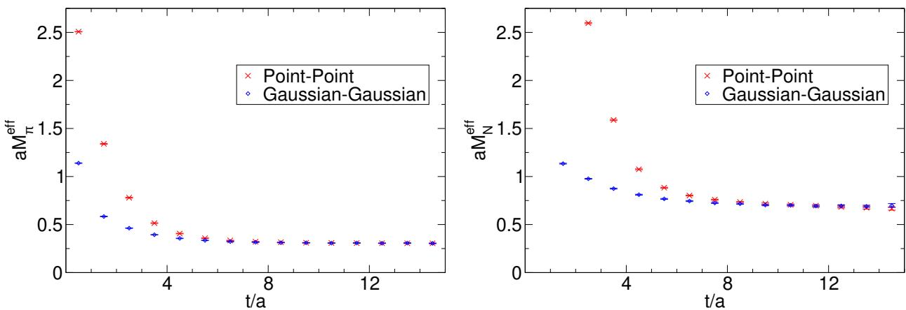
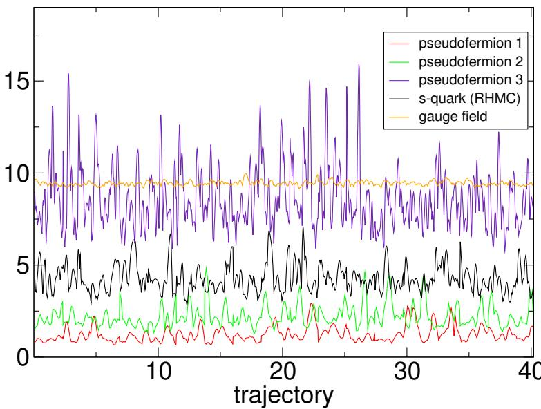
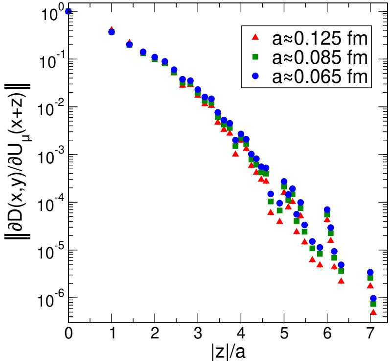
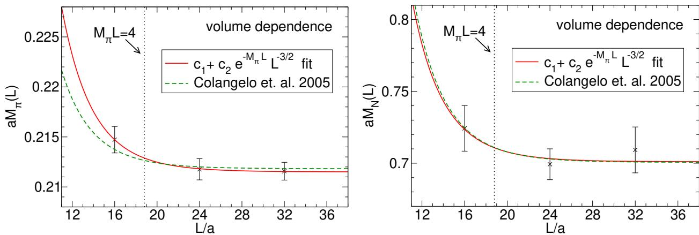
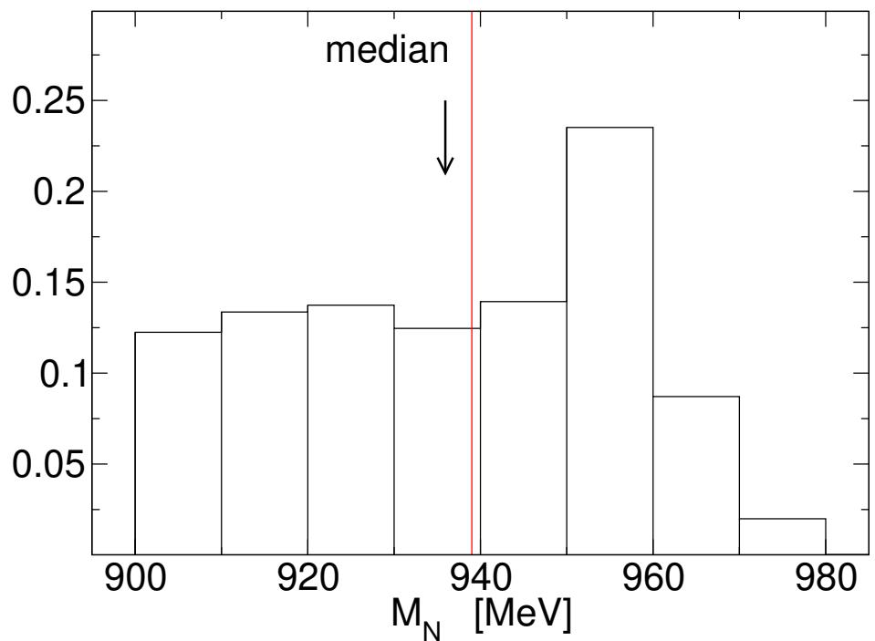

# Ab-initio Determination of Light Hadron Masses

S. Dürr1, Z. Fodor1,2,3, J. Frison4, C. Hoelbling2,3,4, R. Hoffmann2, S. D. Katz $^ { 2 , 3 }$ , S. Krieg2, T. Kurth2, L. Lellouch4, T. Lippert2,5, K.K. Szabo2, G. Vulvert4

1NIC, DESY Zeuthen, D-15738 Zeuthen and FZ Jülich, D-52425 Jülich, Germany. 2Bergische Universität Wuppertal, Gaussstr. 20, D-42119 Wuppertal, Germany. 3Institute for Theoretical Physics, Eötvös University, H-1117 Budapest, Hungary. 4Centre de Physique Théorique,\* Case 907, Campus de Luminy, F-13288 Marseille Cedex 9, France. 5Jülich Supercomputing Centre, FZ Jülich, D-52425 Jülich, Germany.

Budapest-Marseille-Wuppertal Collaboration

More than $99 \%$ of the mass of the visible universe is made up of protons and neutrons. Both particles are much heavier than their quark and gluon constituents, and the Standard Model of particle physics should explain this difference. We present a full ab-initio calculation of the masses of protons, neutrons and other light hadrons, using lattice quantum chromodynamics. Pion masses down to 190 mega electronvolts are used to extrapolate to the physical point with lattice sizes of approximately four times the inverse pion mass. Three lattice spacings are used for a continuum extrapolation. Our results completely agree with experimental observations and represent a quantitative confirmation of this aspect of the Standard Model with fully controlled uncertainties.

The Standard Model of particle physics predicts a cosmological, quantum chromodynamics (QCD)related smooth transition between a high-temparature phase dominated by quarks and gluons and a low-temperature phase dominated by hadrons. The very large energy densities at the high temperatures of the early universe have essentially disappeared through expansion and cooling. Nevertheless, a fraction of this energy is carried today by quarks and gluons, which are confined into protons and neutrons. According to the mass-energy equivalence, $E = m \cdot c ^ { 2 }$ , we experience this energy as mass. Because more than $9 9 \%$ of the mass of ordinary matter comes from protons and neutrons, and in turn about $9 5 \%$ of their mass comes from this confined energy, it is of fundamental interest to perform a controlled, ab initio calculation based on QCD to determined the hadron masses.

QCD is a generalized version of quantum electrodynamics (QED) which describes the electromagnetic interactions. The Euclidean Lagrangian with gauge coupling $g$ and a quark mass of $m$ can be written as ${ \mathcal { L } } \mathrm { = - 1 / ( 2 } g ^ { 2 } ) \mathrm { T r } F _ { \mu \nu } F _ { \mu \nu } + { \bar { \psi } } [ \gamma _ { \mu } ( \partial _ { \mu } + A _ { \mu } ) + m ] \psi .$ where $F _ { \mu \nu } { = } \partial _ { \mu } A _ { \nu } - \partial _ { \nu } A _ { \mu } +$ $[ A _ { \mu } , A _ { \nu } ]$ . In electrodynamics, the gauge potential $A _ { \mu }$ is a real valued field, whereas in QCD it is a $3 \times 3$ matrix field. Consequently, the commutator in $F _ { \mu \nu }$ vanishes in QED, but not in QCD. The $\psi$ fields also have an additional "color" index in QCD, which runs from 1 to 3. Different "favors" of quarks are represented by independent fermionic fields, with possibly different masses. In the work presented here, a full calculation of the light hadron spectrum in QCD, only three input parameters are required: the light and strange quark masses and the coupling $g$ .

The action $S$ of QCD is defined as the four-volume integral of $\mathcal { L }$ Green's functions are averages of products of fields over all field configurations, weighted by the Boltzmann factor $\exp ( - S )$ . A remarkable feature of QCD is asymptotic freedom, which means that for high energies (that is, for energies at least 10 to 100 times higher than that of a proton at rest) the interaction gets weaker and weaker $( l , 2 )$ , enabling perturbative calculations based on a small coupling parameter. Much less is known about the other side, where the coupling gets large, and the physics describing the interactions becomes nonperturbative. To explore the predictions of QCD in this nonperturbative regime, the most systematic approach is to discretize (3) the above Lagrangian on a hypercubic space-time lattice with spacing $a$ , to evaluate its Green's functions numerically and to extrapolate the resulting observables to the continuum $( a \to 0$ . A convenient way to carry out this discretization is to place the fermionic variables on the sites of the lattice, whereas the gauge fields are treated as $3 \times 3$ matrices connecting these sites. In this sense, lattice QCD is a classical four-dimensional statistical physics system.

Calculations have been performed using the quenched approximation, which assumes that the fermion determinant (obtained after integrating over the $\psi$ fields) is independent of the gauge field. Although this approach omits the most computationally demanding part of a full QCD calculation, a thorough determination of the quenched spectrum took almost 20 years. It was shown (4) that the quenched theory agreed with the experimental spectrum to approximately $1 0 \%$ for typical hadron masses and demonstrated that systematic differences were observed between quenched and two flavor QCD beyond that level of precision (4, 5).

Including the effects of the light sea quarks has dramatically improved the agreement between experiment and lattice QCD results. Five years ago, a collaboration of collaborations (6) produced results for many physical quantities that agreed well with experimental results. Thanks to continuous progress since then, lattice QCD calculations can now be performed with light sea quarks whose masses are very close to their physical values (7) (though in quite small volumes). Other calculations, which include these sea-quark effects in the light hadron spectrum, have also appeared in the literature (8, 9, 10, 11, 12, 13, 14, 15, 16). However, all of these studies have neglected one or more of the ingredients required for a full and controlled calculation. The five most important of those are, in the order that they will be addressed below:

I. The inclusion of the up $( u )$ , down $( d )$ and strange (s) quarks in the fermion determinant with an exact algorithm and with an action whose universality class is QCD. For the light hadron spectrum, the effects of the heavier charm, bottom and top quarks are included in the coupling constant and light quark masses.

II. A complete determination of the masses of the light ground-state, flavor nonsinglet mesons and octet and decuplet baryons. Three of these are used to fix the masses of the isospin averaged light $( m _ { u d } )$ and strange $( m _ { s } )$ quark masses and the overall scale in physical units.

III. Large volumes to guarantee small finite-size effects and at least one data point at a significantly larger volume to confirm the smallness of these effects. In large volumes, finite-size corrections to the spectrum are exponentially small (17, 18). As a conservative rule of thumb $M _ { \pi } L { \gtrsim } 4$ , with $M _ { \pi }$ the pion mass and $L$ the lattice size, guarantees that finite-volume errors in the spectrum are around or below the percent level (29). Resonances require special care. Their finite volume behavior is more involved.The literature provides a conceptually satisfactory framework for these effects (19, 20) which should be included in the analysis.

IV. Controlled interpolations and extrapolations of the results to physical $m _ { u d }$ and $m _ { s }$ (or eventually directly simulating at these mass values). Although interpolations to physical $m _ { s }$ , corresponding to $M _ { K } { \simeq } 4 9 5 ~ \mathrm { M e V } ,$ are straightforward, the extrapolations to the physical value of $m _ { u d }$ , corresponding to $M _ { \pi } { \simeq } 1 3 5 \mathrm { M e V } ,$ are difficult. They need computationally intensive calculations with $M _ { \pi }$ reaching down to $2 0 0 \mathrm { M e V }$ or less.

V. Controlled extrapolations to the continuum limit, requiring that the calculations be performed at no less than three values of the lattice spacing, in order to guarantee that the scaling region is reached.

Our analysis includes all five ingredients listed above, thus providing a calculation of the light hadron spectrum with fully controlled systematics as follows.

I. Owing to the key statement from renormalization group theory that higher-dimension, local operators in the action are irrelevant in the continuum limit, there is, in principle, an unlimited freedom in choosing a lattice action. There is no consensus regarding which action would offer the most cost-effective approach to the continuum limit and to physical $m _ { u d }$ .We use an action that improves both the gauge and fermionic sectors and heavily suppresses nonphysical, ultraviolet modes (29). We perform a series of $^ { 2 + 1 }$ flavor calculations: that is, we include degenerate $u$ and $d$ sea quarks and an additional $s$ sea quark. We fix $m _ { s }$ to its approximate physical value. To interpolate to the physical value, four of our simulations were repeated with a slightly different $m _ { s }$ We vary $m _ { u d }$ in a range that extends down to $M _ { \pi } { \approx } 1 9 0 ~ \mathrm { M e V } .$

II. QCD does not predict hadron masses in physical units: only dimensionless combinations (such as mass ratios) can be calculated. To set the overall physical scale, any dimensionful observable can be used. However, practical issues influence this choice. First of all, it should be a quantity that can be calculated precisely and whose experimental value is well known. Second, it should have a weak dependence on $m _ { u d }$ so that its chiral behavior does not interfere with that of other observables. Because we are considering spectral quantities here, these two conditions should guide our choice of the particle whose mass will set the scale. Furthermore, the particle should not decay under the strong interaction. On the one hand, the larger the strange content of the particle, the more precise the mass determination and the weaker the dependence on $m _ { u d }$ . These facts support the use of the $\Omega$ baryon, the particle with the highest strange content. On the other hand, the determination of baryon decuplet masses is usually less precise than those of the octet. This observation would suggest that the ≡ baryon is appropriate. Because both the $\Omega$ and = are reasonable choices, we carry out two analyses, one with $M _ { \Omega }$ ( $\Omega$ set) and one with $M _ { \Xi }$ $\Xi$ set). We find that for all three gauge couplings, $6 / g ^ { 2 } { = } 3 . 3$ ,3.57 and 3.7, both quantities give consistent results, namely: $a { \approx } 0 . 1 2 5$ , 0.085 and $0 . 0 6 5 ~ \mathrm { f m }$ , respectively. To fix the bare quark masses, we use the mass ratio pairs $M _ { \pi } / M _ { \Omega } , M _ { K } / M _ { \Omega }$ or $M _ { \pi } / M _ { \Xi } { , } M _ { K } / M _ { \Xi }$ We determine the masses of the baryon octet $( N , \Sigma , \Lambda , \Xi )$ and decuplet $( \Delta , \Sigma ^ { * } , \Xi ^ { * } , \Omega )$ and those members of the light pseudoscalar $( \pi , K )$ and vector meson $( \rho , K ^ { * } )$ octets that do not require the calculation of disconnected propagators. Typical effective masses are shown in Figure 1.

III. Shifts in hadron masses due to the finite size of the lattice are systematic effects. There are two different effects and we took both of them into account. The first type of volume dependence is related to virtual pion exchange between the different copies of our periodic system and it decreases exponentially with $M _ { \pi } L$ . Using $M _ { \pi } L { \gtrsim } 4$ results in masses which coincide, for all practical purposes, with the infinite volume results [see results, for example, for pions (21) and for baryons (22, 23)). Nevertheless, for one of our simulation points we used several volumes and determined the volume dependence which was included as a (negligible) correction at all points (29). The second type of volume dependence exists only for resonances. The coupling between the resonance state and its decay products leads to a non-trivial level structure in finite volume. Based on (19, 20), we calculated the corrections necessary to reconstruct the resonance masses from the finite volume ground-state energy and included them in the analysis (29).

IV. Though important algorithmic developments have taken place recently [for example (24, 25) and for our setup (26)], simulating directly at physical $m _ { u d }$ in large enough volumes, which would be an obvious choice, is still extremely challenging numerically. Thus, the standard strategy consists of performing calculations at a number of larger $m _ { u d }$ and extrapolating the results to the physical point. To that end we use chiral perturbation theory and/or a Taylor expansion around any of our mass points (29).

$V .$ Our three-flavor scaling study (26) showed that hadron masses deviate from their continuum values by less than approximately $1 \%$ for lattice spacings up to $a { \approx } 0 . 1 2 5 ~ \mathrm { f m }$ Because the statistical errors of the hadron masses calculated in the present paper are similar in size, we do not expect significant scaling violations here. This is confirmed by Figure 2. Nevertheless, we quantified and removed possible discretization errors by a combined analysis using results obtained at three lattice spacings (29).

We performed two separate analyses, setting the scale with $M _ { \Xi }$ and $M _ { \Omega }$ The results of these two sets are summarized in Table 1. The ≡ set is shown in Figure 3. With both scale-setting procedures we find that the masses agree with the hadron spectrum observed in nature (27).

Thus, our study strongly suggests that QCD is the theory of the strong interaction, at low energies as well, and furthermore that lattice studies have reached the stage where all systematic errors can be fully controlled. This will prove important in the forthcoming era in which lattice calculations will play a vital role in unraveling possible new physics from processes which are interlaced with QCD effects.

# References

1. D. J. Gross, F. Wilczek, Phys. Rev. Lett. 30, 1343 (1973).   
2. H. D. Politzer, Phys. Rev. Lett. 30, 1346 (1973).   
3. K. G. Wilson, Phys. Rev. D10, 2445 (1974).   
4. S. Aoki et al., Phys. Rev. Lett. 84, 238 (2000).   
5. S. Aoki et al., Phys. Rev. D67, 034503 (2003).   
6. C. T. H. Davies et al., Phys. Rev. Lett. 92, 022001 (2004).   
7. S. Aoki et al., arXiv:0807.1661.   
8. C. W. Bernard et al., Phys. Rev. D64, 054506 (2001).   
9. C. Aubin et al., Phys. Rev. D70, 094505 (2004).   
10. N. Ukita et al., PoS LAT2007, 138 (2007).   
11. M. Gockeler et al., PoS LAT2007, 129 (2007).   
12. D. J. Antonio et al., Phys. Rev. D75, 114501 (2007).   
13. A. Walker-Loud et al., arXiv, 0806.4549 (2008).   
14. L. Del Debbio, L. Giusti, M. Luscher, R. Petronzio, N. Tantalo, JHEP 02, 056 (2007).   
15. C. Alexandrou et al., arXiv, 0803.3190 (2008).   
16. J. Noaki et al., PoS LAT2007, 126 (2007).   
17. M. Luscher, Commun. Math. Phys. 104, 177 (1986).   
18. M. Luscher, Commun. Math. Phys. 105, 153 (1986).   
19. M. Luscher, Nucl. Phys. B354, 531 (1991).   
20. M. Luscher, Nucl. Phys. B364, 237 (1991).   
21. G. Colangelo, S. Durr, Eur. Phys. J. C33, 543 (2004).

22. A. Ali Khan et al., Nucl. Phys. B689, 175 (2004).

23. B. Orth, T. Lippert, K. Schilling, Phys. Rev. D72, 014503 (2005).

24. M. A. Clark, PoS LAT2006, 004 (2006).

25. W. M. Wilcox, PoS LAT2007, 025 (2007).

26. S. Durr et al., arXiv:0802.2706 (2008).

27. W. M. Yao et al., J. Phys. G33, 1 (2006).

28. C. Bernard et al. [MILC Collaboration], Phys. Rev.D66, 094501 (2002) [arXiv:hep-lat/0206016].

29. Supplementary Online Material

30. Computations were performed on the Blue Gene supercomputers at FZ Jülich and IDRIS and on clusters at Wuppertal and CPT. This work is supported in part by EU grant I3HP, OTKA grants AT049652, DFG grants FO 502/1-2, SFB-TR 55, EU grants RTN contract MRTN-CT-2006-035482 (FLAVIAnet), (FP7/2007-2013)/ERC $ { \mathrm { n } } ^ { o } 2 0 8 7 4 0$ and the CNRS's GDR grant 2921. Useful discussions with J. Charles and M. Knecht are acknowledged.

<table><tr><td>X</td><td>Exp. (27)</td><td>MX (= set)</td><td>MX (Ω set)</td></tr><tr><td>ρ</td><td>0.775</td><td>0.775(29)(13)</td><td>0.778(30)(33)</td></tr><tr><td>K*</td><td>0.894</td><td>0.906(14)(4)</td><td>0.907(15)(8)</td></tr><tr><td>N</td><td>0.939</td><td>0.936(25)(22)</td><td>0.953(29)(19)</td></tr><tr><td>Λ</td><td>1.116</td><td>1.114(15)(5)</td><td>1.103(23)(10)</td></tr><tr><td>W[] </td><td>1.191</td><td>1.169(18)(15)</td><td>1.157(25)(15)</td></tr><tr><td></td><td>1.318</td><td>1.318</td><td>1.317(16)(13)</td></tr><tr><td></td><td>1.232</td><td>1.248(97)(61)</td><td>1.234(82)(81)</td></tr><tr><td>∑*</td><td>1.385</td><td>1.427(46)(35)</td><td>1.404(38)(27)</td></tr><tr><td>E**</td><td>1.533</td><td>1.565(26)(15)</td><td>1.561(15)(15)</td></tr><tr><td>Ω</td><td>1.672</td><td>1.676(20)(15)</td><td>1.672</td></tr></table>

Table 1: Spectrum results in giga electronvolts. The statistical (SEM) and systematic uncertainties on the last digits are given in the first and second set of parentheses, respectively. Experimental masses are isospin-averaged (29). For each of the isospin multiplets considered, this average is within at most $3 . 5 \mathrm { M e V }$ of the masses of all of its members. As expected the octet masses are more accurate than the decuplet masses, and the larger the strange content the more precise is the result. As a consequence the $\Delta$ mass determination is the least precise.

  
Figure 1: Effective masses $a M { = } \log [ C ( t / a ) / C ( t / a + 1 ) ]$ , where $C ( t / a )$ is the correlator at time $t$ , for $\pi$ , $K$ , $N$ , $\Xi$ and $\Omega$ at our lightest simulation point with $M _ { \pi } { \approx } 1 9 0 \mathrm { M e V }$ $a \approx 0 . 0 8 5$ fm with physical strage quark mass). For every 10th trajectory, the hadron correlators were computed with Gaussian sources and sinks whose radii are approximately $0 . 3 2 \mathrm { f m }$ The data points represent mean $\pm$ SEM. The horizontal lines indicate the masses $\pm$ SEM obtained by performing single mass correlated cosh/sinh fits to the individual hadron correlators with a method similar to that of (28).

  
Figure 2: Pion mass dependence of the nucleon $( N )$ and $\Omega$ for all three values of the lattice spacing. (A): masses normalized by $M _ { \Xi }$ , evaluated at the corresponding simulation points. (B): masses in physical units. The scale in this case is set by $M _ { \Xi }$ at the physical point. Triangles on dotted lines correspond to $a { \approx } 0 . 1 2 5 ~ \mathrm { f m }$ , squares on dashed lines to $a { \approx } 0 . 0 8 5$ fm and circles on solid lines to $a { \approx } 0 . 0 6 5$ fm. The points were obtained by interpolating the lattice results to the physical $m _ { s }$ (defined by setting $2 M _ { K } ^ { 2 } { - } M _ { \pi } ^ { 2 }$ to its physical value). The curves are the corresponding fits. The crosses are the continuum extrapolated values in the physical pion mass limit. The lattice-spacing dependence of the results is barely significant statistically despite the factor of 3.7 separating the squares of the largest $( a { \approx } 0 . 1 2 5 ~ \mathrm { f m } )$ and smallest ${ a \mathrm { { \approx } 0 . 0 6 5 } }$ fm) lattice spacings. The $\chi ^ { 2 } .$ /degrees of freedom values of the fits in (A) are 9.46/14 $( \Omega )$ and 7.10/14 $( N )$ , whereas those of the fits in (B) are 10.6/14 $( \Omega )$ and 9.33/14 $( N )$ . All data points represent mean $\pm$ SEM.

  
Figure 3: The light hadron spectrum of QCD. Horizontal lines and bands are the experimental values with their decay widths. Our results are shown by solid circles. Vertical error bars represent our combined statistical (SEM) and systematic error estimates. $\pi$ , $K$ and ≡ have no error bars, because they are used to set the light quark mass, the strange quark mass and the overall scale, respectively.

# Supplementary Online Material

# Details of the simulations

We use a tree-level, $O ( a ^ { 2 } )$ -improved Symanzik gauge action $( S I )$ and work with tree-level, clover-improved Wilson fermions, coupled to links which have undergone six levels of stout link averaging (S2). (The precise form of the action is presented in (S3).)

Simulation parameters, lattice sizes and trajectory lengths after thermalization are summarized in Table S1. Note, that we work on spatial volumes as large as $L ^ { 3 } { \simeq } ( 4 \mathrm { f m } ) ^ { 3 }$ and temporal extents up to $T { \simeq } 8$ fm. Besides significantly reducing finite-volume corrections, this choice has a similar effect on the statistical uncertainties of the results as increasing the number of trajectories at fixed volume. For a given pion mass, this increase is proportional to the ratio of volumes. Thus, for $T \propto L$ ,1,300 trajectories at $M _ { \pi } L { = } 4$ are approximately equivalent to 4,000 trajectories at $M _ { \pi } L { = } 3$ . (A factor $L ^ { 3 }$ comes from the summation over the spatial volume required to project the hadron correlation functions onto the zero-momentum sector and an additional $L$ comes from the fact that more timeslices are available for extracting the corresponding hadron mass.)

The integrated autocorrelation times of the smeared plaquette and that of the number of conjugate gradient iteration steps are less than approximately ten trajectories. Thus every tenth trajectory is used in the analysis. We calculate the spectrum by using up to eight timeslices as sources for the correlation functions. For the precise form of the hadronic operators see e.g. (S4). We find that Gaussian sources and sinks of radii $\approx 0 . 3 2 \mathrm { f m }$ are less contaminated by excited states than point sources/sinks (see Figure S1). The integrated autocorrelation times for hadron propagators, computed on every tenth trajectory, are compatible with 0.5 and no further correlations were found through binning adjacent configurations. In order to exclude possible long-range correlations in our simulations, we performed a run with 10,000 and one with 4,500 trajectories. No long-range correlations were observed. Further, we never encountered algorithmic instabilities as illustrated by the time history of the fermionic force in Figure S2 and discussed in more detail in (S3). Note that the fermionic force, which is the derivative of the fermionic action with respect to the gauge field, is directly related to the locality properties of our action (see Figure S3).

# Finite volume corrections and resonances

For fixed bare parameters (gauge coupling, light quark mass and strange quark mass), the energies of the different hadronic states depend on the spatial size of the lattice (in a finite volume the energy spectrum is discrete and all states are stable). There are two sources of volume dependence, which we call type I and type II. These were discussed in a series of papers by M.

Lüscher $( S 5 , S 6 , S 7 , S 8 )$ . Both effects were quantified in a self-consistent manner in our analysis, using only the results of our calculations (i.e. no numerical inputs from experiments were used).

Type I effects result from virtual pion exchanges between the different copies of our periodic system. These effects induce corrections in the spectrum which fall off exponentially with $M _ { \pi } L$ for large enough volumes (S5). For one set of parameters ( $M _ { \pi } { \approx } 3 2 0 \mathrm { M e V }$ at $a { \approx } 0 . 1 2 5 \operatorname { f m } ,$ , additional runs have been carried out for several spatial volumes ranging from $M _ { \pi } L { \approx } 3 . 5$ to 7. The size dependences of the different hadron masses $M _ { X }$ are successfully described by $M _ { X } ( L ) = M _ { X } + c _ { X } ( M _ { \pi } ) \cdot \exp ( - M _ { \pi } L ) / ( M _ { \pi } L ) ^ { 3 / 2 }$ .Figure S4 shows the volume dependence at $M _ { \pi } { = } 3 2 0 \mathrm { M e V }$ for the two statistically most significant channels : the pion and nucleon channels. The fitted $c _ { X }$ coefficients are in good agreement with those suggested by (S9, S10) which predicts a behavior of $c _ { X } ( M _ { \pi } ) \propto M _ { \pi } ^ { 2 }$ . Our results for these and other channels confirm the rule of thumb: $M _ { \pi } L { \gtrsim } 4$ gives the infinite volume masses within statistical accuracy. Nevertheless, we included these finite volume corrections in our analysis.

The other source of volume dependence (type II) is relevant only to resonant states, in regions of parameter space where they would decay in infinite volume (five out of the twelve particles of the present work are resonant states). Since in this case the lowest energy state with the quantum numbers of the resonance in infinite volume is a two particle scattering state, we need to take the effects of scattering states into account in our analysis. For illustration we start by considering the hypothetical case where there is no coupling between the resonance (which we will refer to as "heavy state" in this paragraph) and the scattering states. In a finite box of size $L$ , the spectrum in the center of mass frame consists of two particle states with energy $\sqrt { M _ { 1 } ^ { 2 } + { \bf { k } } ^ { 2 } } + \sqrt { M _ { 2 } ^ { 2 } + { \bf { k } } ^ { 2 } }$ , where ${ \bf k } = { \bf n } 2 \pi / L$ , $\mathbf { n } \in Z ^ { 3 }$ and $M _ { 1 } , M _ { 2 }$ are the masses of the lighter particles (with corrections of type I discussed in the previous paragraph) and, in addition, of the state of the heavy particle $M _ { X }$ (again with type I corrections). As we increase $L$ , the energy of of any one of the two particle states decreases and eventually becomes smaller than the energy $M _ { X }$ of $X$ . An analogous phenomenon can occur when we fix $L$ but reduce the quark mass (the energy of the two light particles changes more than $M _ { X }$ ). In the presence of interactions, this level crossing disappears and, due to the mixing of the heavy state and the scattering state, an avoided level crossing phenomenon is observed. Such mass shifts due to avoided level crossing can distort the chiral extrapolation of hadron masses to the physical pion mass.

The literature (S6, S7, S8) provides a conceptually satisfactory basis to study resonances in lattice QCD: each measured energy corresponds to a momentum, $| \mathbf { k } |$ , which is a solution of a complicated non-linear equation. Though the necessary formulae can be found in the literature (cf. equations (2.7, 2.10-2.13, 3.4, A3) of (S8)), for completeness the main ingredients are summarized here. We follow (S8) where the $\rho$ -resonance was taken as an example and it was pointed out that other resonances can be treated in the same way without additional difficulties. The $\rho$ -resonance decays almost exclusively into two pions. The absolute value of the pion momentum is denoted by $k = | \mathbf { k } |$ .The total energy of the scattered particles is $W = \bar { 2 ( M _ { \pi } ^ { 2 } + k ^ { 2 } ) ^ { 1 / 2 } }$ in the center of mass frame. The $\pi \pi$ scattering phase $\delta _ { 1 1 } ( k )$ in the isospin $I = 1$ , spin $J = 1$ channel passes through $\pi / 2$ at the resonance energy, which correspond to a pion momentum $k$ equal to $k _ { \rho } = ( M _ { \rho } ^ { 2 } / 4 - M _ { \pi } ^ { 2 } ) ^ { 1 / 2 }$ . In the effective range formula $( k ^ { 3 } / W )$ .

$\cot \delta _ { 1 1 } = a + b k ^ { 2 }$ , this behavior implies $a = - b k _ { \rho } ^ { 2 } = 4 k _ { \rho } ^ { 5 } / ( M _ { \rho } ^ { 2 } \Gamma _ { \rho } )$ ,where $\Gamma _ { \rho }$ is the decay width the resonance (which can be parametrized by an effective coupling between the pions and the $\rho \mathrm { \Sigma }$ ). The basic result of (S7) is that the finite-volume energy spectrum is still given by $W = 2 ( M _ { \pi } ^ { 2 } + k ^ { 2 } ) ^ { 1 / 2 }$ but with $k$ being a solution of a complicated non-linear equation, which involves the $\pi \pi$ scattering phase $\delta _ { 1 1 } ( k )$ in the isospin $I = 1$ , spin $J = 1$ channel and reads $n \pi - \delta _ { 1 1 } ( k ) = \phi ( q )$ .Here $k$ is in the range $0 < k < \sqrt { 3 } M _ { \pi }$ , $n$ is an integer, $q = k L / ( 2 \pi )$ and $\phi ( q )$ is a known kinematical function which we evaluate numerically for our analysis $( \phi ( q ) \propto q ^ { 3 }$ for small $q$ and $\phi ( q ) \approx \pi q ^ { 2 }$ for $q \geq 0 . 1$ to a good approximation; more details on $\phi ( q )$ are given in Appendix A of (S8)). Solving the above equation leads to energy levels for different volumes and pion masses (for plots of these energy levels, see Figure 2 of (S8)).

Thus, the spectrum is determined by the box length $L$ , the infinite volume masses of the resonance $M _ { X }$ and the two decay products $M _ { 1 }$ and $M _ { 2 }$ and one parameter, $g _ { X }$ , which describes the effective coupling of the resonance to the two decay products and is thus directly related to the width of the resonance. In the unstable channels our volumes and masses result in resonance states $M _ { X }$ which have lower energies than the scattering states (there are two exceptions, see later). In these cases $M _ { X }$ can be accurately reconstructed from $L , M _ { 1 } , M _ { 2 }$ and $g _ { X }$ . However, since we do not want to rely on experimental inputs in our calculations of the hadron masses, we choose to use, for each resonance, our set of measurements for various $L$ , $M _ { 1 }$ and $M _ { 2 }$ to determine both $M _ { X }$ and $g _ { X }$ . With our choices of quark masses and volumes we find despite limited sensitivity to the resonances' widths, that we can accurately determine the resonances' masses. Moreover, the finite volume corrections induced by these effects never exceed a few percent. In addition, the widths obtained in the analysis are in agreement with the experimental values, albeit with large errors. (For a precise determination of the width, which is not our goal here, one would preferably need more than one energy level obtained by cross-correlators. Such an analysis is beyond the scope of the present paper.)

Out of the $1 4 { \cdot } 1 2 { = } 1 6 8$ mass determinations (14 sets of lattice parameters/volumessee Table S1-and 12 hadrons) there are two cases for which $M _ { X }$ is larger than the energy of the lowest scattering state. These exceptions are the $\rho$ and $\Delta$ for the lightest pion mass point at $a { \approx } 0 . 0 8 5$ fm. Calculating the energy levels according to (S7, S8) for these two isolated cases, one observes that the energy of the lowest lying state is already dominated by the contribution from the neighboring, two particle state. More precisely, this lowest state depends very weakly on the resonance mass, which therefore cannot be extracted reliably. In fact, an extraction of $M _ { X }$ from the lowest lying state would require precise information on the width of the resonance. Since one does not want to include the experimental width as an input in an ab initio calculation, this point should not be used to determine $M _ { \rho }$ and $M _ { \Delta }$ .Thus, for, and only for the $\rho$ and $\Delta$ channels, we left out this point from the analysis.

# Approaching the physical mass point and the continuum limit

We consider two different paths, in bare parameter space, to the physical mass point and continuum limit. These correspond to two different ways of normalizing the hadron masses obtained for a fixed set of bare parameters. For both methods we follow two strategies for the extrapolation to the physical mass point and apply three different cuts on the maximum pion mass. We also consider two different parameterizations for the continuum extrapolation. All residual extrapolation uncertainties are accounted for in the systematic errors. We carry out this analysis both for the ≡ and for the $\Omega$ sets separately.

We call the two ways of normalizing the hadron masses: 1. "the ratio method", 2. "mass independent scale setting".

1. The ratio method is motivated by the fact that in QCD one can calculate only dimensionless combinations of observables, e.g. mass ratios. Furthermore, in such ratios cancellations of statistitical uncertainties and systematic effects may occur. The method uses the ratios $r _ { X } = M _ { X } / M _ { \Xi }$ and parametrizes the mass dependence of these ratios in terms of $r _ { \pi } { = } M _ { \pi } / M _ { \Xi }$ and $r _ { K } { = } M _ { K } / M _ { \Xi }$ . The continuum extrapolated two-dimensional surface $r _ { X } { = } r _ { X } ( r _ { \pi } , r _ { K } )$ is an unambiguous prediction of QCD for a particle of type $X$ (a couple of points of this surface have been determined in (S3)). One-dimensional slices $( 2 r _ { K } ^ { 2 } - r _ { \pi } ^ { 2 }$ was set to 0.27, to its physical value) of the two-dimensional surfaces for $N$ and $\Omega$ are shown on Figure 2 of our paper. (Here we write the formulas relevant for $\Xi$ set; analogous expressions hold for the $\Omega$ set. The final results are also given for the $\Omega$ set).

A linear term in $r _ { K } ^ { 2 }$ (or $M _ { K } ^ { 2 }$ ) is sufficient for the small interpolation needed in the strange quark mass direction. On the other hand, our data is accurate enough that some curvature with respect to $r _ { \pi } ^ { 2 }$ (or $M _ { \pi } ^ { 2 }$ ) is visible in some channels. In order to perform an extrapolation to the physical pion mass one needs to use an expansion around some pion mass point. This point can be $r _ { \pi } { = } 0$ $M _ { \pi } { = } 0 )$ , which corresponds to chiral perturbation theory. Alternatively one can use a non-singular point which is in a range of $r _ { \pi } ^ { 2 }$ (or $M _ { \pi } ^ { 2 }$ ) which includes the physical and simulated pion masses. We follow both strategies (we call them "chiral fit" and "Taylor fit", respectively).

In addition to a linear expression in $M _ { \pi } ^ { 2 }$ , chiral perturbation theory predicts $( S I I )$ an $M _ { \pi } ^ { 3 }$ next-to-leading order behavior for masses other than those of the pseudo-Goldstone bosons. This provides our first strategy ("chiral fit"). A generic expansion of the ratio $r _ { X }$ around a reference point reads: $r _ { X } = r _ { X } ( r e f ) + \alpha _ { X } [ r _ { \pi } ^ { 2 } - r _ { \pi } ^ { 2 } ( r e f ) ] + \beta _ { X } [ r _ { K } ^ { 2 } - r _ { K } ^ { 2 } ( r e f ) ] + h o c$ ,where hodenotes higher order contriutis. In ur chiral , hois f theform $r _ { \pi } ^ { 3 }$ , all coefficients are left free and the reference point is taken to be $r _ { \pi } ^ { 2 } ( r e f ) { = } 0$ and $r _ { K } ^ { 2 } ( r e f )$ is the midpoint between our two values of $r _ { K } ^ { 2 }$ , which straddle $r _ { K } ^ { 2 } ( p h y s )$ . The second strategy is a Taylor expansion in $r _ { \pi } ^ { 2 }$ and $r _ { K } ^ { 2 }$ around a reference point which does not correspond to any sort of singularity ("Taylor fit"). In this case, $r _ { K } ^ { 2 } ( r e f )$ is again at the center of our fit range and $r _ { \pi } ^ { 2 } ( r e f )$ is the midpoint of region defined by the physical value of the pion mass and the largest simulated pion mass considered. This choice guarantees that all our points are well within the radius of convergence of the expansion, since the nearest singularities are at $M _ { \pi } = 0$ and/or $M _ { K } = 0$ Higher order contributions, hoc, of the form $r _ { \pi } ^ { 4 }$ turned out to be sufficient.

We extrapolate to the physical pion mass following both strategies (cubic term of the "chiral fit" or a quartic contribution of the "Taylor fit"). The variations in our results which follow from the use of these different procedures are included in our systematic error analysis.

The range of applicability of these expansions is not precisely known a priori. In case of the two vector mesons the coefficients of the higher order ( $( r _ { \pi } ^ { 3 }$ or $r _ { \pi . } ^ { 4 }$ contributions were consistent with zero even when using our full pion mass range. Nevertheless, they are included in the analysis. For the baryons, however, the higher order contributions are significant. The difference between the results obtained with the two approaches gives some indication of the possible contributions of yet higher order terms not included in our fits. To quantify these contributions further, we consider three different ranges of pion mass. In the first one we include all 14 simulation points, in the second one we keep points upto $r _ { \pi } = 0 . 3 8$ (thus dropping two pion mass points) and in the third one we apply an even stricter cut at $r _ { \pi } ~ = ~ 0 . 3 1$ (which corresponds to omitting the five heaviest points). The pion masses which correspond to these cuts will be given shortly. The differences between results obtained using these three pion mass ranges are included in the systematic error analysis.

To summarize, the "ratio method" uses the input data $r _ { X }$ , $r _ { \pi }$ and $r _ { K }$ to determine $r _ { X } ( r e f )$ , $\alpha _ { X }$ and $\beta _ { X }$ and, based on them, we obtain $r _ { X }$ at the physical point. The determination of this value is done with the two fit strategies ("chiral" and "Taylor") for all three pion mass ranges.

2. The second, more conventional method ("mass independent scale setting") consists of first setting the lattice spacing by extrapolating $M _ { \Xi }$ to the physical point, given by the physical ratios of $M _ { \pi } / M _ { \Xi }$ and $M _ { K } / M _ { \Xi }$ Using the resulting lattice spacings obtained for each bare gauge coupling, we then proceed to fit $M _ { X }$ VS. $M _ { \pi }$ and $M _ { K }$ applying both extrapolation stratagies ("chiral" and "Taylor") discussed above. We use the same three pion mass ranges as for the "ratio method": in the first all simulation points are kept, in the second we cut at $M _ { \pi } { = } 5 6 0 \mathrm { M e V }$ and the third case this cut was brought down to $M _ { \pi } { = } 4 5 0 \mathrm { M e V } .$

As shown in the 2+1 flavor scaling study of (S3), typical hadron masses, obtained in calculations which are performed with our $O ( a )$ -improved action, deviate from their continuum values by less than approximately $1 \%$ for lattice spacings up to $a \approx 0 . 1 2 5$ fm. Moreover, (S3) shows that these cutoff effects are linear in $a ^ { 2 }$ as $a ^ { 2 }$ is scaled from $a \sim 0 . 0 6 5$ fm to $a \sim 0 . 1 2 5 \mathrm { f m }$ and even above. Thus, we use the results obtained here, for three values of the lattice spacing down to $a \sim 0 . 0 6 5 \mathrm { f m }$ , to extrapolate away these small cutoff effects, by allowing $r _ { X } ( r e f )$ (or $M _ { X } ( r e f ) )$ to acquire a linear dependence in $a ^ { 2 }$ . In addition to the extrapolation in $a ^ { 2 }$ , we perform an extrapolation in $a$ and use the difference as an estimate for possible contributions of higher order terms not accounted for in our continuum extrapolation.

The physical mass and continuum extrapolations are carried out simultaneously in a combined, correlated analysis.

# Statistical and systematic error analysis

Systematic uncertainties are accounted for as described above. In addition, to estimate the possible contributions of excited states to our extraction of hadron masses from the time-dependence of two-point functions, we consider 18 possible time intervals whose initial time varies from low values, where excited states may contribute, to higher values, where the quality of fit clearly indicate the absence of such contributions.

Since the light hadron spectrum is known experimentally it is of extreme importance to carry out a blind data analysis. One should avoid any arbitrariness related e.g. to the choice of some fitting intervals or pre-specified coefficients of the chiral fit. We follow an extended frequentist's method (S12). To this end we combine several possible sets of fitting procedures (without imposing any additional information for the fits) and weight them according to their fit quality. Thus, we have 2 normalization methods, 2 strategies to extrapolate to the physical pion mass, 3 pion mass ranges, 2 different continuum extrapolations and 18 time intervals for the fits of two point functions, which result in $2 { \cdot } 2 { \cdot } 3 { \cdot } 2 { \cdot } 1 8 { = } 4 3 2$ different results for the mass of each hadron.

In lattice QCD calculations, electromagnetic interactions are absent and isospin is an exact symmetry. Electromagnetic and isospin breaking effects are small, typically a fraction of $1 \%$ in the masses of light vector mesons and baryons (S16). Moreover, electromagnetic effects are a small fraction of the mass difference between the members of a same isospin multiplet (S16). We account for these effects by isospin averaging the experimental masses to which we compare our results. This eliminates the leading isospin breaking term, leaving behind effects which are only a small fraction of $1 \%$ . For the pion and kaon masses, we use isospin averaging and Dashen's theorem (S17), which determines the leading order electromagnetic contributions to these masses. Higher order corrections, which we neglect in our work, are expected to be below the 3 per mil level (see e.g. (S18)). All of these residual effects are very small, and it is safe to neglect them in comparing our results to experiment.

The central value and systematic error bar for each hadron mass is determined from the distribution of the results obtained from our 432 procedures, each weighted by the corresponding fit quality. This distribution for the nucleon is shown in Figure S5. The central value for each hadron mass is chosen to be the median of the corresponding distribution. The systematic error is obtained from the central $6 8 \%$ confidence interval. To calculate statistical errors, we repeat the construction of these distributions for 2000 bootstrap samples. We then build the bootstrap distribution of the medians of these 2000 distributions. The statistical error (SEM) on a hadron mass is given by the central $6 8 \%$ confidence interval of the corresponding bootstrap distribution. These systematic and statistical errors are added in quadrature, yielding our final error bars. The individual components of the total systematic error are given in Table S2.

<table><tr><td rowspan=1 colspan=1>β</td><td rowspan=1 colspan=1>amud</td><td rowspan=1 colspan=1>ams</td><td rowspan=1 colspan=1>L3 . T</td><td rowspan=1 colspan=1># traj.</td></tr><tr><td rowspan=1 colspan=1>3.3</td><td rowspan=1 colspan=1>-0.0960-0.1100-0.1200-0.1233-0.1265</td><td rowspan=1 colspan=1>-0.057-0.057-0.057-0.057-0.057</td><td rowspan=1 colspan=1>163 . 32163 . 32163 .64163 · 64 / 243 . 64 / 323 . 64243 .64</td><td rowspan=1 colspan=1>10000145045005000 / 2000 / 13002100</td></tr><tr><td rowspan=1 colspan=1>3.57</td><td rowspan=1 colspan=1>-0.0318-0.0380-0.0440-0.0483</td><td rowspan=1 colspan=1>0.0 / -0.010.0 / -0.010.0 / -0.0070.0 / -0.007</td><td rowspan=1 colspan=1>243 · 64243 ·64323 .64483 .64</td><td rowspan=1 colspan=1>1650 / 16501350 / 15501000 / 1000500 / 1000</td></tr><tr><td rowspan=1 colspan=1>3.7</td><td rowspan=1 colspan=1>-0.0070-0.0130-0.0200-0.0220-0.0250</td><td rowspan=1 colspan=1>0.00.00.00.00.0</td><td rowspan=1 colspan=1>323 .96323.96323.96323 .96403 .96</td><td rowspan=1 colspan=1>11001450205013501450</td></tr></table>

Table S1: Bare lagrangian parameters, lattice sizes and statistics. The table summarizes the 14 simulation points at three different lattice spacings ordered by the light quark masses. Note that due to the additive mass renormalization, the bare mass parameters can be negative. At each lattice spacing 4-5 light quark masses are studied. The results of all these simulations are used to perform a combined mass and continuum extrapolation to the physical point. In addition, for one set of Lagrangian parameters, different volumes were studied and four of our simulations at $_ { \beta = 3 . 5 7 }$ were repeated with different strange quark masses.

  
Figure S1: Effective masses for different source types in the pion (left panel) and nucleon (right panel) channels. Point sources have vanishing extents, whereas Gaussian sources, used on Coulomb gauge fixed configurations have radii of approximately $0 . 3 2 \mathrm { f m }$ .Clearly, the extended sources/sinks result in much smaller excited state contamination.

<table><tr><td rowspan=1 colspan=1></td><td rowspan=1 colspan=4>continuum extrapolation</td><td rowspan=1 colspan=1>chiral fits/normalization</td><td rowspan=1 colspan=1>excited states</td><td rowspan=1 colspan=1>finite volume</td></tr><tr><td rowspan=1 colspan=1>ρ</td><td rowspan=1 colspan=4>0.20</td><td rowspan=1 colspan=1>0.55</td><td rowspan=1 colspan=1>0.45</td><td rowspan=10 colspan=1>0.200.200.050.100.050.100.050.100.300.05</td></tr><tr><td rowspan=1 colspan=1>K*</td><td rowspan=1 colspan=4>0.40</td><td rowspan=1 colspan=1>0.30</td><td rowspan=1 colspan=1>0.65</td></tr><tr><td rowspan=1 colspan=1>N</td><td rowspan=1 colspan=4>0.15</td><td rowspan=1 colspan=1>0.90</td><td rowspan=1 colspan=1>0.25</td></tr><tr><td rowspan=1 colspan=1>Λ</td><td rowspan=2 colspan=4>0.550.15</td><td rowspan=1 colspan=1>0.60</td><td rowspan=1 colspan=1>0.40</td></tr><tr><td rowspan=1 colspan=1>∑</td><td rowspan=1 colspan=2>0.15</td><td rowspan=1 colspan=1>0.85</td><td rowspan=1 colspan=1>0.25</td></tr><tr><td rowspan=1 colspan=1></td><td rowspan=1 colspan=2>0.60</td><td rowspan=2 colspan=2></td><td rowspan=2 colspan=1>0.400.65</td><td rowspan=1 colspan=1>0.60</td></tr><tr><td rowspan=1 colspan=1>∆</td><td rowspan=1 colspan=3>0.35</td><td rowspan=1 colspan=1>0.95</td></tr><tr><td rowspan=1 colspan=1>∑*</td><td rowspan=1 colspan=4>0.20</td><td rowspan=1 colspan=1>0.65</td><td rowspan=1 colspan=1>0.75</td></tr><tr><td rowspan=1 colspan=1>B*</td><td rowspan=1 colspan=4>0.35</td><td rowspan=1 colspan=1>0.75</td><td rowspan=1 colspan=1>0.75</td></tr><tr><td rowspan=1 colspan=1>Ω</td><td rowspan=1 colspan=4>0.45</td><td rowspan=1 colspan=1>0.55</td><td rowspan=1 colspan=1>0.60</td></tr></table>

Table S2: Error budget given as fractions of the total systematic error. Results represent averages over the $\Xi$ and $\Omega$ sets. The columns correspond to the uncertainties related to the continuum extrapolation $( { \mathcal { O } } ( a )$ or $\mathcal { O } ( a ^ { 2 } )$ behavior), to the extrapolation to the physical pion mass (obtained from chiral/Taylor extrapolations for each of three possible pion mass intervals using the ratio method or the mass independent scale setting), to possible excited state contamination (obtained from different fit ranges in the mass extractions), and to finite volume corrections (obtained by including or not including the leading exponential correction). If combined in quadrature, the individual fractions do not add up to exactly 1. The small $( \lesssim 2 0 \% )$ differences are due to correlations, the non-Gaussian nature of the distributions and the fact that the very small finite volume effects are treated like corrections in our analysis, not contributions to the systematic error (the effect of yet higher order corrections is completely negligible). The finite volume corrections of the decuplet resonances increase with increasing strange content. This is only due to the fact that these are fractions of decreasing total systematic errors. The absolute finite volume corrections of these resonances are on the same level.

  
Figure S2: Forces in the molecular dynamics time history. We show here this history for a typical sample of trajectories after thermalization. Since the algorithm is more stable for large pion masses and spatial sizes, we present —as a worst case scenario— the fermionic force for our smallest pion mass $M _ { \pi } { \approx } 1 9 0 ~ \mathrm { M e V }$ $M _ { \pi } L { \approx } 4 )$ . The gauge force is the smoothest curve. Then, from bottom to top there are pseudofermion 1, 2, the strange quark and pseudofermion 3 forces, in order of decreasing mass. No sign of instability is observed.

  
Figure S3: Locality properties of the Dirac operator used in our simulations. In the literature, the term locality is used in two different ways (see e.g. (S13, S14, S15)). Our Dirac operator is ultralocal in both senses. First of all (type A locality), in the sum $\textstyle \sum _ { x , y } { \bar { \psi } } ( x ) D ( x , y ) \psi ( y )$ the non-diagonal elements of our $D ( x , y )$ are by definition strictly zero for all $( x , y )$ pairs except for nearest neighbors. The figure shows the second aspect of locality (type B), i.e., how $D ( x , y )$ depends on the gauge field $U _ { \mu }$ at some distance $z$ : $\| \partial D ( x , y ) / \partial U _ { \mu } ( x + z ) \|$ In the analyses we use the Euclidian metric for $| z |$ . We take the Frobenius norm of the resulting antihermitian matrix and sum over spin, color and Lorentz indices. An overall normalization is performed to ensure unity at $| z | { = } 0$ . The action is by definition ultralocal, thus $\| \partial D ( x , y ) / \partial U _ { \mu } ( x + z ) \|$ depends only on gauge field variables residing within a fixed range. Furthermore, within this ultralocality range the decay is, in very good approximation, exponential with an effective mass of about $2 . 2 a ^ { - 1 }$ . This is much larger than any of our masses, even on the coarsest lattices.

  
Figure S4: Volume dependence of the $\pi$ (left panel) and $N$ (right panel) masses for one of our simulation points corresponding to $a \approx 0 . 1 2 5 \mathrm { f m }$ and $M _ { \pi } \approx 3 2 0 { \mathrm { M e V } } .$ The results of fits to the form $c _ { 1 } { + } c _ { 2 } \exp ( { - } M _ { \pi } L ) / ( M _ { \pi } L ) ^ { 3 / 2 }$ are shown as the solid curves, with $c _ { 1 } = a M _ { X } ( L = \infty )$ and $c _ { 2 } = a c _ { X } ( M _ { \pi } )$ given in the text $( X = \pi , N$ for pion/nucleon). The dashed curves correspond to fits with the $c _ { 2 }$ of refs. (S9, S10).

  
Figure S5: Distribution used to estimate the central value and systematic error on the nucleon mass. The distribution was obtained from 432 different fitting procedures as explained in the text. The median is shown by the arrow. The experimental value of the nucleon mass is indicated by the vertical line.

# References

S1. M. Luscher, P. Weisz, Phys. Lett. B158, 250 (1985).   
S2. C. Morningstar, M. J. Peardon, Phys. Rev. D69, 054501 (2004).   
S3. S. Durr, et al., arXiv:0802.2706 (2008).   
S4. I. Montvay, G. Munster, Quantum fields on a lattice (Cambridge Univ. Pr., Cambrid 1994).   
S5. M. Luscher, Commun. Math. Phys. 104, 177 (1986).   
S6. M. Luscher, Commun. Math. Phys. 105, 153 (1986).   
S7. M. Luscher, Nucl. Phys. B354, 531 (1991).   
S8. M. Luscher, Nucl. Phys. B364, 237 (1991).   
S9. G. Colangelo, S. Dur, C. Haefeli, Nucl. Phys. B721, 136 (2005).   
S10. G. Colangelo, A. Fuhrer, C. Haefeli, Nucl. Phys. Proc. Suppl. 153, 41 (2006).   
S11. P. Langacker, H. Pagels, Phys. Rev. D10, 2904 (1974).   
S12. W. M. Yao, et al., J. Phys. G33, 1 (2006).   
S13. P. Hernandez, K. Jansen, M. Luscher, Nucl. Phys. B552, 363 (1999).   
S14. T. G. Kovacs, Phys. Rev. D67, 094501 (2003).   
S15. S. Durr, PoS LAT2005, 021 (2006).   
S16. J. Gasser and H. Leutwyler, Phys. Rept. 87, 77 (1982).   
S17. R. F. Dashen, Phys. Rev. 183, 1245 (1969).   
S18. C. Aubin et al., Phys. Rev. D70, 114501 (2004).