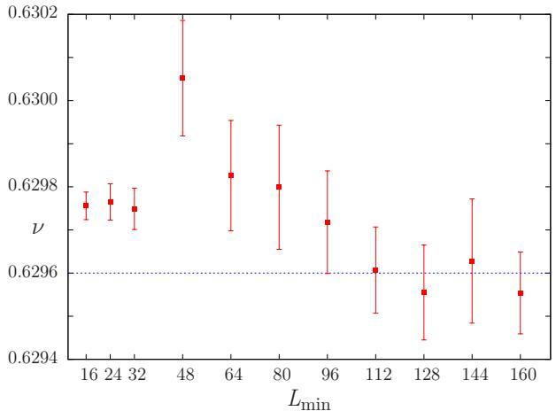
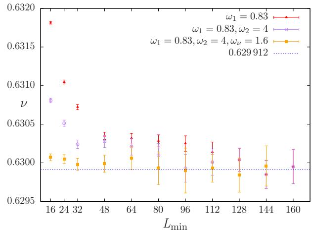
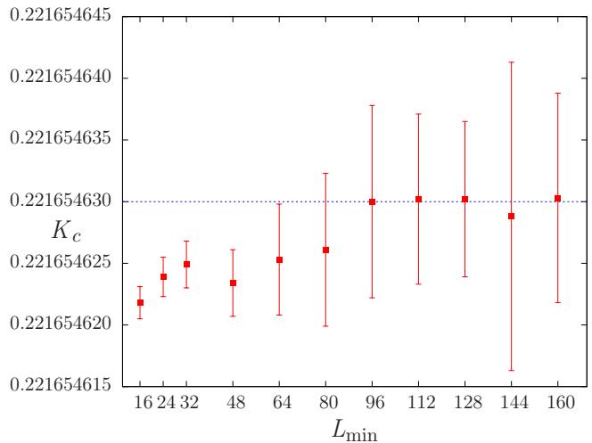
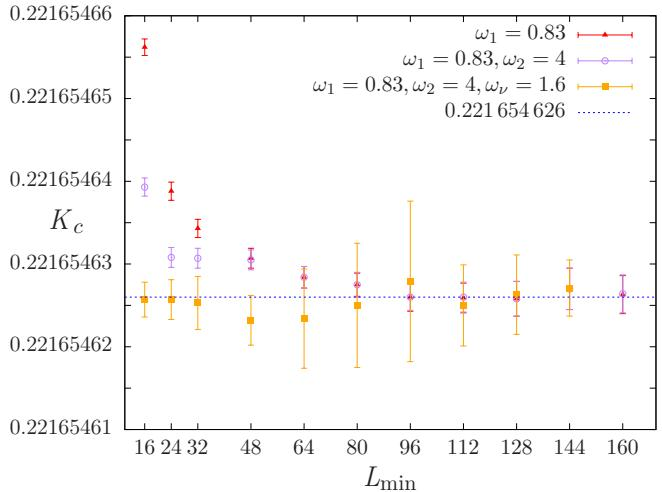
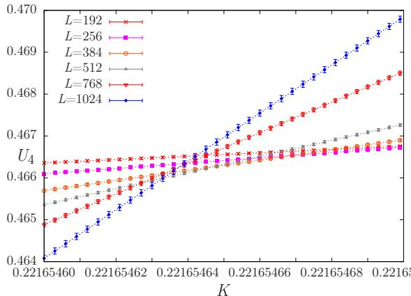
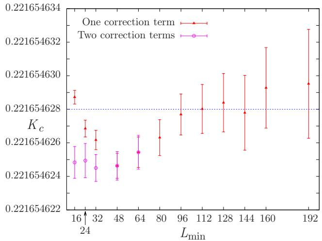
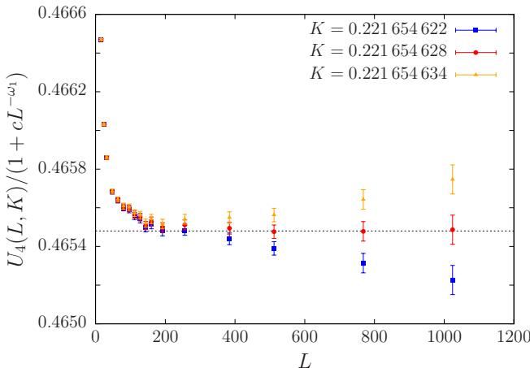
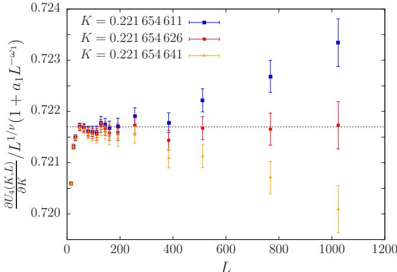

# Pushing the Limits of Monte Carlo Simulations for the 3d Ising Model

Alan M. Ferrenberg $^ { 1 }$ ,\* Jiahao Xu $^ 2$ , and David P. Landau $^ 2$ † $^ { 1 }$ Information Technology Services and Department of Chemical, Paper & Biomedical Engineering, Miami University, Oxford, OH 45056 USA $^ 2$ Center for Simulational Physics, University of Georgia, Athens, GA 30602 USA (Dated: June 12, 2018)

While the 3d Ising model has defied analytic solution, various numerical methods like Monte Carlo, MCRG and series expansion have provided precise information about the phase transition. Using Monte Carlo simulation that employs the Wolff cluster fipping algorithm with both 32-bit and 53-bit random number generators and data analysis with histogram reweighting and quadruple precision arithmetic, we have investigated the critical behavior of the simple cubic Ising Model, with lattice sizes ranging from $1 6 ^ { 3 }$ to $1 0 2 4 ^ { 3 }$ . By analyzing data with cross correlations between various thermodynamic quantities obtained from the same data pool, e.g. logarithmic derivatives of magnetization and derivatives of magnetization cumulants, we have obtained the critical inverse temperature $K _ { c } = 0 . 2 2 1 6 5 4 6 2 6 ( 5 )$ and the critical exponent of the correlation length $\nu = 0 . 6 2 9 9 1 2 ( 8 6 )$ with precision that exceeds all previous Monte Carlo estimates.

PACS numbers: 05.10.Ln, 05.70.Jk, 64.60.F

# I. INTRODUCTION

The Ising Model [1] has played a seminal role in the theory of phase transitions, and has served as a testing ground for innumerable numerical and theoretical approaches. Although it has been solved in one- and twodimension [1, 2], its analytic solution for three-dimension is still a mystery. Nevertheless, by the end of the last century various numerical methods like Monte Carlo [3], nonequilibrium relaxation Monte Carlo [4], Monte Carlo renormalization group [5, 6], field theoretic methods [7, 8] and high-temperature series expansions [9] have provided precise information about the nature of the phase transition [10] and critical exponents, although in some cases the results did not agree within the error bars. In addition, Rosengren made an "exact conjecture" for the critical temperature for the 3d Ising model [11] and the precision of numerical calculations was insufficient to determine if this prediction was correct. Fisher, however, pointed out that a number of other "exact conjectures" could be derived that gave quite similar numerical values [12]. Hence, while rather precise values existed for the 3d Ising critical temperature, there were still unanswered questions. (For a rather complete review of results prior to 2002 see Ref. [10].)

Over the past decade or so, several new developments appeared that reinvigorated interest in the critical behavior of the 3d Ising model. Recently, the conformal bootstrap method, using the constraints of crossing symmetry and unitarity in conformal field theories, has given unparalleled precision in the estimates for the critical exponent $\nu$ for the 3d Ising model [1315]. New Monte Carlo simulation based, in part, on non-perturbative approaches [1618], and tensor renormalization group theory with high-order singularity value decomposition [19] have also yielded very precise results. In clarifying work, Wu, McCoy, Fisher, Chayes and Perk [2022] gave very convincing arguments that a supposed "exact" solution was simply wrong.

Precise numerical estimates for various critical properties play an important role as a testing ground for developing theories and supposed exact solutions, and Monte Carlo simulation is potentially one of the best suited methods for delivering quantitative information about the critical behavior. In this paper, we present the results of high-precision Monte Carlo simulations of critical behavior in the 3d Ising model, using histogram reweighting techniques [23, 24], cross correlation analysis [25, 26] and finite-size scaling methods [2730] to obtain high resolution estimates for the critical coupling and critical exponents.

# II. MODEL AND METHODS

# A. Three-dimensional Ising model

We have considered the simple cubic, ferromagnetic Ising model with nearest-neighbor interactions on $L \times$ $L \times L$ lattices with periodic boundary conditions. Each of the lattice sites $i$ has a spin, $\sigma _ { i }$ , which can take on the values $\sigma _ { i } = + 1$ for spin up and $\sigma _ { i } = - 1$ for spin down. The interaction Hamiltonian is given by

$$
\mathcal { H } = - J \sum _ { \langle i , j \rangle } \sigma _ { i } \sigma _ { j } ,
$$

where $\left. i , j \right.$ denotes distinct pairs of nearest-neighbor sites and $J$ is the interaction constant. We also define the dimensionless energy $E$ as

$$
E = - \sum _ { \langle i , j \rangle } \sigma _ { i } \sigma _ { j } .
$$

In discussing the critical properties of the Ising model, it is easier to deal with the inverse temperature, so we define the dimensionless coupling constant $K = J / k _ { B } T$ and use $K$ for the discussion.

# B. Monte Carlo sampling method

We have simulated $L \times L \times L$ simple cubic lattices using the Wolff cluster fipping algorithm [31]. Single clusters are grown and fipped sequentially. Bonds are drawn to all nearest neighbors of the growing cluster with probability

$$
p = 1 - e ^ { - 2 K \delta _ { \sigma _ { i } \sigma _ { j } } }
$$

To accelerate the Wolff algorithm, we calculated the energy and magnetization by only looking at the spins that actually get flipped in the process. To do that, rather than flipping spins immediately we temporarily set them equal to zero and keep a list of those spins. By setting the spins in that cluster equal to zero we don't calculate the internal energy of the cluster since the energy change only comes from the edges of the cluster. The magnetization change, however, is related to the number of spins in the cluster. After calculating the changes, we go back and set all of the "zeroed" spins to their correct value (flipped from their original value). So we calculate the energy and magnetization once, then add the changes to them to get the new values.

In the simulation, a new random number was generated for each bond update, using the Mersenne Twister random number generator [32]. We have implemented the Mersenne Twister algorithm with using both 32-bit word length and 53-bit word length.

The simulations were performed at $K _ { 0 } ~ = ~ 0 . 2 2 1 6 5 4$ , which is an estimate for the critical inverse temperature $K _ { c }$ by MCRG analysis [6] and also used in an earlier, high resolution Monte Carlo study [3]. Data were obtained for lattices with $1 6 \leq L \leq 7 6 8$ , after $2 \times 1 0 ^ { 5 }$ Wolff steps were discarded for equilibrium. Even for the largest lattice size, $L = 1 0 2 4$ , the system had reached the equilibrium value of the energy by $1 3 0 0 0 0$ cluster steps, and the simulation was then run another ten times the equilibrium relaxation time before data accumulation began. Actual lattice sizes studied were $L = 1 6$ , 24, 32, 48, 64, 80, 96, 112, 128, 144, 160, 192, 256, 384, 512, 768, and 1024. For $L \leq 7 6 8$ we started from an ordered state and the relaxation to equilibrium was less than a thousand Wolff flips in all cases [33]. Our procedure insured not only that equilibrium had been reached but that also correlation with the initial state had been lost. For $L = 1 0 2 4$ we began with random states but our procedure insured that the system had reached equilibrium and that more than 10 times the equilibrium relaxation time had elapsed before data were taken. We performed between 6000 runs to 12 000 runs of $5 \times 1 0 ^ { 6 }$ measurements for each lattice size. In total, we have used around $2 \times 1 0 ^ { 7 }$ CPU core hours and generated more than 5TB data using 5 different Linux clusters. For the largest lattice ( $L = 1 0 2 4$ ), the run length for a single run is around 4000 times the correlation time for the internal energy, and the average cluster size is around $1 . 1 \times 1 0 ^ { 6 }$ .

# C. Histogram reweighting

One limitation on the resolution of Monte Carlo simulations near phase transition is that many runs must be performed at different temperature to precisely locate the peaks in response functions. Using histograms we can extract more information from Monte Carlo simulations [23, 24], because samples taken from a known probability distribution can be translated into samples from another distribution over the same state space.

An importance sampling Monte Carlo simulation (in our case using cluster flipping as described above) is first carried out at the inverse temperature $K _ { 0 }$ to generate configurations with a probability proportional to the Boltzmann weight, $\exp ( - K _ { 0 } { \cal E } )$ . The probability of simultaneously observing the system with total (dimensionless) energy $E$ and total magnetization $M$ is,

$$
P _ { K _ { 0 } } = \frac { 1 } { Z ( K _ { 0 } ) } W ( E , M ) \exp ( K _ { 0 } E ) ,
$$

where $Z ( K _ { 0 } )$ is the partition function, and $W ( E , M )$ is the number of configurations with energy $E$ and magnetization $M$ . Then, a histogram $H _ { 0 } ( E , M )$ of the energy and the magnetization at $K _ { 0 }$ is constructed to provide an estimate for the equilibrium probability distribution. Thus,

$$
H _ { 0 } ( E , M ) = \frac { N } { Z ( K _ { 0 } ) } \tilde { W } ( E , M ) \exp ( - K _ { 0 } E ) ,
$$

where $\tilde { W } ( E , M )$ is an estimate for the true density of states $W ( E , M )$ , $N$ is the number of measurements made. In the limit of an infinite-length run, we can replace $W ( E , M )$ with $\ddot { W } ( E , M )$ , which will yield the relationship between the histogram measured at $K = K _ { 0 }$ and the (estimated) probability distribution for arbitrary $K$ ,

$$
P _ { K } ( E , M ) = \frac { H _ { 0 } ( E , M ) e ^ { \Delta K E } } { \sum _ { E , M } H _ { 0 } ( E , M ) e ^ { \Delta K E } } ,
$$

where $\Delta K = K _ { 0 } - K$ . Based on $P _ { K } ( E , M )$ , we can calculate the average value of any function of $E$ and $M$ , $f ( E , M )$ ,

$$
\langle f ( E , M ) \rangle _ { K } = \sum _ { E , M } f ( E , M ) P _ { K } ( E , M )
$$

As $K$ can be varied continuously, the histogram method is able to locate the peaks for different thermodynamic derivatives precisely (e.g. using the golden-section search technique [34]), and it provides an opportunity to study the critical behavior using Monte Carlo with high resolution.

# D. Quantities to be analyzed

Ferrenberg and Landau [3] showed that the critical exponent $\nu$ of the correlation length can be estimated more precisely from Monte Carlo simulation data if multiple quantities, including traditional quantities which still have the same critical properties, are included. The logarithmic derivative of any power of the magnetization

$$
\frac { \partial \ln \langle | m | ^ { i } \rangle } { \partial K } = \frac { 1 } { \langle | m | ^ { i } \rangle } \frac { \partial \langle | m | ^ { i } \rangle } { \partial K } = \frac { \langle | m | ^ { i } E \rangle } { \langle | m | ^ { i } \rangle } - \langle E \rangle ,
$$

for $i = 1 , 2 , \dots$ , can yield an estimate for $\nu$ and we have considered the logarithmic derivatives of $\langle | m | \rangle$ , $\langle | m | ^ { 2 } \rangle$ , $\langle | m | ^ { 3 } \rangle$ and $\langle | m | ^ { 4 } \rangle$ in this analysis. We also included (reduced) magnetization cumulants $U _ { 2 i }$ [35] defined by

$$
U _ { 2 i } = 1 - \frac { \langle | m | ^ { 2 i } \rangle } { 3 \langle | m | ^ { i } \rangle ^ { 2 } } , \quad i = 1 , 2 , 3 , \dots
$$

whose derivatives with respect to $K$ can also be used to estimate $\nu$ . In this analysis we have considered the second-order, fourth-order and sixth-order cumulants $U _ { 2 }$ , $U _ { 4 }$ and $U _ { 6 }$ .

Once $\nu$ is determined, we can estimate the inverse critical temperature $K _ { c } ( L )$ from the locations of the peaks in the above quantities. Apart from those quantities, we can also use the specific heat

$$
C = K ^ { 2 } L ^ { - d } ( \langle E ^ { 2 } \rangle - \langle E \rangle ^ { 2 } ) ,
$$

the coupling derivative of $| m |$ ,

$$
\frac { \partial \langle | m | \rangle } { \partial K } = \langle | m | E \rangle - \langle | m | \rangle \langle E \rangle ,
$$

the finite-lattice susceptibility,

$$
\chi ^ { \prime } = K L ^ { d } ( \langle | m | ^ { 2 } \rangle - \langle | m | \rangle ^ { 2 } ) ,
$$

and the zero of the fourth-order energy cumulant

$$
Q _ { 4 } = 1 - \frac { \langle ( E - \langle E \rangle ) ^ { 4 } \rangle } { 3 \langle ( E - \langle E \rangle ) ^ { 2 } \rangle ^ { 2 } } .
$$

Note that in Eq. (12), it is the finite-lattice susceptibility, not the "true" susceptibility calculated from the variance of $m$ , $\chi = K L ^ { d } ( \langle m ^ { 2 } \rangle - \langle m \rangle ^ { 2 } )$ . The "true" susceptibility cannot be used to determine $K _ { c } ( L )$ as it has no peak for finite systems. For sufficiently long runs, $\langle m \rangle = 0$ for zero magnetic field ( $h = 0$ ) so that any peak in $\chi$ is merely due to the finite statistics of the simulation.

We have calculated all of the above quantities by using the GCC Quad-Precision Math Library which provides quadruple (128 bit) precision.

# E. Finite-size scaling analysis

At a second order phase transition the critical behavior of a system in the thermodynamic limit can be extracted from the size dependence of the singular part of the free energy density. This finite size scaling theory was first developed by Fisher [2730].

According to finite-size scaling theory, and assuming homogeneity, hyperscaling and using $L$ (linear dimension)and $T$ (temperature) as variables, the free energy of a system is described by the scaling ansatz,

$$
F ( L , T ) = L ^ { - ( 2 - \alpha ) / \nu } \mathcal { F } ( \varepsilon L ^ { 1 / \nu } , h L ^ { ( \gamma + \beta ) / \nu } ) ,
$$

where $\varepsilon = ( T - T _ { c } ) / T _ { c }$ $T _ { c }$ is the infinite-lattice critical temperature) and $h$ is the magnetic field. The critical exponents $\alpha$ , $\beta$ , $\gamma$ and $\nu$ assume their infinite lattice values. The choice of the scaling variable $x = \varepsilon L ^ { 1 / \nu }$ is motivated by the observation that the correlation length, which diverges as $\varepsilon ^ { - \nu }$ as the transition is approached, is limited by the lattice size $L$ . The various thermodynamic properties can be determined from Eq. (14) and have corresponding scaling forms, e.g.,

$$
\begin{array} { l } { { m = L ^ { - \beta / \nu } \mathcal { M } ^ { 0 } ( \varepsilon L ^ { 1 / \nu } ) , } } \\ { { \chi = L ^ { \gamma / \nu } \chi ^ { 0 } ( \varepsilon L ^ { 1 / \nu } ) + b _ { \chi } , } } \\ { { C = L ^ { \alpha / \nu } \mathcal { C } ^ { 0 } ( \varepsilon L ^ { 1 / \nu } ) + b _ { C } , } } \end{array}
$$

where $\mathcal { M } ^ { 0 } ( x )$ , $\chi ^ { 0 } ( x )$ and ${ \mathcal C } ^ { 0 } ( x )$ are scaling functions, and $b _ { \chi } , b _ { C }$ are analytic background terms. Because we are interested in zero-field properties ( $h = 0$ ), $x$ is the only relevant thermodynamic variable.

A number of different practical implementations based on FSS schemes have been derived and successfully applied to the analysis of the critical phenomena [3, 10, 16]. In our analysis, we determine the effective transition temperature very precisely based on the location of peaks in multiple thermodynamic quantities as discussed in Sec. IID.

Take the specific heat $C$ for example, for a finite lattice, the peak occurs at the temperature where the scaling function $\mathcal { C } ^ { 0 }$ is maximum, i.e., when

$$
\frac { \partial \mathcal { C } ^ { 0 } ( x ) } { \partial x } \bigg | _ { x = x ^ { * } } = 0 .
$$

The temperature corresponding to the peak is the finitelattice (effective) transition temperature $T _ { c } ( L )$ , on the condition $x = x ^ { * }$ varies with $L$ asymptotically as

$$
T _ { c } ( L ) = T _ { c } + T _ { c } x ^ { * } L ^ { - 1 / \nu } .
$$

The finite-size scaling ansatz is valid only for sufficiently large lattice size, $L$ , and temperatures sufficiently close to $T _ { c }$ . Corrections to scaling and finite-size scaling must be taken into account for smaller systems and temperatures away from $T _ { c }$ . Basically, there are two kinds of correction terms, one is due to the irrelevant scaling fields which can be expressed in terms of an exponent $\theta$ leading to additional terms like $a _ { 1 } \varepsilon ^ { \theta } + a _ { 2 } \varepsilon ^ { 2 \theta } + \cdot \cdot \cdot$ , while the other is due to the non-linear scaling fields which can be expressed like $b _ { 1 } \varepsilon ^ { 1 } + b _ { 2 } \varepsilon ^ { 2 } + \cdot \cdot \cdot$ . The temperatures that we consider in our analysis differ from $T _ { c }$ (or $\varepsilon = 0$ )

by amounts proportional to $L ^ { - 1 / \nu }$ (Eq. (19)), so that the correction terms can be expressed by the power-law $a _ { 1 } L ^ { - \theta / \nu } + a _ { 2 } L ^ { - 2 \theta / \nu }$ and $b _ { 1 } L ^ { - 1 / \nu } + b _ { 2 } L ^ { - 2 / \nu }$ .

If we take correction terms into account, the estimate for $T _ { c } ( L )$ can be expressed to be

$$
\begin{array} { r l } & { T _ { c } ( L ) = T _ { c } + A _ { 0 } ^ { \prime } L ^ { - 1 / \nu } ( 1 + A _ { 1 } ^ { \prime } L ^ { - \omega _ { 1 } } + A _ { 2 } ^ { \prime } L ^ { - 2 \omega _ { 1 } } + \cdots } \\ & { \qquad + B _ { 1 } ^ { \prime } L ^ { - \omega _ { 2 } } + B _ { 2 } ^ { \prime } L ^ { - 2 \omega _ { 2 } } + \cdots + C _ { 1 } ^ { \prime } L ^ { - ( \omega _ { 1 } + \omega _ { 2 } ) } + \cdots } \\ & { \qquad + D _ { 1 } ^ { \prime } L ^ { - \omega _ { \nu } } + D _ { 2 } ^ { \prime } L ^ { - 2 \omega _ { \nu } } + \cdots + E _ { 1 } ^ { \prime } L ^ { - \omega _ { N R } } + \cdots ) } \end{array}
$$

where $\omega _ { i }$ b $\ i \ = \ 1 , 2 , \ldots$ ) are the correction exponents, $\omega _ { \nu } = 1 / \nu$ is the correction exponent corresponding to the non-linear scaling fields [36], and $\omega _ { N R }$ is the correction exponent due to the rotational invariance of the lattice [37]. As we have defined the coupling as $K = J / k _ { B } T$ , $K _ { c } ( L )$ can be expressed as

$$
\begin{array} { l } { { K _ { c } ( L ) = K _ { c } + A _ { 0 } L ^ { - 1 / \nu } ( 1 + A _ { 1 } L ^ { - \omega _ { 1 } } + A _ { 2 } L ^ { - 2 \omega _ { 1 } } + \cdots } } \\ { { + B _ { 1 } L ^ { - \omega _ { 2 } } + B _ { 2 } L ^ { - 2 \omega _ { 2 } } + \cdots + C _ { 1 } L ^ { - ( \omega _ { 1 } + \omega _ { 2 } ) } + \cdots } } \\ { { + D _ { 1 } L ^ { - \omega _ { \nu } } + D _ { 2 } L ^ { - 2 \omega _ { \nu } } + \cdots + E _ { 1 } L ^ { - \omega _ { N R } } + \cdots ) \ } } \end{array}
$$

Rather than using Eq. (21) to estimate $K _ { c }$ directly, we can first estimate the critical exponent $\nu$ using the quantities discussed in Sec. II D. After obtaining a precise estimate for $\nu$ , we can insert it into Eq. (21), so that there is one less unknown parameter to do the non-linear fit to Eq. (21).

To estimate $\nu$ precisely, we can use the following critical scaling form without the prior knowledge of the transition coupling $K _ { c }$

$$
\begin{array} { l } { \displaystyle \frac { \partial U _ { 2 i } } { \partial K } \bigg | _ { \mathrm { m a x } } = U _ { i , 0 } L ^ { 1 / \nu } ( 1 + a _ { 1 } L ^ { - \omega _ { 1 } } + a _ { 2 } L ^ { - 2 \omega _ { 1 } } + \cdot \cdot \cdot } \\ { \displaystyle \qquad + b _ { 1 } L ^ { - \omega _ { 2 } } + b _ { 2 } L ^ { - 2 \omega _ { 2 } } + \cdot \cdot \cdot + c _ { 1 } L ^ { - ( \omega _ { 1 } + \omega _ { 2 } ) } + \cdot \cdot \cdot } \\ { \displaystyle \qquad + d _ { 1 } L ^ { - \omega _ { \nu } } + d _ { 2 } L ^ { - 2 \omega _ { \nu } } + \cdot \cdot \cdot + e _ { 1 } L ^ { - \omega _ { N R } } + \cdot \cdot \cdot . ) } \end{array}
$$

$$
\begin{array} { r l r } {  { \frac { \partial \ln \langle | m | ^ { i } \rangle } { \partial K } \bigg | _ { \mathrm { m a x } } = D _ { i , 0 } L ^ { 1 / \nu } ( 1 + a _ { 1 } L ^ { - \omega _ { 1 } } + a _ { 2 } L ^ { - 2 \omega _ { 1 } } + \cdot \cdot \cdot } } \\ & { } & { + b _ { 1 } L ^ { - \omega _ { 2 } } + b _ { 2 } L ^ { - 2 \omega _ { 2 } } + \cdot \cdot \cdot + c _ { 1 } L ^ { - ( \omega _ { 1 } + \omega _ { 2 } ) } + \cdot \cdot \cdot } \\ & { } & { + d _ { 1 } L ^ { - \omega _ { \nu } } + d _ { 2 } L ^ { - 2 \omega _ { \nu } } + \cdot \cdot \cdot + e _ { 1 } L ^ { - \omega _ { N R } } + \cdot \cdot \cdot \cdot ) _ { \mathrm { ~ . ~ } } } \end{array}
$$

Once $\nu$ is determined from the fit of Eq. (22) and Eq. (23), we can estimate the critical inverse temperature $K _ { c }$ with a fixed value of $\nu$

Another method which can be used to determine the inverse transition temperature is Binder's 4th order cumulant crossing technique [35]. As the lattice size $L $ $\infty$ , the fourth-order magnetization cumulant $U _ { 4 } \to 0$ for $K \ < \ K _ { c }$ and $U _ { 4 } \to 2 / 3$ for $K > K _ { c }$ . $U _ { 4 }$ can be plotted as a function of $K$ for different lattice sizes, and the location of the intersections between curves for the two lattice sizes is given by

$$
\begin{array} { r } { K _ { \mathrm { c r o s s } } ( L , b ) = K _ { c } + a _ { 1 } L ^ { - 1 / \nu - \omega _ { 1 } } \bigg ( \frac { b ^ { - \omega _ { 1 } } - 1 } { b ^ { 1 / \nu } - 1 } \bigg ) } \\ { + a _ { 2 } L ^ { - 1 / \nu - \omega _ { 2 } } \bigg ( \frac { b ^ { - \omega _ { 2 } } - 1 } { b ^ { 1 / \nu } - 1 } \bigg ) + \cdots , } \end{array}
$$

where $L$ is the size of the smaller lattice, $b = L ^ { \prime } / L$ is the ratio of two lattice sizes, and $\omega _ { 1 }$ , $\omega _ { 2 }$ are correction exponents in the finite-size scaling formulation.

# F. Jackknife method with cross correlations

Ideally, in a Monte Carlo simulation, a configuration only depends on the previous configuration, but in practice, it is also likely to be correlated to earlier configurations. Generally, the farther away two configurations are, the less correlation. Because measurements in the timeseries are correlated, the fluctuations appear smaller than they should be. To deal with this issue, we can consider blocks of the original data, and use jackknife resampling [38].

An important advance was made by Weigel and Janke [25, 26] via the seminal observation that there could be significant cross correlation between different quantities that could lead to systematic bias in the estimates of critical quantities extracted from the data.

Suppose we have a set (sample) of $n$ measurements of a random variable $\mathbf { x } = ( x _ { 1 } , x _ { 2 } , \cdots , x _ { n } )$ , and an estimator ${ \hat { \theta } } = f ( \mathbf { x } )$ . To estimate the value and error of $\hat { \theta }$ the jackknife focuses on the samples that leave out one measurement at a time. We define the jacknife average, $x _ { i } ^ { J }$ by,

$$
x _ { i } ^ { J } = \frac { 1 } { n - 1 } \sum _ { j \neq i } x _ { j } ,
$$

where $i = 1 , 2 , \cdots , n$ , so $x _ { i } ^ { J }$ is the average of all the $x$ values except $x _ { i }$ . Similarly, we define

$$
\hat { \theta } _ { i } ^ { J } = f ( x _ { i } ^ { J } ) .
$$

The jackknife estimate of ${ \hat { \theta } } = f ( \mathbf { x } )$ is the average of $\hat { \theta } _ { i } ^ { J }$ , i.e.

$$
\bar { \theta } = \frac { 1 } { n } \sum _ { i = 1 } ^ { n } \hat { \theta } _ { i } ^ { J } = \frac { 1 } { n } \sum _ { i = 1 } ^ { n } f ( x _ { i } ^ { J } ) ,
$$

and the jackknife error $\sigma ( \hat { \theta } )$ , is given by,

$$
\sigma ( \hat { \theta } ) = \left[ \frac { n - 1 } { n } \sum _ { i = 1 } ^ { n } ( \hat { \theta } _ { i } ^ { J } - \bar { \theta } ) ^ { 2 } \right] ^ { 1 / 2 }
$$

In Eq. (27) and Eq. (28), each data block has only one element, but generally there can be multiple adjacent elements in each block. For example, we can have $n$ data blocks, where each block has $N _ { b } = N / n$ adjacent elements ( $N$ is the total number of measurements in the time series).

When attempting to extract the parameter $\hat { \theta }$ based on multiple estimates $\hat { \theta } ^ { ( k ) } ( k \ = \ 1 , 2 , . . . , m )$ from the same original time-series data, Weigel and Janke [25, 26] showed that there could be significant cross correlation between estimates $\hat { \theta } ^ { ( k ) }$ and ${ \hat { \theta } } ^ { ( l ) }$ . For example, we can determine a number of estimates for $\nu$ from Eq. (22) and Eq. (23). Denoting them $\nu ^ { ( k ) } ( k = 1 , 2 , . . . , m )$ , we obtain different $\nu ^ { ( k ) }$ from different quantities, although they are all calculated from the same configurations of the system.

To reduce the cross correlation effectively, we considered the jackknife covariance matrix $\mathbf { G } \in \mathbb { R } ^ { m \times m }$ [38]. For a number of estimates ${ \hat { \theta } } ^ { ( k ) }$ , the $r ^ { \mathrm { t h } }$ row, $c ^ { \mathrm { t h } }$ column entry of matrix $\mathbf { G }$ is given by,

$$
\mathbf { G } _ { r c } ( \hat { \theta } ) = \frac { n - 1 } { n } \sum _ { i = 1 } ^ { n } ( \hat { \theta } _ { i } ^ { J , ( r ) } - \bar { \theta } ^ { ( r ) } ) ( \hat { \theta } _ { i } ^ { J , ( c ) } - \bar { \theta } ^ { ( c ) } ) .
$$

The $m$ different estimates $\hat { \theta } ^ { ( k ) } ( k = 1 , 2 , . . . , m )$ for the same parameter $\hat { \theta }$ , should have the same expectation value. So the estimated value for $\hat { \theta }$ can be determined by a linear combination,

$$
\bar { \theta } = \sum _ { k = 1 } ^ { m } \alpha _ { k } \hat { \theta } ^ { ( k ) } .
$$

where $\textstyle \sum _ { k } \alpha _ { k } = 1$ . Based on the cross correlation analysis from Ref. [25, 26], a Lagrange multiplier can be introduced, where the constraint $\textstyle \sum _ { k } \alpha _ { k } = 1$ is enforced, to minimize the variance,

$$
\sigma ^ { 2 } ( \hat { \theta } ) = \sum _ { k = 1 } ^ { m } \sum _ { l = 1 } ^ { m } \alpha _ { k } \alpha _ { l } ( \langle { \hat { \theta } } ^ { ( k ) } { \hat { \theta } } ^ { ( l ) } \rangle - \langle { \hat { \theta } } ^ { ( k ) } \rangle \langle { \hat { \theta } } ^ { ( l ) } \rangle ) .
$$

The optimal choice for the weights is,

$$
\alpha _ { k } = \frac { \sum _ { l = 1 } ^ { m } [ \mathbf { G } ( \hat { \boldsymbol { \theta } } ) ^ { - 1 } ] _ { k l } } { \sum _ { k = 1 } ^ { m } \sum _ { l = 1 } ^ { m } [ \mathbf { G } ( \hat { \boldsymbol { \theta } } ) ^ { - 1 } ] _ { k l } } ,
$$

where $\mathbf G ( { \hat { \theta } } ) ^ { - 1 }$ is the inverse of the covariance matrix. Traditionally, the weights are bounded to be $0 \leq \alpha _ { k } \leq 1$ ; however, the optimal choices given in Eq. (32) are the more general unbounded weights, which can be negative. The negative weights may lead to the average lying outside the range of individual estimates, where individual variances are connected due to cross correlations. Thus, they can help alleviate the effect of cross correlations.

Based on the optimal choice for the weights, the variance can be expressed by,

$$
\sigma ^ { 2 } ( \hat { \theta } ) = \frac { 1 } { \sum _ { k = 1 } ^ { m } \sum _ { l = 1 } ^ { m } [ \mathbf { G } ( \hat { \theta } ) ^ { - 1 } ] _ { k l } } .
$$

# G. Testing methodology and quality control

A new challenge that arises at the level of accuracy of this study is the finite precision of the pseudorandom number generator and the restriction this puts on the temperatures that can be simulated. In the Wolff algorithm, the probability of adding a spin to the cluster is related to $K$ by

$$
p = 1 - e ^ { - 2 K \delta _ { \sigma _ { i } \sigma _ { j } } }
$$

When this probability is converted to a 32-bit unsigned number for comparison with pseudorandom numbers generated in the simulation it is truncated from 1537987121.70821 to 1537987121. If that is reconverted back into a value of $K$ the result differs from 0.221 654 in the 10th decimal place. For the largest system sizes, this is only a factor of 20 smaller than the statistical error. By performing simulations with a 53-bit pseudorandom number generator we have verified that this is not significant for the current analysis, but for future studies of larger systems and/or higher precision, a 32-bit random number generator would not be sufficient. For the data analysis we used the corrected effective $K _ { 0 }$ instead of 0.221 654 and for $L = 1 0 2 4$ we used the multiplehistogram method [24] to combine results for the 32 and 53-bit pseudorandom number generators.

To determine the critical quantities (e.g. $\nu$ and $K _ { c }$ ) with high resolution by using finite-size scaling analysis, it is necessary to find the peak values of derivatives of the thermodynamic quantities and their corresponding locations with very high precision. As the imprecision will accumulate during calculation, double precision may not be enough to fulfill the task. Therefore, quadruple precision arithmetic has been used in the data analysis.

Additionally, we have simulated $3 2 ^ { 3 }$ systems with the Wolff cluster flipping algorithm and the Metropolis single spin-flip algorithm. A total of $3 \times 1 0 ^ { 1 0 }$ measurements were taken for each algorithm. The Wolff cluster simulation for $L = 3 2$ was repeated using the MRG32K3A random number generator from Pierre L'Ecuyer, "Combined Multiple Recursive Random Number Generators", Operations Research, 47, 1 (1999), 159-164. (We used the implementation by Guskova, Barash and Shchur in their rngavxlib random number library [39].) The locations and values of the maxima in all quantities were the same, to within the error bars, as those from the Metropolis simulations and the Wolff simulations with the Mersenne Twister; and t-test comparisons yielded no p-values less than 0.2. Hence the problems found by Ferrenberg et al. [40] using other random number generators were not noticeable here. Even though the Mersenne Twister has been tested multiple times, all computer algorithms for generating (pseudo-) random number streams will ultimately produce some small bias that will limit the accuracy of a simulation. While we have not been able to detect such effects, caveat emptor.

TABLE I. Results for the critical exponent $\nu$ when only considering one correction term as a function of $L _ { \mathrm { m i n } }$ .   

<table><tr><td>Lmin</td><td>ν</td></tr><tr><td>16</td><td>0.629 756(32)</td></tr><tr><td>24</td><td>0.629 765(42)</td></tr><tr><td>32</td><td>0.629 749(48)</td></tr><tr><td>48</td><td>0.630 05(13)</td></tr><tr><td>64</td><td>0.629 83(13)</td></tr><tr><td>80</td><td>0.629 80(14)</td></tr><tr><td>96</td><td>0.629 72(12)</td></tr><tr><td>112</td><td>0.629 61(10)</td></tr><tr><td>128</td><td>0.629 56(11)</td></tr><tr><td>144</td><td>0.629 63(14)</td></tr><tr><td>160</td><td>0.629 554(95)</td></tr></table>

# III. RESULTS AND DISCUSSION

# A. Finite-size scaling analysis to determine $\nu$

First, we performed an analysis with only one correction term,

$$
X _ { \mathrm { m a x } } = X _ { 0 } L ^ { 1 / \nu } ( 1 + a _ { 1 } L ^ { - \omega _ { 1 } } )
$$

where $X$ is the quantity we have used to estimate the critical exponent $\nu$ : the logarithmic derivatives $\partial \ln \left. | m | ^ { i } \right. / \partial K$ for $i = 1 , 2 , 3 , 4$ ; the magnetization cumulant derivatives $\partial U _ { 2 i } / \partial K$ for $i = 1 , 2 , 3$ . Least-squares fit has been performed for Eq. (34). $\chi ^ { 2 }$ per degree of freedom (dof) is used as the goodness of the fit, and ideally it is approximately 1, with values too small indicating that the error is too large and values too large indicating a poor quality of fit. In our analysis, the $\chi ^ { 2 }$ per dof is between 0.50 to 1.73 which is a reasonable range.

By calculating the covariance matrix and doing the cross-correlation analysis, we give estimates for $\nu$ in Table I where the minimum lattice size included in the analysis, $L _ { \mathrm { m i n } }$ , is eliminated one by one.

In Fig. 1, we see that the estimated value for the critical exponent $\nu$ seems to be stable for small values of $L _ { \mathrm { m i n } }$ ( $L _ { \operatorname* { m i n } } = 1 6$ , 24, 32). And there is a sudden jump from $L _ { \mathrm { m i n } } = 3 2$ to $L _ { \operatorname* { m i n } } = 4 8$ . Finally, $\nu$ value tends to be stable at the large lattices ( $L _ { \mathrm { m i n } } \ge 1 1 2$ ), around 0.629 60.

The finite-size effect is strong when lattice sizes are small. Only considering one correction term is insufficient, and there is a systematic decrease in the value of $\nu$ as $L _ { \mathrm { m i n } }$ increases. But the first three values for $\nu$ seem to be abnormal. This is a consequence of a single correction term attempting to account for all finite-size effects with estimates for different sizes having different uncertainties. Therefore, the value of the correction exponent from such fits differs from the theoretical prediction (0.83) [14]. Including small lattices, the estimate for the correction exponent is larger than 0.83 and the resulting estimate for $\nu$ is smaller than it should be. It seems to be stable at around 0.629 75 when $L _ { \mathrm { m i n } } \leq 3 2$ . However, in order to minimize the least squares, all fitting parameters would vary altogether. As a single correction term contributes differently for different system sizes, it would result in inconsistent estimates for $\omega$ and $\nu$ . In consequence, more correction terms need to be taken into account.

  
FIG. 1. Results for the critical exponent $\nu$ when only considering one correction term as a function of $L _ { \mathrm { m i n } }$ .

Because of the lack of a sufficient number of degrees of freedom, it is difficult to include two or more correction terms as unknown fitting parameters. However, with the help of the conformal bootstrap [13, 14], we have the theoretical prediction for the confluent correction exponents,

$$
\omega _ { 1 } = 0 . 8 3 0 3 ( 1 8 ) , \quad \omega _ { 2 } \approx 4 .
$$

Additionally, we can consider the correction term corresponding to the non-linear scaling fields [36],

$$
\omega _ { \nu } = 1 / \nu
$$

Also, a correction term due to the rotational invariance of the lattice [37] may play a role,

$$
\omega _ { N R } = 2 . 0 2 0 8 ( 1 2 )
$$

In our analysis we permitted any of the types of correction terms in Eq. (22) and Eq. (23) to contribute an amount that was statistically significant, but due to the finite precision of our estimates for thermodynamic quantities and the limited number of system sizes in the analysis we found that including more than three correction terms did not lead to meaningful fits. Performing least squares fits with 7 different combinations of three correction terms, yielded consistent estimates for the asymptotic values of the critical exponent $\nu$ .

We have found that the best fit was obtained by using $\omega _ { 1 } = 0 . 8 3$ , $\omega _ { 2 } = 4$ and $\omega _ { \nu } = 1 . 6$ . We will show these results in detail.

Thus, the fitting model is,

$$
X _ { \mathrm { m a x } } = X _ { 0 } L ^ { 1 / \nu } ( 1 + a _ { 1 } L ^ { - \omega _ { 1 } } + a _ { 2 } L ^ { - \omega _ { 2 } } + a _ { 3 } L ^ { - \omega _ { \nu } } )
$$

We have considered one fixed correction exponent $\omega _ { 1 } =$ 0.83, two fixed exponents $\omega _ { 1 } = 0 . 8 3$ , $\omega _ { 2 } = 4$ , and three fixed exponents $\omega _ { 1 } ~ = ~ 0 . 8 3$ , $\omega _ { 2 } ~ = ~ 4$ , $\omega _ { \nu } ~ = ~ 1 . 6$ , to the fitting model Eq. (38). The results for $\nu$ are shown in Table II.

TABLE II. Results for the critical exponent $\nu$ when considering one fixed correction exponent $\omega _ { 1 } = 0 . 8 3$ , two fixed exponents $\omega _ { 1 } = 0 . 8 3$ , $\omega _ { 2 } = 4$ , and three fixed exponents $\omega _ { 1 } = 0 . 8 3$ , $\omega _ { 2 } = 4$ , $\omega _ { \nu } = 1 . 6$ as a function of $L _ { \mathrm { m i n } }$ .   

<table><tr><td>Lmin</td><td>ν(ω1 fixed)</td><td>ν(ω1,2 fixed)</td><td>ν(ω1,2,ν fixed)</td></tr><tr><td>16</td><td>0.631 814(18)</td><td>0.630 806(30)</td><td>0.630 072(45)</td></tr><tr><td>24</td><td>0.631 046(26)</td><td>0.630 513(40)</td><td>0.630 049(57)</td></tr><tr><td>32</td><td>0.630 722(33)</td><td>0.630 241(55)</td><td>0.629 980(77)</td></tr><tr><td>48</td><td>0.630 350(48)</td><td>0.630 278(78)</td><td>0.629 99(11)</td></tr><tr><td>64</td><td>0.630 319(62)</td><td>0.630 21(11)</td><td>0.630 06(15)</td></tr><tr><td>80</td><td>0.630 285(78)</td><td>0.630 10(15)</td><td>0.629 93(21)</td></tr><tr><td>96</td><td>0.630 25(10)</td><td>0.629 93(18)</td><td>0.629 90(29)</td></tr><tr><td>112</td><td>0.630 14(13)</td><td>0.630 01(17)</td><td>0.629 93(18)</td></tr><tr><td>128</td><td>0.630 04(15)</td><td>0.630 04(15)</td><td>0.629 84(22)</td></tr><tr><td>144</td><td>0.629 85(18)</td><td>0.629 85(18)</td><td>0.629 96(26)</td></tr><tr><td>160</td><td>0.629 95(22)</td><td>0.629 95(22)</td><td></td></tr></table>

  
FIG. 2. Results for the critical exponent $\nu$ when considering one fixed correction exponent $\omega _ { 1 } = 0 . 8 3$ , two fixed exponents $\omega _ { 1 } ~ = ~ 0 . 8 3$ , $\omega _ { 2 } ~ = ~ 4$ , and three fixed exponents $\omega _ { 1 } ~ = ~ 0 . 8 3$ , $\omega _ { 2 } = 4$ , $\omega _ { \nu } = 1 . 6$ as a function of $L _ { \mathrm { m i n } }$ .

In Fig. 2, we see that, with only one fixed confluent correction exponent ( $\omega _ { 1 } ~ = ~ 0 . 8 3$ ), the estimated value for the critical exponent $\nu$ decreases as $L _ { \mathrm { m i n } }$ increases if $L _ { \mathrm { m i n } } ~ \leq ~ 1 2 8$ The $\nu$ value seems to be stable if $L _ { \mathrm { m i n } } \ge 1 2 8$ . $\chi ^ { 2 }$ per dof is very high when $L _ { \mathrm { m i n } }$ is small, which indicates that only considering one correction term into the fit is inadequate, especially for the small lattice sizes ( $L _ { \operatorname* { m i n } } = 1 6$ , 24, 32). When considering two fixed confluent correction exponents ( $\omega _ { 1 } = 0 . 8 3$ , $\omega _ { 2 } = 4$ ), $\nu$ value decreases systematically up to $L _ { \mathrm { m i n } } = 9 6$ . After that, the $\nu$ value appears to be statistically fluctuating. Still, $\chi ^ { 2 }$ per dof is high when $L _ { \mathrm { m i n } }$ is small, which means that two correction terms are not enough for small lattice sizes ( $L _ { \operatorname* { m i n } } = 1 6$ , 24). Compared with the analysis with only one fixed correction exponent, the estimates for $\nu$ are very consistent when $L _ { \operatorname* { m i n } } ~ \geq ~ 1 2 8$ . This is because when $L _ { \mathrm { m i n } }$ becomes large enough, the second confluent correction term contributes little.

TABLE III. Results for the critical exponent $\nu$ from jackknife analysis on estimates for $\nu$ that are from the three correction terms analysis for values of $L _ { \mathrm { m i n } }$ within the ranges shown.   

<table><tr><td>Lmin</td><td>ν</td></tr><tr><td>16-144</td><td>0.629 97(21)</td></tr><tr><td>24-144</td><td>0.629 96(19)</td></tr><tr><td>32-144</td><td>0.629 95(16)</td></tr><tr><td>48-144</td><td>0.629 94(16)</td></tr><tr><td>64-144</td><td>0.629 94(15)</td></tr><tr><td>80-144</td><td>0.629 912(86)</td></tr><tr><td>96-144</td><td>0.629 908(81)</td></tr></table>

When considering three correction exponents, two for confluent corrections ( $\omega _ { 1 } = 0 . 8 3$ , $\omega _ { 2 } ~ = ~ 4$ )and one for the non-linear scaling fields ( $\omega _ { \nu } ~ = ~ 1 . 6$ ), the estimated value for the critical exponent $\nu$ seems to be statistically fluctuating. $\chi ^ { 2 }$ per dof for each quantity is between 0.53 to 1.78, which is reasonable. But, all estimates for the critical exponent $\nu > 0 . 6 2 9 9 7$ if $L _ { \mathrm { m i n } } ~ < ~ 8 0$ , while $\nu < 0 . 6 2 9 9 7$ if $L _ { \mathrm { m i n } } ~ \ge ~ 8 0$ . It seems that there is still a systematic decrease of $\nu$ as $L _ { \mathrm { m i n } }$ increases. Therefore, the value for $\nu$ is estimated by taking the average of $\nu$ obtained from different fits for different $L _ { \mathrm { m i n } }$ varying from 80 to 144, $\nu = 0 . 6 2 9 9 1 2$ . To estimate the error of $\nu$ , we used the jackknife method on estimates of $\nu$ from three correction term analysis using different ranges of $L _ { \mathrm { m i n } }$ : consider estimates for $\nu$ from $L _ { \mathrm { m i n } } = 9 6$ to 144, then do a jackknife analysis to estimate the value and error of $\nu$ . Add one $\nu$ value corresponding to $L _ { \mathrm { m i n } } = 8 0$ , then do a jackknife analysis from $L _ { \mathrm { m i n } } = 8 0$ to 144. Do this one by one, up to the analysis from $L _ { \operatorname* { m i n } } = 1 6$ to 144. Results are shown in Table III.

Based on the values of $L _ { \mathrm { m i n } }$ to estimate the value of $\nu$ (from 80 to 144), we find

$$
\nu = 0 . 6 2 9 9 1 2 ( 8 6 ) .
$$

# B. Finite-size scaling analysis to determine $K _ { c }$

To estimate the critical coupling $K _ { c }$ , we have considered the location of the peak of the logarithmic derivatives $\partial \ln \left. | m | ^ { i } \right. / \partial K$ for $i = 1 , 2 , 3 , 4$ ; the magnetization cumulant derivatives $\partial U _ { 2 i } / \partial K$ for $i = 1 , 2 , 3$ ; the specific heat $C$ ; the derivative of the modulus of the magnetization $\partial \langle | m | \rangle / \partial K$ ; the finite-lattice susceptibility $\chi ^ { \prime }$ ; as well as the location of zero of the fourth-order energy cumulant $Q _ { 4 }$ .

First, estimate the critical coupling $K _ { c }$ with one correction term,

$$
K _ { c } ( L ) = K _ { c } + A _ { 0 } L ^ { - 1 / \nu } ( 1 + A _ { 1 } L ^ { - \omega _ { 1 } } )
$$

where the critical exponent is fixed to be $\nu = 0 . 6 2 9 9 1 2$ , and the correction exponent $\omega _ { 1 }$ is unfixed. Except in the situation where $L _ { \mathrm { m i n } } ~ = ~ 1 6$ for $\partial \langle | m | \rangle / \partial K$ , the $\chi ^ { 2 }$ per degree of freedom is high (2.76), in other cases, $\chi ^ { 2 }$ per dof is acceptable.

TABLE IV. Results for the critical coupling $K _ { c }$ when only considering one correction term as a function of $L _ { \mathrm { m i n } }$ .   

<table><tr><td>Lmin</td><td>Kc</td></tr><tr><td>16</td><td>0.221 654 621 8(13)</td></tr><tr><td>24</td><td>0.221 654 623 9(16)</td></tr><tr><td>32</td><td>0.221 654 624 9(19)</td></tr><tr><td>48</td><td>0.221 654 623 4(27)</td></tr><tr><td>64</td><td>0.221 654 625 3(45)</td></tr><tr><td>80</td><td>0.221 654 626 1(62)</td></tr><tr><td>96</td><td>0.221 654 630 0(78)</td></tr><tr><td>112</td><td>0.221 654 630 2(69)</td></tr><tr><td>128</td><td>0.221 654 630 2(63)</td></tr><tr><td>144</td><td>0.221 654 628(13)</td></tr><tr><td>160</td><td>0.221 654 630 3(85)</td></tr></table>

  
FIG. 3. Results for the critical coupling $K _ { c }$ with only one correction term included in the fitting as a function of $L _ { \mathrm { m i n } }$ .

By calculating the covariance matrix and doing the cross correlation analysis, we estimated $K _ { c }$ as shown in Table IV. Minimum lattice size $L _ { \mathrm { m i n } }$ that is taken into account is eliminated one by one.

In Fig. 3, we can see that, the estimated value for the critical coupling $K _ { c }$ appears to be stable if $L _ { \operatorname* { m i n } } ~ \geq ~ 9 6$ , around 0.221 654 630.

Similar to the analysis to determine $\nu$ we used seven different combinations of the three correction terms and found that the choice had negligible impact on the estimate for $K _ { c }$ . The best fit was obtained by using $\omega _ { 1 } = 0 . 8 3$ , $\omega _ { 2 } = 4$ and $\omega _ { \nu } = 1 . 6$ . We will show these results in detail.

With the help of the theoretical prediction, we have considered one fixed correction exponent $\omega _ { 1 } = 0 . 8 3$ , two fixed exponents $\omega _ { 1 } = 0 . 8 3$ , $\omega _ { 2 } = 4$ , and three fixed exponents $\omega _ { 1 } = 0 . 8 3$ , $\omega _ { 2 } = 4$ , $\omega _ { \nu } = 1 . 6$ , to the fitting model Eq. (41).

$$
\begin{array} { r } { K _ { c } ( L ) = K _ { c } + A _ { 0 } L ^ { - 1 / \nu } ( 1 + A _ { 1 } L ^ { - \omega _ { 1 } } + A _ { 2 } L ^ { - \omega _ { 2 } } + A _ { 3 } L ^ { - \omega _ { \nu } } ) } \end{array}
$$

  
FIG. 4. Results for the critical coupling $K _ { c }$ when considering one fixed correction exponent $\omega _ { 1 } = 0 . 8 3$ , two fixed exponents $\omega _ { 1 } ~ = ~ 0 . 8 3$ , $\omega _ { 2 } ~ = ~ 4$ , and three fixed exponents $\omega _ { 1 } ~ = ~ 0 . 8 3$ , $\omega _ { 2 } = 4$ , $\omega _ { \nu } = 1 . 6$ as a function of $L _ { \mathrm { m i n } }$ .

The results for $K _ { c }$ are shown in Table V.

In Fig. 4, we can see that, when considering only one fixed confluent correction exponent ( $\omega _ { 1 } = 0 . 8 3$ ), the estimated value for the critical coupling $K _ { c }$ decreases as $L _ { \mathrm { m i n } }$ increases if $L _ { \mathrm { m i n } } \leq 8 0$ . The $K _ { c }$ value appears to be stable if $L _ { \mathrm { m i n } } \ge 8 0$ b $\chi ^ { 2 }$ per dof is very high when $L _ { \mathrm { m i n } }$ is small, which means that the quality of the fit is not good with one correction term when the lattice size is small ( $L _ { \operatorname* { m i n } } = 1 6$ , 24, 32). When considering two fixed confluent correction exponents ( $\omega _ { 1 } = 0 . 8 3$ , $\omega _ { 2 } = 4$ ), the $K _ { c }$ value decreases systematically up to $L _ { \mathrm { m i n } } ~ = ~ 8 0$ as well. After that, the $K _ { c }$ value appears to be statistically fluctuating. Still, $\chi ^ { 2 }$ per dof is high when $L _ { \mathrm { m i n } }$ is small, which indicates that two correction terms are not enough for small lattice sizes ( $L _ { \operatorname* { m i n } } = 1 6$ , 24). Compared with the analysis with only one fixed correction exponent, the estimates for $K _ { c }$ are highly consistent when $L _ { \operatorname* { m i n } } \ge 6 4$ . This is because when $L _ { \mathrm { m i n } }$ becomes large enough, the second confluent correction term contributes little, and these two analyses tend to generate similar results.

When considering three correction exponents, two for confluent corrections ( $\omega _ { 1 } = 0 . 8 3$ , $\omega _ { 2 } ~ = ~ 4$ ) and one for non-linear scaling fields ( $\omega _ { \nu } = 1 . 6$ ), $\chi ^ { 2 }$ per dof for each quantity is decent except the following cases:

$\chi ^ { 2 }$ per $\mathrm { d o f = 2 . 5 2 }$ , if $L _ { \mathrm { m i n } } = 1 4 4$ for $\partial \ln \left. \left| m \right| \right. / \partial K$ , $\chi ^ { 2 }$ per $\mathrm { d o f } = 2 . 4 1$ , if $L _ { \mathrm { m i n } } = 1 4 4$ for $\partial \ln \left. | m | ^ { 2 } \right. / \partial K$ , $\chi ^ { 2 }$ per $\mathrm { d o f = 2 . 3 4 }$ , if $L _ { \mathrm { m i n } } = 1 4 4$ for $\chi ^ { \prime }$ , $\chi ^ { 2 }$ per $\mathrm { d o f } = 2 . 8 9$ , if $L _ { \mathrm { m i n } } = 1 4 4$ for $\partial U _ { 4 } / \partial K$ , $\chi ^ { 2 }$ per $\mathrm { d o f } = 2 . 8 4$ , if $L _ { \mathrm { m i n } } = 1 4 4$ for $\partial U _ { 6 } / \partial K$ .

This is because of the lack of degrees of freedom when $L _ { \mathrm { m i n } }$ is large.

The estimated value for the critical coupling $K _ { c }$ appears to be statistically fluctuating. The fluctuation of $K _ { c }$ when $L _ { \mathrm { m i n } } ~ \leq ~ 8 0$ is larger than the one when $L _ { \mathrm { m i n } } ~ \ge ~ 8 0$ . Additionally, finite-size effect reduces as larger lattice sizes are considered. Thus, the value of

TABLE V. Results for the critical coupling $K _ { c }$ from fits with: (left column) a single correction term (fixed correction exponent $\omega _ { 1 } = 0 . 8 3$ ); (center column) two correction terms (fixed exponents $\omega _ { 1 } = 0 . 8 3$ , $\omega _ { 2 } = 4$ ; and (right column) three correction terms (fixed exponents $\omega _ { 1 } = 0 . 8 3$ , $\omega _ { 2 } = 4$ , $\omega _ { \nu } = 1 . 6$ ) as a function of $L _ { \mathrm { m i n } }$ .   

<table><tr><td>Lmin</td><td>Kc(1 fixed ω)</td><td>Kc(2 fixed ω)</td><td>Kc(3 fixed ω)</td></tr><tr><td>16</td><td>0.221 654 656 2(10)</td><td>0.221 654 639 3(11)</td><td>0.221 654 625 7(21)</td></tr><tr><td>24</td><td>0.221 654 638 8(11)</td><td>0.221 654 630 8(12)</td><td>0.221 654 625 7(24)</td></tr><tr><td>32</td><td>0.221 654 634 3(11)</td><td>0.221 654 630 7(12)</td><td>0.221 654 625 3(32)</td></tr><tr><td>48</td><td>0.221 654 630 7(12)</td><td>0.221 654 630 5(12)</td><td>0.221 654 623 2(30)</td></tr><tr><td>64</td><td>0.221 654 628 4(13)</td><td>0.221 654 628 4(13)</td><td>0.221 654 623 4(60)</td></tr><tr><td>80</td><td>0.221 654 627 5(14)</td><td>0.221 654 627 5(15)</td><td>0.221 654 625 0(75)</td></tr><tr><td>96</td><td>0.221 654 626 0(17)</td><td>0.221 654 626 0(16)</td><td>0.221 654 627 9(97)</td></tr><tr><td>112</td><td>0.221 654 625 9(18)</td><td>0.221 654 626 0(18)</td><td>0.221 654 625 0(49)</td></tr><tr><td>128</td><td>0.221 654 625 8(21)</td><td>0.221 654 625 8(21)</td><td>0.221 654 626 3(48)</td></tr><tr><td>144</td><td>0.221 654 627 0(25)</td><td>0.221 654 627 0(25)</td><td>0.221 654 627 1(34)</td></tr><tr><td>160</td><td>0.221 654 626 3(23)</td><td>0.221 654 626 4(23)</td><td></td></tr></table>

TABLE VI. Results for the critical coupling $K _ { c }$ from jackknife analysis on estimates for $K _ { c }$ that are from the three correction terms analysis.   

<table><tr><td>Lmin</td><td>Kc</td></tr><tr><td>16-144</td><td>0.221 654 625 5(42)</td></tr><tr><td>24-144</td><td>0.221 654 625 4(41)</td></tr><tr><td>32-144</td><td>0.221 654 625 4(41)</td></tr><tr><td>48-144</td><td>0.221 654 625 4(40)</td></tr><tr><td>64-144</td><td>0.221 654 625 8(33)</td></tr><tr><td>80-144</td><td>0.221 654 626 2(23)</td></tr><tr><td>96-144</td><td>0.221 654 626 6(18)</td></tr></table>

$K _ { c }$ is estimated through the average of $K _ { c }$ for $L _ { \mathrm { m i n } } ~ { = }$ 80 to 144, which is $0 . 2 2 1 6 5 4 6 2 6 2$ . Likewise, a jackknife analysis has been done on the estimates for $K _ { c }$ which are obtained from the three correction terms analysis. Results are shown in Table VI.

Based on the values of $L _ { \mathrm { m i n } }$ from 80 to 144 we estimate $K _ { c } = 0 . 2 2 1 6 5 4 6 2 6 2 ( 2 3 )$ .whereas using $L _ { \operatorname* { m i n } } = 1 6$ to 144, the estimate for the critical coupling would be, $K _ { c } =$ 0.221 654625 5(42). Therefore, our final estimate from the finite size scaling analysis, with conservative error bars, is

$$
K _ { c } = 0 . 2 2 1 6 5 4 6 2 6 ( 5 ) .
$$

# C. Crossing technique of the 4th order magnetization cumulant

As the lattice size $L  \infty$ , the fourth-order magnetization cumulant $U _ { 4 } \to 0$ for $K \ < \ K _ { c }$ and $U _ { 4 } \to 2 / 3$ for $K > K _ { c }$ . For large enough lattice sizes, curves for $U _ { 4 }$ cross as a function of inverse temperature at a "fixed point" $U ^ { * }$ , and the location of the crossing "fixed point" is $K _ { c }$ . Because the lattices are not infinitely large, finitesize correction terms will prevent all curves from crossing at a common intersection (as in Fig. 5). However, Fig. 5 gives us a preliminary estimate for $K _ { c }$ .

  
FIG. 5. Inverse temperature $K$ dependence of the fourth order magnetization cumulant $U _ { 4 }$ for $L \times L \times L$ Ising lattices.

TABLE VII. Results for the critical coupling $K _ { c }$ obtained using the cumulant crossing technique with one correction term.   

<table><tr><td>Lmin</td><td>Kc</td><td>dof</td><td>χ 2 per dof</td></tr><tr><td>16</td><td>0.221 654 628 72(41)</td><td>131</td><td>1.64</td></tr><tr><td>24</td><td>0.221 654 626 85(50)</td><td>115</td><td>1.10</td></tr><tr><td>32</td><td>0.221 654 626 17(58)</td><td>100</td><td>1.06</td></tr><tr><td>48</td><td>0.221 654 624 63(75)</td><td>86</td><td>0.88</td></tr><tr><td>64</td><td>0.221 654 625 44(91)</td><td>73</td><td>0.89</td></tr><tr><td>80</td><td>0.221 654 626 3(11)</td><td>61</td><td>0.90</td></tr><tr><td>96</td><td>0.221 654 627 7(12)</td><td>50</td><td>0.84</td></tr><tr><td>112</td><td>0.221 654 628 0(15)</td><td>40</td><td>0.93</td></tr><tr><td>128</td><td>0.221 654 628 4(17)</td><td>31</td><td>1.04</td></tr><tr><td>144</td><td>0.221 654 627 8(22)</td><td>23</td><td>1.18</td></tr><tr><td>160</td><td>0.221 654 629 3(24)</td><td>16</td><td>1.29</td></tr><tr><td>192</td><td>0.221 654 629 5(33)</td><td>10</td><td>1.70</td></tr></table>

The locations of the cumulant crossings have been fitted to Eq. (24) with one correction term. All of the parameters are allowed to vary independently, i.e., no fixed values for $\nu$ and $\omega$ . Results are shown in Table VII, where $L _ { \mathrm { m i n } }$ is the minimum lattice size taken into account.

TABLE VIII. Results for the critical coupling $K _ { c }$ by using cumulant crossing technique with two correction terms.   

<table><tr><td>Lmin</td><td>Kc</td><td>dof</td><td>$χ 2 per dof</td></tr><tr><td>16</td><td>0.221 654 624 83(95)</td><td>129</td><td>0.94</td></tr><tr><td>24</td><td>0.221 654 624 9(10)</td><td>113</td><td>0.96</td></tr><tr><td>32</td><td>0.221 654 624 50(80)</td><td>98</td><td>0.85</td></tr><tr><td>48</td><td>0.221 654 624 63(85)</td><td>84</td><td>0.90</td></tr><tr><td>64</td><td>0.221 654 625 4(10)</td><td>71</td><td>0.91</td></tr></table>

  
FIG. 6. Results for the critical coupling $K _ { c }$ using cumulant crossings with one correction term and two correction terms.

Additionally, the locations of the cumulant crossings have been fitted to Eq. (24) with two correction terms. Results are shown in Table VIII. For $L _ { \operatorname* { m i n } } > 2 4$ , the second correction term is ill-defined, and by $L _ { \mathrm { m i n } } = 8 0$ , the calculation gives identical values for the two correction exponents. This is because we lack precision to include two correction terms for the crossing technique.

In Fig. 6, the critical coupling appears to be stable if $L _ { \mathrm { m i n } } ~ \ge ~ 9 6$ . The value of $K _ { c }$ can be estimated by taking the average of $K _ { c }$ values for $L _ { \mathrm { m i n } } ~ \ge ~ 9 6$ , which is $0 . 2 2 1 6 5 4 6 2 8 4$ . A jackknife analysis has been done on the estimates for $K _ { c }$ that are from the one correction term analysis. Results are shown in Table IX.

Using results for $L _ { \mathrm { m i n } }$ (96 to 192) we estimate

$$
K _ { c } = 0 . 2 2 1 6 5 4 6 2 8 ( 2 )
$$

# D. Alternative finite-size scaling analysis

In Sec. III A, a finite-size scaling analysis was performed by looking at the magnitude of quantities at the peak locations. Alternatively, critical exponents can be estimated by looking at quantities at our estimate for $K _ { c }$ (denoted $K _ { c } ^ { e s t } = 0 . 2 2 1 6 5 4 6 2 6$ , i.e. the estimated value for $K _ { c }$ for an infinite lattice).

$$
X ( K = K _ { c } ^ { e s t } ) = X _ { 0 } L ^ { \lambda } ( 1 + a _ { 1 } L ^ { - \omega _ { 1 } } + \cdots ) ,
$$

TABLE IX. Results for the critical coupling $K _ { c }$ by using jackknife analysis on estimates for $K _ { c }$ that are from the cumulant crossing technique with one correction term analysis.   

<table><tr><td>Lmin</td><td>Kc</td></tr><tr><td>16-144</td><td>0.221 654 627 4(49)</td></tr><tr><td>24-144</td><td>0.221 654 627 3(47)</td></tr><tr><td>32-144</td><td>0.221 654 627 3(46)</td></tr><tr><td>48-144</td><td>0.221 654 627 5(45)</td></tr><tr><td>64-144</td><td>0.221 654 627 8(34)</td></tr><tr><td>80-144</td><td>0.221 654 628 1(24)</td></tr><tr><td>96-144</td><td>0.221 654 628 4(16)</td></tr><tr><td>112-144</td><td>0.221 654 628 6(14)</td></tr><tr><td>128-144</td><td>0.221 654 628 7(12)</td></tr></table>

where $X$ is the quantity being used to determine the critical exponent $\lambda$ . For the susceptibility and the specific heat Eq. (44) includes an analytic background term.

$\nu$ can be estimated from derivatives of magnetization cumulants and logarithmic derivatives of the magnetization at $K _ { c } ^ { e s t }$ . By doing the fit with three fixed correction exponents, and by calculating the jackknife covariance matrix and doing the cross correlation analysis, we find $\nu$ to be

$$
\nu = 0 . 6 2 9 9 3 ( 1 0 ) .
$$

This result agrees with the value of $\nu$ estimated from Eq. (39).

By examining the scaling behavior of the susceptibility at $K _ { c } ^ { e s t }$ , we have found that $\gamma / \nu = 1 . 9 6 3 9 0 ( 4 5 )$ . Combining this value with our estimate for $\nu$ at Eq. (39), and assuming that exponent estimates for $\gamma$ and $\nu$ are independent, we have determined the critical exponent $\gamma$ of the magnetic susceptibility to be

$$
\gamma = 1 . 2 3 7 0 8 ( 3 3 ) .
$$

We also performed an analysis of the susceptibility at constant $U _ { 4 }$ as suggested by Hasenbusch [16]. Fixing $U _ { 4 } ~ = ~ 0 . 4 6 5 5$ and including the higher order confluent corrections to scaling we found that $\gamma = 1 . 2 3 7 0 1 ( 2 8 )$ , a value that is almost identical to, and with only a slightly smaller error bar than, the value obtained from finite size scaling of the susceptibility.

Because of the large analytic background in the specific heat (see Eq. (17)), it was not possible to extract estimates of the exponent $\alpha$ with comparable precision to the other exponents evaluated here. For this reason, we have not quoted an estimated value.

Similarly, by considering the critical behavior of $| m |$ at $K _ { c } ^ { e s t }$ w e obtained $\beta / \nu = 0 . 5 1 8 0 1 ( 3 5 )$ , or

$$
\beta = 0 . 3 2 6 3 0 ( 2 2 ) .
$$

# E. Self-consistency check

Inspired by a recent 3d bond and site percolation study [41], a noticeable off-critical behavior would be observed

  
FIG. 7. Plot of the 4th order magnetization cumulant as a function of $L$ for fixed $K$ values. The value of $c$ was estimated by doing a fit for $U _ { 4 }$ by Eq. (48). The dashed line indicates our asymptotic value for $U ^ { * }$ .

when Monte Carlo data are 3 error bars away from the critical point.

Following is the cumulant's ansatz [35],

$$
U _ { 4 } ( L ) = U ^ { * } ( 1 + c L ^ { - \omega _ { 1 } } )
$$

where $U _ { 4 }$ is the 4th order cumulant and $U ^ { * }$ is a "fixed point".

To justify our quoted error bars for the crossing technique, $K _ { c } ~ = ~ 0 . 2 2 1 6 5 4 6 2 8 ( 2 )$ , we performed a plot of 4th order magnetization cumulant at $K = 0 . 2 2 1 6 5 4 6 2 2$ , 0.221 654 628 and $0 . 2 2 1 6 5 4 6 3 4$ in Fig. 7. The value of $c$ was estimated by doing a fit for the cumulant by Eq. (48). It was generated at the estimated critical inverse temperature, with a fixed correction exponent $\omega _ { 1 } ~ = ~ 0 . 8 3$ , over the range of $L = 1 4 4$ to 1024. It can be seen that, the data at $K \ : = \ : 0 . 2 2 1 6 5 4 6 2 2$ and $K \ : = \ : 0 . 2 2 1 6 5 4 6 3 4$ begin to diverge as $L$ increases, while the data at $K =$ 0.221 654 628 converge to $U ^ { * } = 0 . 4 6 5 4 8 ( 5 )$ . Our estimate is consistent with 0.465 45(13) from Blöte et al [42], but higher than 0.465 306(34) from Deng and Blöte [43].

Similarly, a plot of the derivative of the 4th order magnetization cumulant is shown in Fig. 8. Based on the FSS estimate $K _ { c } = 0 . 2 2 1 6 5 4 6 2 6 ( 5 )$ in Sec. IIIB, the data away from the estimated critical point by 3 error bars have a noticeable divergence.

All in all, Fig. 7 and Fig. 8 indicate that our quoted error bars for $K _ { c }$ from the crossing technique and the FSS are reliable.

# F. Discussion

It is only because of the combination of an efficient, cluster-flipping Monte Carlo algorithm, high statistics simulations, histogram reweighting, and a crosscorrelation jackknife analysis that we were able to achieve the high resolution results presented earlier in this Section. Now, we can compare our estimates for $K _ { c }$ and $\nu$ with other high-resolution result from simulation and theory. Table X shows the comparison.

  
FIG. 8. Plot of the derivative the 4th order magnetization cumulant as a function of $L$ for fixed $K$ values. The value of $a _ { 1 }$ was estimated by doing a fit for $\partial U _ { 4 } / \partial K$ by Eq. (44).

In Sec. III A, we determined the critical exponent of the correlation length $\nu = 0 . 6 2 9 9 1 2 ( 8 6 )$ . Our value is perfectly consistent (i.e. within the error bars) with the recent conformal bootstrap result of Kos et al. [15], as well as that from an older work by El-Showk et al. [14]. In addition, our result agrees with the high-temperature result of Butera and Comi [9], Monte Carlo result of Deng and Blöte [43], and nonequilibrium relaxation Monte Carlo result of Ozeki and Ito [4]. Also, our result agrees well with the Monte Carlo result of Hasenbusch [16] but is lower than that of Weigel and Janke [26]; however, within the respective error bars there is agreement although we have substantially higher precision than either of these previous studies. Our system sizes and statistics are substantially greater than those used by Weigel and Janke, and Hasenbusch examined the behavior of the ratio of partition functions $Z _ { a } / Z _ { p }$ , and the second moment correlation length over the linear lattice size $\xi _ { 2 } / L$ so the methodologies are not identical. Our estimate for $K _ { c }$ differs from that obtained by Kaupuzs et al [17] using a parallel Wolff algorithm by an amount that barely agrees to within the error bars. Somewhat perplexingly, they were able to fit their data to two rather different values of $\nu$ , so no comparison of critical exponents is possible.

The recent tensor renormalization group result for $K _ { c }$ [19] does not agree with our result; in fact the difference is many times the respective error bars.

To place these results in perspective, it is interesting to note that as far back as 1982 Gaunt's high temperature series expansions [44] gave the estimate $K _ { c } = 0 . 2 2 1 6 6 ( 1 )$ and in 1983 Adler [45] estimated $0 . 2 2 1 6 5 5 < K _ { c } <$ 0.221 656 with confluent corrections included in the analysis.

Neither the Rosengren's "exact conjecture" nor

TABLE X. Comparison of our results for the critical coupling $K _ { c }$ and the critical exponents $\nu$ , $\gamma$ with other recently obtained Te s o i ey, u is la yi $\gamma = \nu ( 2 - \eta )$ . The error is calculated using simple error propagation, which assumes that $\nu$ and $\eta$ are independent and uncorrelated. a Special purpose computer.   

<table><tr><td>Reference</td><td>Method</td><td>Kc</td><td>ν</td><td>γ</td></tr><tr><td>Butera and Comi(2002) [9]</td><td>HT series</td><td>0.221 655(2)</td><td>0.629 9(2)</td><td>1.237 1(1)</td></tr><tr><td>Blöte et al.(1999) [42]a</td><td>MC</td><td>0.221 654 59(10)</td><td>0.630 32(56)</td><td>1.237 2(13)*</td></tr><tr><td>Deng and Blöte(2003) [43]</td><td>MC</td><td>0.221 654 55(3)</td><td>0.630 20(12)</td><td>1.2372(4)*</td></tr><tr><td>Ozeki and Ito(2007) [4]b</td><td>MC NL relax</td><td>0.221 654 7(5)</td><td>0.635(5)</td><td>1.255(18)*</td></tr><tr><td>Weigel and Janke(20í0) [26]</td><td>MC</td><td>0.221 657 03(85)</td><td>0.630 0(17)</td><td>1.240 9(62)*</td></tr><tr><td>Hasenbusch(2010) [16]</td><td>MC</td><td>0.221 654 63(8)</td><td>0.630 02(10)</td><td>1.237 19(21)*</td></tr><tr><td>Kaupuzs(2011) [17]</td><td>MC</td><td>0.221 654 604(18)</td><td></td><td></td></tr><tr><td>Kos et al.(2016) [15]</td><td>conformal bootstrap</td><td></td><td>0.629 971(4)</td><td>1.237 075(8)*</td></tr><tr><td>Wang et al.(2014) [19]</td><td>tensor RG</td><td>0.221 654 555 5(5)</td><td></td><td></td></tr><tr><td>Rosengren(1986) [11]</td><td>conjecture</td><td>0.221 658 63 . . .</td><td></td><td></td></tr><tr><td>Our results (no fit assumptions)</td><td>MC</td><td>0.221 654 630(7)</td><td>0.629 60(15)</td><td>1.236 41(45)</td></tr><tr><td>Our results (constrained fits)</td><td>MC</td><td>0.221 654 626(5)</td><td>0.629 912(86)</td><td>1.237 08(33)</td></tr><tr><td>Our results (cumulant crossings)</td><td>MC</td><td>0.221 654 628(2)</td><td></td><td></td></tr><tr><td>Our results (constant U4)</td><td>MC</td><td></td><td></td><td>1.237 01(28)</td></tr></table>

Zhang's so-called "exact" solution agree with our numerical values, thus adding further evidence to the already strong arguments that neither are, in fact, exact.

In Sec. IIID, we have estimated the critical exponents by using an alternative finite-size scaling analysis. The critical exponent of the correlation length is estimated to be $\nu = 0 . 6 2 9 9 3 ( 1 0 )$ , which is consistent with our estimate in Sec. III A. While our final estimate is slightly lower than the best alternative values, there is agreement to within the error bars. Also, our estimate $\gamma = 1 . 2 3 7 0 8 ( 3 3 )$ is consistent with the conformal bootstrap estimates given by Kos et al. [15], El-Showk et al. [14], and slightly smaller than the Monte Carlo estimates by Deng and Blöte [43], Hasenbusch [16], and Weigel and Janke [26]; but, once again, there is overlap within the respective error bars.

and can provide independent verification of the predictions from those methods. Our values provide further numerical evidence that none of the purported "exact" values are correct. To within error bars we obtain the same value for the critical exponent $\nu$ as that predicted by the conformal bootstrap; however, our estimate for the critical temperature $K _ { c }$ does not agree with the result from the tensor renormalization group to within the respective error bars.

As efforts to increase Monte Carlo precision continue, new sources of error must be taken into account. Future attempts to substantially improve precision will need to carry out more stringent tests of the random number generator and acquire much greater statistics for much larger lattice sizes. Such simulations and subsequent analysis would require orders of magnitude greater computer resources and would thus be non-trivial.

# IV. CONCLUSION

We have studied a 3d Ising model with the Wolff cluster flipping algorithm, histogram reweighting, and finite size scaling including cross-correlations using quadruple precision arithmetic for the analysis. Using a wide range of system sizes, with the largest containing more than $1 0 ^ { 9 }$ spins, and including corrections to scaling, we have obtained results for $K _ { c }$ , $\nu$ , and $\gamma$ that are comparable in precision to those from the latest theoretical predictions

# ACKNOWLEDGMENTS

We thank Dr. M. Weigel and Dr. S.-H. Tsai for valuable discussions. Computing resources were provided by the Georgia Advanced Computing Resource Center, the Ohio Supercomputing Center, and the Miami University Computer Center.

[4] Y. Ozeki and N. Ito, J. Phys. A: Math. Theor. 40, R149 (2007).   
[5] H. W. J. Blöte, J. R. Heringa, A. Hoogland, E. W. Meyer, and T. S. Smit, Phys. Rev. Lett. 76, 2613 (1996).   
[6] G. S. Pawley, R. H. Swendsen, D. J. Wallace, and K. G. Wilson, Phys. Rev. B 29, 4030 (1984). [7] R. Guida and J. Zinn-Justin, J. Phys. A 31, 8103 (1998). [8] A. A. Pogorelov and I. M. Suslov, J. Exp. Theor. Phys. 106, 1118 (2008).   
[9] P. Butera and M. Comi, Phys. Rev. B 65, 144431 (2002).   
[10] A. Pelissetto and E. Vicari, Phys. Rep. 368, 549 (2002).   
[11] A. Rosengren, J. Phys. A: Math. Gen. 19, 1709 (1986).   
[12] M. E. Fisher, J. Phys. A: Math. Gen. 28, 6323 (1995).   
[13] S. El-Showk, M. F. Paulos, D. Poland, S. Rychkov, D. Simmons-Duffin, and A. Vichi, Phys. Rev. D 86, 025022 (2012).   
[14] S. El-Showk, M. F. Paulos, D. Poland, S. Rychkov, D. Simmons-Duffin, and A. Vichi, J. Stat. Phys. 157, 869 (2014).   
[15] F. Kos, D. Poland, D. Simmons-Duffin, and A. Vichi, J. High Energ. Phys. 2016, 36 (2016).   
[16] M. Hasenbusch, Phys. Rev. B 82, 174433 (2010).   
[17] J. Kaupuzs, J. Rimsans, and R. V. N. Melnik, Ukr. J. Phys. 56, 845 (2011).   
[18] J. Kaupuzs, R. V. N. Melnik, and J. Rimsans, ArXiv e-prints (2014), arXiv:1407.3095 [cond-mat.stat-mech].   
[19] S. Wang, Z.-Y. Xie, J. Chen, B. Normand, and T. Xiang, Chin. Phys. Lett. 31, 070503 (2014).   
[20] F. Wu, B. M. McCoy, M. E. Fisher, and L. Chayes, Phil. Mag. 88, 3093 (2008).   
[21] F. Wu, B. M. McCoy, M. E. Fisher, and L. Chayes, Phil. Mag. 88, 3103 (2008).   
[22] M. E. Fisher and J. H. H. Perk, Phys. Lett. A 380, 1339 (2016).   
[23] A. M. Ferrenberg and R. H. Swendsen, Phys. Rev. Lett. 61, 2635 (1988).   
[24] A. M. Ferrenberg and R. H. Swendsen, Phys. Rev. Lett. 63, 1195 (1989).   
[25] M. Weigel and W. Janke, Phys. Rev. Lett. 102, 100601 (2009).   
[26] M. Weigel and W. Janke, Phys. Rev. E 81, 066701 (2010).   
[27] M. E. Fisher, in Critical Phenomena, edited by M. S. Green (Academic Press, New York, 1971) pp. 198.   
[28] M. E. Fisher and M. N. Barber, Phys. Rev. Lett 28, 1516 (1972).   
[29] M. N. Barber, in Phase Transitions and Critical Phenomena, Vol. 8, edited by C. Domb and J. L. Lebowitz (Academic Press, New York, 1983) pp. 146266.   
[30] V. Privman(editor), Finite-Size Scaling and Numerical Simulation (World Scientific, Singapore, 1990).   
[31] U. Wolff, Phys. Rev. Lett. 62, 361 (1989).   
[32] M. Matsumoto and T. Nishimura, ACM Trans. Model. Comput. Simul. 8, 3 (1998).   
[33] N. Ito and G. A. Kohring, Physica A: Statistical Mechanics and its Applications 201, 547 (19€   
[34] J. Kiefer, Proceedings of the American Mathematical Society 4, 502   
[35] K. Binder, Z. Phys. B 43, 119 (1981).   
[36] A. Aharony and M. E. Fisher, Phys. Rev. B 27, 4394 (1983).   
[37] M. Campostrini, A. Pelissetto, P. Rossi, and E. Vicari, Phys. Rev. E 65, 066127 (2002).   
[38] B. Efron and R. J. Tibshirani, An Introduction to the Bootstrap (Chapman and Hall, New York, 1993).   
[39] M. S. Guskova, L. Y. Barash, and L. N. Shchur, Computer Physics Communications 200, 402 (2016).   
[40] A. Ferrenberg, D. P. Landau, and Y. Wong, Phys. Rev. Lett. 69, 3382 (1992).   
[41] J. Wang, Z. Zhou, W. Zhang, T. M. Garoni, and Y. Deng, Phys. Rev. E 87, 052107 (2013).   
[42] H. W. J. Blöte, L. N. Shchur, and Å. L. Talapov, Int. J. Mod. Phys. C 10, 1137 (1999).   
[43] Y. Deng and H. W. J. Blöte, Phys. Rev. E 68, 036125 (2003).   
[44] D. S. Gaunt, in Phase Transitions, Proc. 1980 Cargese Summer Institute, edited by M. Levy, J. C. Le Guillou, and J. Zinn-Justin (Plenum, New York, 1982).   
[45] J. Adler, J. Phys. A : Math. Gen. 16, 3585 (1983).