# Lattice Study of the Massive Schwinger Model with $\theta$ Term under Lüscher's "Admissibility" Condition

Hidenori Fukaya and Tetsuya Onogi Yukawa Institute for Theoretical Physics, Kyoto University, Kyoto 606-8502, Japan

Lüscher's "admissibility" condition on the gauge field space plays an essential role in constructing lattice gauge theories which has exact chiral symmetries. We apply the gauge action proposed by Lüscher with the domain-wall fermion action to the numerical simulation of the massive Schwinger model. We find this action can generate configurations in each topological sector separately without any topology changes. By developing a new method to sum over different topological sectors, we calculate meson masses in nonzero- $\theta$ vacuum.

PACS numbers: 12.38.Gc (temporary)

# I. INTRODUCTION

Thererar problesuheorherehe ir ey playsruc roAlhoug thei hoeetatiai lavo answers siche vental  acti s fomeiterhe speculi [, , 3] o theack y hiakheavFh etevu av be e ac t asounhat attreat tie GnspWison a [, wicis orexap alize yhe Neuberge'verap Direrator , 6,haveexac chirlyri] uc actions are expected to givefundamental mprovement in the study Kmeson physis, fnite temperature QCD, or even chiral gauge theories, despite their complicated forms.

At he assial levetheGinspar-Wilonelati  sufficint lvheproblemiraly.Howver he qvei e ol he oreeuce aühauhe breaking topological structures by restricting the link variables to satisfy the "admissibility condition"[8] ;

$$
\| 1 - P _ { \mu \nu } ( x ) ) \| < \epsilon \mathrm { f o r ~ a l l } x , \mu , \nu .
$$

where

$$
P _ { \mu \nu } ( x ) = U _ { \mu } ( x ) U _ { \nu } ( x + \hat { \mu } a ) U _ { \mu } ^ { \dagger } ( x + \hat { \nu } a ) U _ { \nu } ^ { \dagger } ( x ) ,
$$

nd $\epsilon$ is afed positive number. In rder or the gauge feld to satisy this conditin autoatically, he propose the ollowing action as an example,

$$
S _ { G } = \left\{ \begin{array} { l l } { \displaystyle \beta \sum _ { x , \mu > \nu } \frac { \left( 1 - \mathrm { R e } P _ { \mu \nu } ( x ) \right) } { 1 - \| 1 - P _ { \mu \nu } ( x ) \| / \epsilon } \mathrm { i f } \| 1 - P _ { \mu \nu } ( x ) \| < \epsilon }  \\ { \infty } & { \mathrm { o t h e r w i s e } } \end{array} . \right.
$$

The admissibility condition makes gauge fields smooth and unphysical configurations such as vortices are supe   ub cniarhe, 0T oi such as U(1)problem, $\theta$ vacuum and so on. Moreover, Lüscher's action is also differentiable and gauge invariant and has a good continuum limit as Wilson's action.

Although there are other proposals for improvements of the gauge action [11, 12, 13, 14, 15, 16, 17], they do not keep anytopolgic strucures. Ithis snse Lüscher acti cmbine wi GinsparWilsonei acti wl bthebe hoivtiaiheattioreveblynditse tnrhil nce yev alzh exa  [8]18]. Thus it would be important to examine how admibility works and how topolgical structures are realized on the lattice in numerical simulations.

In this pape eappy Lsr' cttheeltud theavosivScwee [9] on the t s he i wam actn [20, 1] i r  xamie ho he mibly orks y probing the topological properties of the lattice theories.The massive Schwinger model is a good test grod for s has oriogiuhely naahe with QCD such as U(1) problem and confinement. There already exis extensive studies of topological structures f sieavhe   , tak publication and focus on the feasibility study of our method and the new results on $\theta$ vacuum in the present work.

Wefound that Lücher'gaugeaction cangenerate congurations i ach topological secto separatelyWedevelo a new method to evaluate the observables in nonzero- $\theta$ vacuum by summing over those in different sectors with correc weights. Ourstrategys quit differet from that sampli thersectors by ehanci topolg hange [29, 30, 31, 32].) We applied our method to the meson correlators and observe the $\theta$ dependence of the isotriplet memassWeeuche l  sus;thetrmema calc fermion mass and the their $\theta$ dependence, and the fact that the isosinglet meson acquires a heavier mass than the isotriplet meson due to anomaly (the so-called U(1) problem).

This paper is organized as follows. In section II, we summarize main results of the continuum massive Schwner I coniuthory. In Apendix, we cpare Lüsche's actonand Wilso' ctn n the quen aproxiion, and show the impact of the admissibility condition on the topological and chiral properties.

# II. REVIEW OF THE MASSIVE SCHWINGER MODEL

# A. Continuum theory

We consider the two favor massive Schwinger model [3, 34, 35] with degenerate masses. The continu actionin Euclidean space is defined as

$$
\begin{array} { r c l } { { } } & { { } } & { { S = \displaystyle S _ { G } + S _ { F } , } } \\ { { } } & { { } } & { { S _ { G } = \displaystyle \int d ^ { 2 } x \frac { 1 } { 4 g ^ { 2 } } F _ { \mu \nu } ( x ) F ^ { \mu \nu } ( x ) , } } \\ { { } } & { { } } & { { } } \\ { { } } & { { } } & { { S _ { F } = \displaystyle \int d ^ { 2 } x \sum _ { i = 1 } ^ { 2 } \bar { \psi } _ { i } ( x ) ( { / D } + m ) \psi _ { i } ( x ) , } } \end{array}
$$

where

$$
\begin{array} { r l r } & { } & { F _ { \mu \nu } ( x ) = \partial _ { \mu } A _ { \nu } ( x ) - \partial _ { \nu } A _ { \mu } ( x ) , \quad \mathcal { P } { = } \displaystyle \sum _ { \mu = 1 } ^ { 2 } \gamma ^ { \mu } ( \partial _ { \mu } { + } i A _ { \mu } ) , } \\ & { } & { \gamma ^ { 1 } = \left( \begin{array} { l l } { 0 } & { 1 } \\ { 1 } & { 0 } \end{array} \right) , \gamma ^ { 2 } = \left( \begin{array} { l l } { 0 } & { - i } \\ { i } & { 0 } \end{array} \right) , \gamma ^ { 3 } = - i \gamma ^ { 1 } \gamma ^ { 2 } , } \end{array}
$$

$A _ { \mu }$ is the gauge field and $\psi$ is the two-spinor fermion field. We take $g$ and $m$ to be positive without losing generality. 'If we take the space-time to be a torus $T ^ { 2 }$ , the space of gauge fields is separated into topological sectors each of which is labeled by an integer

$$
N = \frac { 1 } { 4 \pi } \int _ { T ^ { 2 } } d ^ { 2 } x \epsilon _ { \mu \nu } F ^ { \mu \nu } ,
$$

vhere we take the sign convention of the antisymmetric tensor as $\epsilon _ { 1 2 } = 1$ . Then this theory has vacuums dependent n phase $\theta$ . Full path integrals are defined by a summation of integrals in each topological sector;

$$
\begin{array} { r c l } { { } } & { { } } & { { \displaystyle Z _ { f u l l } ( g , m , \theta ) ~ = ~ \sum _ { N = - \infty } ^ { + \infty } e ^ { i N \theta } Z _ { N } ( g , m ) } } \\ { { } } & { { } } & { { \displaystyle Z _ { N } ( g , m ) ~ = ~ \int D A _ { \mu } ^ { N } D \bar { \psi } D \psi \exp ( - S _ { G } - S _ { F } ) , } } \end{array}
$$

where $A _ { \mu } ^ { N }$ denote gauge fields in the sector with topological charge $N$ .Using Eq.(6), we can rewrite $Z _ { f u l l } ( g , m , \theta )$ as folows

$$
Z _ { f u l l } ( g , m , \theta ) = \int { \cal D } A _ { \mu } { \cal D } \bar { \psi } { \cal D } \psi \exp ( - S _ { G } - S _ { F } - S _ { \theta } ) ,
$$

where

$$
S _ { \theta } = - i \int d ^ { 2 } x { \frac { \theta } { 4 \pi } } \epsilon _ { \mu \nu } F ^ { \mu \nu } .
$$

It is well-known that this model is equivalent to the two-component scalar theory [34, 35, 36]

$$
\begin{array} { r c l } { { S } } & { { = } } & { { \displaystyle \int d ^ { 2 } x \left[ \frac { 1 } { 2 } \partial _ { \mu } \phi _ { + } ( x ) \partial ^ { \mu } \phi _ { + } ( x ) + \frac { 1 } { 2 } \partial _ { \mu } \phi _ { - } ( x ) \partial ^ { \mu } \phi _ { - } ( x ) + \frac { \mu _ { 0 } ^ { 2 } } { 2 } ( \phi _ { + } ( x ) ) ^ { 2 } \right. } } \\ { { } } & { { } } & { { \left. - 2 c m g \cos \left( \sqrt { 2 \pi } \phi _ { + } ( x ) - \frac { \theta } { 2 } \right) \cos ( \sqrt { 2 \pi } \phi _ { - } ( x ) ) \right] , } } \end{array}
$$

where µ0 = g√ $\mu _ { 0 } = g \sqrt { \frac { 2 } { \pi } }$ and $c$ is a numerical constant.

For $m \ll \mu _ { 0 }$ and $\theta \sim 0$ , perturbative calculations of $O ( m )$ show that light scalar $\phi _ { - }$ has the mass

$$
m _ { - } = \sqrt { 2 \pi } ( 2 c m \mu _ { 0 } ^ { 1 / 2 } \cos \frac { \theta } { 2 } ) ^ { 2 / 3 } ,
$$

and heavy scalar $\phi _ { + }$ has the mass

$$
m _ { + } = \mu _ { 0 } + ( O ( m ) \mathrm { c o r r e c t i o n s } ) .
$$

Now, we discuss the chiral behaviors of the two-favor Schwinger model in the chiral limit $m  0$ . The action has $U ( 2 ) _ { A } \simeq S U ( 2 ) _ { A } \times U ( 1 ) _ { A }$ chiral symmetry in this limit. $U ( 1 ) _ { A }$ symmetry is broken by the anomaly, which m   alg uWe e $\pi _ { 0 } \equiv$ $\psi _ { 1 } \gamma _ { 3 } \psi _ { 1 } - \psi _ { 2 } \gamma _ { 3 } \psi _ { 2 }$ and the isosinglet meson operator $\eta \equiv \psi _ { 1 } \gamma _ { 3 } \psi _ { 1 } + \psi _ { 2 } \gamma _ { 3 } \psi _ { 2 }$ by the fermion bilinears. In the bosonization picture, it is shown that $\pi _ { 0 }$ propagation corresponds to that of light scalar $\phi _ { - }$ and $\eta$ propagation corresponds to that of heavy scalar $\phi _ { + }$ . In the massless limit, Eqs. (11) and (12) show that $\pi _ { 0 }$ becomes massless while $\eta$ remains massive in accordance with the $\mathrm { U } ( 1 )$ problem in two-dimensional QED.

# B. Lattice theory

Let us consider the lattice regularization of the massive Schwinger model. We take the lattice size is $L \times L \times L _ { 3 }$ with lattice spacing $a = 1$ , where $L _ { 3 }$ is the length of the third direction for the domain wall fermions [20, 21]. Action is defined as follows

$$
\begin{array} { l } { { S = \beta S _ { G } + S _ { F } , } } \\ { { S _ { G } = \left\{ \begin{array} { l l } { { \displaystyle \sum _ { P } \frac { \left( 1 - \mathrm { R e } P _ { \mu \nu } \left( x \right) \right) } { 1 - \left( 1 - \mathrm { R e } P _ { \mu \nu } \left( x \right) \right) / \epsilon } \mathrm { i f ~ a d m i s s i b l e } \ , } } \\ { { \displaystyle \infty } } \end{array} \right. } } \\ { { S _ { F } = \displaystyle \sum _ { x , x ^ { \prime } , s , s ^ { \prime } , i = 1 } \sum _ { i = 1 } ^ { 2 } \left[ \bar { \psi } _ { s } ^ { i } ( x ) D _ { D W } ( x , s ; x ^ { \prime } , s ^ { \prime } ) \psi _ { s ^ { \prime } } ^ { i } ( x ^ { \prime } ) \right. } } \\ { { \displaystyle \left. \quad + \phi _ { s } ^ { i * } ( x ) D _ { A P } ( x , s ; x ^ { \prime } , s ^ { \prime } ) \phi _ { s ^ { \prime } } ^ { i } ( x ^ { \prime } ) \right] , } } \end{array}
$$

where

$$
\begin{array} { r l } { { \displaystyle { \cal D } _ { D W } ( x , s ; x ^ { \prime } , s ^ { \prime } ) ~ = ~ { \frac { 1 } { 2 } } \sum _ { \mu = 1 } ^ { 2 } \{ ( 1 + \gamma _ { \mu } ) U _ { \mu } ( x ) \delta _ { x + \hat { \mu } , x ^ { \prime } } \delta _ { s , s ^ { \prime } } } } \\ { { ~ + ( 1 - \gamma _ { \mu } ) U _ { \mu } ^ { \dagger } ( x - \hat { \mu } ) \delta _ { x - \hat { \mu } , x ^ { \prime } } \delta _ { s , s ^ { \prime } } \} } } \\ { { ~ + ( M - 3 ) \delta _ { x , x ^ { \prime } } \delta _ { s , s ^ { \prime } } } } \\ { { ~ + { \cal P } _ { + } \delta _ { s + 1 , s ^ { \prime } } \delta _ { x , x ^ { \prime } } + { \cal P } _ { - } \delta _ { s - 1 , s ^ { \prime } } \delta _ { x , x ^ { \prime } } } } \\ { { ~ + ( m - 1 ) { \cal P } _ { + } \delta _ { s , L _ { 3 } } \delta _ { s ^ { \prime } , 1 } \delta _ { x , x ^ { \prime } } + ( m - 1 ) { \cal P } _ { - } \delta _ { s , 1 } \delta _ { s ^ { \prime } , L _ { 3 } } \delta _ { x , x ^ { \prime } } , } } \end{array}
$$

$$
\begin{array} { l } { { \displaystyle { \cal D } _ { A P } ( x , s ; x ^ { \prime } , s ^ { \prime } ) ~ = ~ \frac { 1 } { 2 } \sum _ { \mu = 1 } ^ { 2 } \{ ( 1 + \gamma _ { \mu } ) U _ { \mu } ( x ) \delta _ { x + \hat { \mu } , x ^ { \prime } } \delta _ { s , s ^ { \prime } } } } \\ { { ~ + ( 1 - \gamma _ { \mu } ) U _ { \mu } ^ { \dagger } ( x - \hat { \mu } ) \delta _ { x - \hat { \mu } , x ^ { \prime } } \delta _ { s , s ^ { \prime } } \} } } \\ { { ~ + ( M - 3 ) \delta _ { x , x ^ { \prime } } \delta _ { s , s ^ { \prime } } } } \\ { { ~ + P _ { + } \delta _ { s + 1 , s ^ { \prime } } \delta _ { x , x ^ { \prime } } + P _ { - } \delta _ { s - 1 , s ^ { \prime } } \delta _ { x , x ^ { \prime } } } } \\ { { ~ - 2 P _ { + } \delta _ { s , L 3 } \delta _ { s ^ { \prime } , 1 } \delta _ { x , x ^ { \prime } } - 2 P _ { - } \delta _ { s , 1 } \delta _ { s ^ { \prime } , L 3 } \delta _ { x , x ^ { \prime } } . } } \end{array}
$$

$\beta = 1 / g ^ { 2 }$ , $M$ is a constant satisfying $0 < M < 1 , \sum _ { P }$ denotes summation over all plaquettes and $P _ { \pm }$ are the chiral projection operators;

$$
P _ { \pm } = \frac { 1 \pm \gamma _ { 3 } } { 2 } .
$$

$m$ is the fermion mass. $\phi ^ { i }$ 's are Pauli-Villars regulators which cancel the bulk contribution.

S  elanhe lattice theory with Lüscher's gauge action has a topological invariant

$$
N = - { \frac { i } { 2 \pi } } \sum _ { x } \ln { \cal P } _ { 1 2 } ( x ) .
$$

Thischarecorreponds tEq.an gauge eld congurations areclassiint topologial sectorsEacsor characterized by $N$ has the classical gauge configuration $U _ { \mu } ^ { c l } ( x , y )$ minimizing the action, which is given as

$$
\begin{array} { l } { { { \displaystyle U _ { 1 } ^ { c l [ N ] } ( x , y ) ~ = ~ \exp \left\{ \frac { 2 \pi i \nu _ { 1 } } { L } - \frac { 2 \pi N i } { L } \delta _ { x , L - 1 } x \right\} , } } } \\ { { { \displaystyle U _ { 2 } ^ { c l [ N ] } ( x , y ) ~ = ~ \exp \left\{ \frac { 2 \pi i \nu _ { 2 } } { L } + \frac { 2 \pi N i } { L ^ { 2 } } y \right\} , } } } \end{array}
$$

up to gauge transformations, where $\nu _ { 1 }$ and $\nu _ { 2 }$ are the parameters which determine the values of Wilson lines in $x$ and $y$ directions. $\nu _ { 1 , 2 }$ can take any values in the region $0 \leq \nu _ { 1 , 2 } < 1$ . This configuration gives constant background electric fields over the torus.

# III. LATTICE SIMULATIONS

# A. Observables in each sector

Simulatioarriut y Hybri MonteCrmeho wih LücheruactionEq..Theavs are calculated by the conjugate gradient algorithm.

We take $1 6 \times 1 6 \times 6$ lattice. The simulation is carried out at $\beta = 1 / g ^ { 2 } = 0 . 5$ and $M = 0 . 9$ . The parameter for the admissibility condition is chosen as $\epsilon = 1 . 0$ . At this value of $\epsilon$ , we find that initial topological charge is not changed through the simulation. ( See Fig. 1 and Fig. 2. ) For the fermion mass, we choose $m = 0 . 1 , 0 . 2 , 0 . 3 , 0 . 4$ . 50 molecular dynamics steps with stepsize $\Delta \tau = 0 . 0 2$ are performed in one trajectory of the Hybrid Monte Carlo algoritm.Congurations areupdated per10trajectoris.Weenerate 500conurations or eac topologicl s b takn thecassil cguration Eq.9 s thenil coguratiro the  uatins sector with topological charge $N$ , we measure the isotriplet meson propagator

$$
C _ { \pi } ( x ) = \sum _ { y } \langle \pi ( x , y ) \pi ( 0 , 0 ) \rangle _ { \beta , m } ^ { N } ,
$$

and the isosinglet meson propagator

$$
C _ { \eta } ( x ) = \sum _ { y } \langle \eta ( x , y ) \eta ( 0 , 0 ) \rangle _ { \beta , m } ^ { N } ,
$$

where $\langle \rangle _ { \beta , m } ^ { N }$ denotes the expectation valunt $N$ sector.

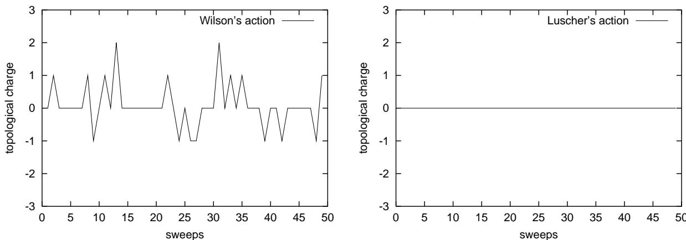  
FIG. gauge action with $\beta = 2 . 0$ , Right: Lüscher's gauge action with $\beta = 0 . 5$ . The topological charge changes for Wilson's gauge action, while it does not for Lüscher's action.

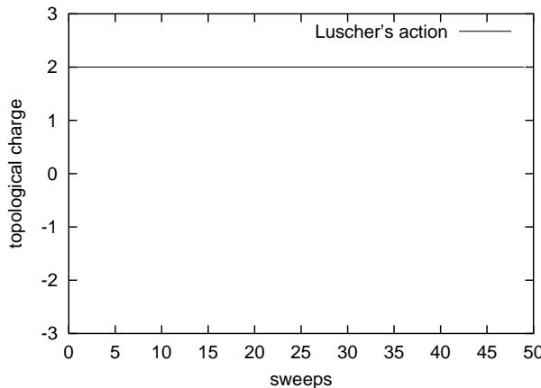  
FIG. 2: The Monte Carlo evolution of the topological charge with Lüscher's action for $\beta = 0 . 5$ is shown. The initial topological charge is two.

# B. A new method of summing over different topological sectors

The HybMontr p avleTu ven yEq.1)as icnditi, we ecuatis io hanihetpolgichar value of the coupling constant.

Now, we discuss full path integrals on $\theta$ -vacuum. Suppose that we measure the expectation value of an operator $O$ ,

$$
\langle { \cal O } \rangle _ { \beta , m } ^ { f u l l } = { \frac { \sum _ { N = - \infty } ^ { + \infty } e ^ { i N \theta } \int { \cal D } U _ { \mu } ^ { N } { \cal D } \bar { \psi } { \cal D } \psi { \cal O } e ^ { - \beta S _ { G } - S _ { F } } } { \sum _ { N = - \infty } ^ { + \infty } e ^ { i N \theta } Z _ { N } ( \beta , m ) } }
$$

where $U _ { \mu } ^ { N }$ denote link variables in the sector with $N$ and

$$
Z _ { N } ( \beta , m ) = \int { \cal D } U _ { \mu } ^ { N } { \cal D } \bar { \psi } { \cal D } \psi e ^ { - \beta S _ { G } - S _ { F } }
$$

is the lalicur parof the $Z _ { N }$ $\left. O \right. _ { \beta , m } ^ { f u l l }$

$$
\langle O \rangle _ { \beta , m } ^ { f u l l } = \frac { \sum _ { N = - \infty } ^ { + \infty } e ^ { i N \theta } \langle O \rangle _ { \beta , m } ^ { N } R ^ { N } ( \beta , m ) } { \sum _ { N = - \infty } ^ { + \infty } e ^ { i N \theta } R ^ { N } ( \beta , m ) } ,
$$

where

$$
\langle { \cal O } \rangle _ { \beta , m } ^ { N } = \frac { \int D U _ { \mu } ^ { N } D \bar { \psi } D \psi { \cal O } e ^ { - \beta S _ { G } - S _ { F } } } { Z _ { N } ( \beta , m ) } ,
$$

and

$$
R ^ { N } ( \beta , m ) = \frac { Z _ { N } ( \beta , m ) } { Z _ { 0 } ( \beta , m ) } .
$$

Ve call $R ^ { N } ( \beta , m )$ the reweighting factor. Note that $Z _ { N } ( \beta , m )$ satisfies the following differential equation;

$$
\frac { \partial Z _ { N } ( \beta , m ) } { \partial \beta } / Z _ { N } ( \beta , m ) = - \langle S _ { G } \rangle _ { \beta , m } ^ { N } .
$$

By integrating over $\beta$ again, $Z _ { N } ( \beta , m )$ is expressed as,

$$
Z _ { N } ( \beta , m ) = Z _ { N } ( \infty , m ) \exp \left( \int _ { \beta } ^ { \infty } d \beta ^ { \prime } \langle S _ { G } \rangle _ { \beta ^ { \prime } , m } ^ { N } \right) .
$$

Then, the reweighting factor $R ^ { N } ( \beta , m )$ is expressed as,

$$
\begin{array} { r l r } { R ^ { N } ( \beta , m ) } & { = } & { \frac { Z _ { N } ( \infty , m ) } { Z _ { 0 } ( \infty , m ) } \exp \left[ \displaystyle \int _ { \beta } ^ { \infty } d \beta ^ { \prime } \left( \langle S _ { G } \rangle _ { \beta ^ { \prime } , m } ^ { N } - \langle S _ { G } \rangle _ { \beta ^ { \prime } , m } ^ { 0 } \right) \right] } \\ & { = } & { \exp ( - \beta S _ { G m i n } ^ { N } ) \frac { \int d \nu _ { 1 } d \nu _ { 2 } \operatorname* { d e t } ( D _ { D W } ^ { N } ) ^ { 2 } / \operatorname* { d e t } ( D _ { A P } ^ { N } ) ^ { 2 } } { \int d \nu _ { 1 } d \nu _ { 2 } \operatorname* { d e t } ( D _ { D W } ^ { 0 } ) ^ { 2 } / \operatorname* { d e t } ( D _ { A P } ^ { 0 } ) ^ { 2 } } } \\ & { } & { \times \exp \left[ \displaystyle \int _ { \beta } ^ { \infty } d \beta ^ { \prime } \left( \langle S _ { G } - S _ { G m i n } ^ { N } \rangle _ { \beta ^ { \prime } , m } ^ { N } - \langle S _ { G } \rangle _ { \beta ^ { \prime } , m } ^ { 0 } \right) \right] , } \end{array}
$$

where $S _ { G m i n } ^ { N }$ $N$ $D _ { D W } ^ { N }$ and $D _ { A P } ^ { N }$ are Dirac operators given by this background. Note that the integrand vanishes rapidly as $\beta ^ { \prime } \to \infty$ , so the integral over $\beta ^ { \prime }$ converges.

$\theta$ vacuum by obtaining $\langle O \rangle _ { \beta , m } ^ { N }$ and $R ^ { N } \left( \beta , m \right)$ i c sct. It hould e notethat hismethoy sliacn witheblnthichet charg s sriy onsrvInu prc e tak the propery that Lücer'guacin allows o t caTh conventional gaugeactions, with which the topolgy change  suppressed but not completey prohibited so that ne has to tackle the problem of enhancing topology changes.

A related but somewhat different approach was proposed by Dürr [37] where one makes a quenched calculation and give the whole ermion determinant as the reweighting factor. He also proposed an approximation in whic one replachedeterminant orthe ive conguration bythedeterminan como epresentative conguration for the given sector, which reduces the enormous computational effort .

Of course, computing the reweighting factors for the sum over topologies requires extra works. Whether this pr works mus  emi prail sas. Ine olowi sions ehow hat is valid and full path integrals can be evaluated with controlled statistical and systematic errors.

# C. Calculation of $R ^ { N } ( \beta , m )$

Fig. 3, we can see Let us discus ho $S _ { G m i n } ^ { N }$ $R ^ { N } ( \beta , m )$ $| N | ^ { 2 }$ $S _ { G m i n } ^ { N }$ are evaluated easily. In

The fermion determinant $\operatorname* { d e t } D ^ { 2 }$ on classical background in the sector with $N$ is numerically calculated using the Householder method and the QL method [38]. The integral over the moduli $\nu _ { 1 , 2 }$ is approximated by the weighted su ve e scee potnior riuthe olnteratn reThe e points for the weighted sums are $5 \times 5$ for both $\operatorname* { d e t } ( D _ { D W } ^ { \cup } ) ^ { 2 } / \operatorname* { d e t } ( D _ { A P } ^ { \cup } ) ^ { 2 }$ , and for $\operatorname* { d e t } ( D _ { D W } ^ { N } ) ^ { 2 } / \operatorname* { d e t } ( D _ { A P } ^ { N } ) ^ { 2 }$ with $N \neq 0$ . The value of

$$
D e t ^ { N } \equiv { \frac { \int d \nu _ { 1 } d \nu _ { 2 } \operatorname * { d e t } ( D _ { D W } ^ { N } ) ^ { 2 } / \operatorname * { d e t } ( D _ { A P } ^ { N } ) ^ { 2 } } { \int d \nu _ { 1 } d \nu _ { 2 } \operatorname * { d e t } ( D _ { D W } ^ { 0 } ) ^ { 2 } / \operatorname * { d e t } ( D _ { A P } ^ { 0 } ) ^ { 2 } } } ,
$$

is plotted in Fig.5. It decreases as $| N |$ increases, due to the contribution of small eigenvalues proportional to the feromass hicerghenrivaltolgial sctors inctienhor alize lattice in $L _ { 3 } \to \infty$ limit [7].

In order t btain the exponentialactor i Eq29), we nee to evaluate the interal thefollowi qny

$$
S _ { s u b t r } ^ { N } ( \beta ^ { \prime } , m ) \equiv \langle S _ { G } - S _ { G m i n } ^ { N } \rangle _ { \beta ^ { \prime } , m } ^ { N } - \langle S _ { G } \rangle _ { \beta ^ { \prime } , m } ^ { 0 } .
$$

Since $S _ { s u b t r } ^ { N } ( \beta ^ { \prime } , m )$ decreases rpidly as $\beta ^ { \prime } \to \infty$ the integral of $S _ { s u b t r } ^ { N }$ over $\beta ^ { \prime }$ is well p d $S _ { s u b t r } ^ { N } ( \beta ^ { \prime } , m )$ at $\beta ^ { \prime } = 0 . 5 , 1 . 0 , 1 . 5 , 2 . 0$ For each , we evaluate $S _ { s u b t r } ^ { N } ( \beta ^ { \prime } , m )$ by sampling more than 5000 configurations.

Total reweighting factor $R ^ { N } ( \beta , m )$ at $\beta = 0 . 5$ and $m = 0 . 2$ is plotted in Fig. 6. It is shown that higher topologica sectors are indeed suppressed by the reweighting factor.

Finaycin e eators ntheehticrs btaitheotlpeatinvalu $\theta$ vacuum as

$$
\sum _ { y } \langle \pi ( x , y ) \pi ( 0 , 0 ) \rangle _ { f u l l } = \sum _ { N = - 4 } ^ { 4 } e ^ { i N \theta } \sum _ { y } \langle \pi ( x , y ) \pi ( 0 , 0 ) \rangle _ { \beta , m } ^ { N } R ^ { N } ( \beta , m ) ,
$$

and

$$
\sum _ { y } \langle \eta ( x , y ) \eta ( 0 , 0 ) \rangle _ { f u l l } = \sum _ { N = - 4 } ^ { 4 } e ^ { i N \theta } \sum _ { y } \langle \eta ( x , y ) \eta ( 0 , 0 ) \rangle _ { \beta , m } ^ { N } R ^ { N } ( \beta , m ) ,
$$

up to a constant normalization factor. Here we have ignored $| N | > 4$ sectors since they only give contributions less than $1 . 2 \ \%$ of zero sector. Then we can get pion mass and $\eta$ meson mass including full nonperturbative effects and $\theta$ dependence. In this calculation, the propagators are fitted by minimizing the $\chi ^ { 2 }$ and the total statistical errors are estimated by summing those in individual sections in quadrature.

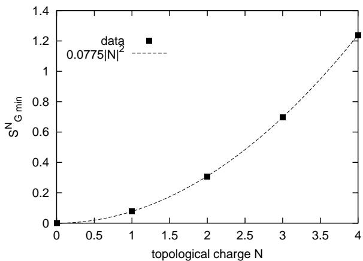  
FIG. data and the dotted line is the fit with a quadratic function.

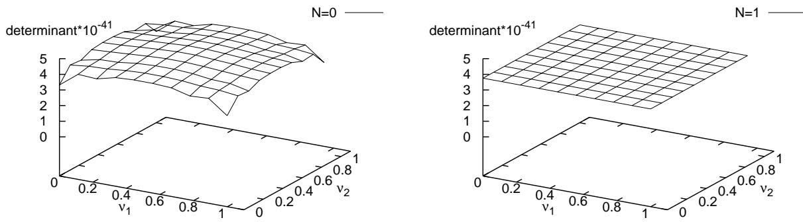  
FIG. 4: Three dimensional plot of the $\nu$ dependence of the fermion determinant $\operatorname* { d e t } ( D _ { D W } ^ { N } ) ^ { 2 } / \operatorname* { d e t } ( D _ { A P } ^ { N } ) ^ { 2 }$ . Left: $N = 0$ case, Right: $N = 1$ case.

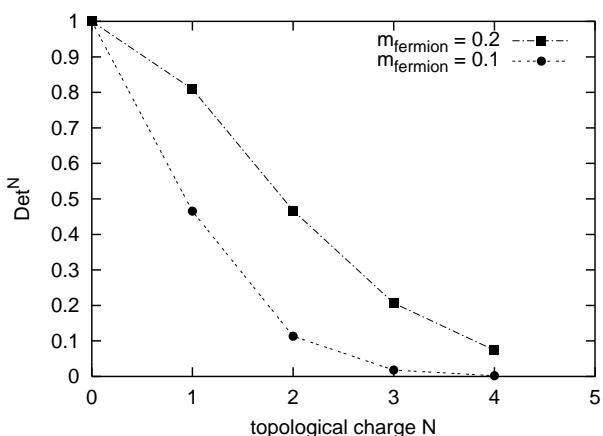  
FIG. 5: $| N |$ dependence of $D e t ^ { N }$ for the fermion mass m $= 0 . 1$ , 0.2 are shown.

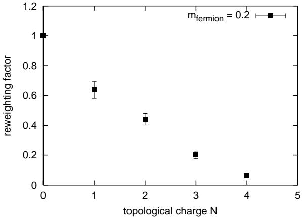  
FIG. 6: The total reweighting factor $R ^ { N } ( 0 . 5 , 0 . 2 )$ is plotted as a function of the topological charge. The factor falls off rapidly as the topological charge increases.

# D. Systematic errors

In this subsection we discuss possible systematic errors.These error estimations show that our simulation is reasonable and the results are reliable.

Let us now study the lattice spacing dependence. We measure a dimensionless quantity $A \equiv m _ { \pi } ^ { 6 } / ( m ^ { 4 } \sigma )$ at $\beta =$ $0 . 5 , 1 . 0 , 1 . 5 , 2 . 0$ in zero topological sector, where $m _ { \pi }$ denotes pion mass and $\sigma$ denotes the string tension. As Fig. 7 indicates, the results at $\beta = 0 . 5$ show no large lattice spacing dependence which suggests that the discretization error is under control.

Next we discuss finite size effects for the space-time size $L$ and and for the extra dimension size $L _ { 3 }$ . We measure the pion mass on the lattices of size $L ^ { 2 } \times L _ { 3 } = 8 ^ { 2 } \times 6 , 1 0 ^ { 2 } \times 6 , 1 6 ^ { 2 } \times 6 , 2 0 ^ { 2 } \times 6 , 1 6 ^ { 2 } \times 2 , 1 6 ^ { 2 } \times 4$ and $1 6 ^ { 2 } \times 1 0$ in the zero sector. Fig. 8 shows $L$ dependence and Fig. 9 shows $L _ { 3 }$ dependence. We find the meson mass is stable for $L$ larger than 16 and for $L _ { 3 }$ larger than 6 so that the finite size error is also under control with our choice of the lattice size $1 6 ^ { 2 } \times 6$ .The discretization error andfnite sizeerrors from the nonzero topological sector is similarly undrcontrol.

We now study the error in the integration over the moduli $\nu _ { 1 , 2 }$ . In order to estimate the systematic error we also evaluate the integral by the weighted sum of $1 0 \times 1 0$ points. We find that the change is very tiny ( relative change $\sim 1 0 ^ { - 8 }$ )  is negligibe compare o other systemai errors, s  exped fom he mil $\nu$ dependence of $\operatorname* { d e t } ( D _ { D W } ^ { 0 } ) ^ { 2 } / \operatorname* { d e t } ( D _ { A P } ^ { 0 } ) ^ { 2 }$ in Fig. 4. Fig. 4 also shows that $\operatorname* { d e t } ( D _ { D W } ^ { N } ) ^ { 2 } / \operatorname* { d e t } ( D _ { A P } ^ { N } ) ^ { 2 }$ with $N \neq 0$ has almost no $\nu$ dpe I h ab  c  seh par alyil [. W therefore conclude that the error in the weighted sum is even more negligible or the nonzero topological scor.

Since the integral of $S _ { s u b t r } ^ { N }$ over $\beta ^ { \prime }$ $S _ { s u b t r } ^ { N }$ in an

<table><tr><td colspan="2">By trapezoidal rule By fit</td></tr><tr><td>R0(0.5, 0.2)</td><td>1.0</td></tr><tr><td>R1(0.5, 0.2) 0.637(56)</td><td>1.0 0.59(22)</td></tr><tr><td>R2(0.5, 0.2)</td><td>0.442(39) 0.45(16)</td></tr><tr><td>R3(0.5, 0.2)</td><td>0.201(25) 0.32(18)</td></tr><tr><td>R4(0.5, 0.2) 0.0636(91)</td><td>0.072(46)</td></tr><tr><td>mπ(at θ = 0)</td><td>0.647(07) 0.650(34)</td></tr></table>

TABLE $S _ { s u b t r } ^ { N }$ ;The trapezoidal rule and the integral of the polynomial fit. The resulting pion masses are also given.

alternative way, in which we fit the discrete set of data with the function of the form

$$
S _ { s u b t r } ^ { N } ( \beta ^ { \prime } , m ) = \frac { a _ { 1 } } { \beta ^ { \prime } ^ { 2 } } + \frac { a _ { 2 } } { \beta ^ { \prime } ^ { 3 } } ,
$$

and compute the integral of $S _ { s u b t r } ^ { N }$ over $\beta ^ { \prime }$ lytical $S _ { s u b t r } ^ { N }$ does not vroe . As we discussed before, we neglect $| N | > 4$ sectors since these contribution are suppressed by large value of action and fermion zero modes. Fig. 10 shows the pion mass at $\theta = 0 . 3 \pi$ measured for a variety of the highest topological charge $N _ { m a x }$ . Therefore the truncation error in the sum over topological sectors are negligible in comparison with the statistical errors.

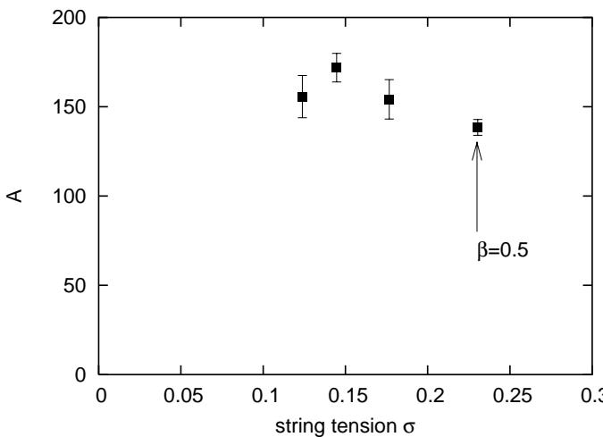  
FIG. 7: Lattice spacing dependence of the dimensionless quantity $A \equiv m _ { \pi } ^ { 6 } / ( m ^ { 4 } \sigma )$ . Horizontal axis is the string tension ir lattice unit.

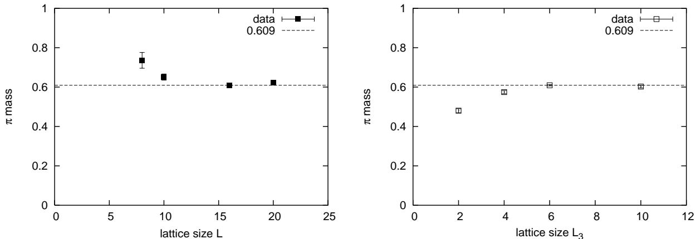  
FIG.8: The dependenceof the pion mass on the lattice FIG.9:The dependencof the pion mass on the lattice size $L$ in the space-time direction. The fermion mass is size $L _ { 3 }$ in the third direction. The fermion mass is $m =$ $m = 0 . 2$ .Filled symbols are the data and the dotted line 0.2.Open symbols are the data and the dotted line shows shows the fitted mass for $L = 1 6$ . The pion mass shows the fitted mass for $L _ { 3 } ~ = ~ 6$ . The pion mass shows no no volume dependence for $L  \geq 1 6$ . volume dependence for $L _ { 3 } \geq 6$ .

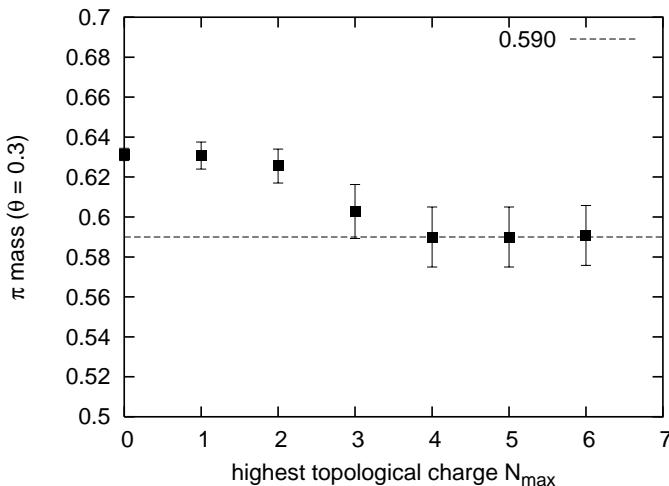  
FIG. 10: The pion mass from the sum over $| N | \leq | N _ { m a x } |$ sector contributions for $m = 0 . 2$ and $\theta = 0 . 3 \pi$ . No change in the mass for $N _ { \operatorname* { m a x } } \ge 4$ is observed.

# IV. MESON MASSES

# A. Pion mass and $\theta$ dependence

Fig. 11 shows pion propagators in each topological sector and Fig. 12 shows full propagators at various $\theta$ . We measure the pion mass by fitting these data to the hyperbolic cosine function. The fit range is $x = \lfloor 5 , 8 \rfloor$ for which we find good plateau in the effective mass plot as Fig. 13 shows. In fitting $\chi ^ { 2 } / d o f$ is also a small value $( \chi ^ { 2 } / d o f < 0 . 1 )$ .

Fig.14 shows pion mass at $\theta = 0$ as a fnctio eron mass $m$ . We ignore the $m$ dependence of $S _ { s u b t r } ^ { N } ( \beta ^ { \prime } , m )$ and use $m = 0 . 2$ result for all $m$ . We fit the results to the following function suggested by the continuum theory with possible additional constant term $b$ from the residual mass of pion,

$$
m _ { \pi } ( m ) = a m ^ { 2 / 3 } + b .
$$

Fig.14 shows that Eq. (35) fits the data very well ( $\chi ^ { 2 } / d o f = 0 . 3 9$ ) so that the fermion mass dependence is consistent with the continuum theory. The residual mass of the pion measured in the chiral limit is also tiny as $b = - 0 . 0 5 7 { \pm } 0 . 0 6 0$ , which shows that the violation of the chiral symmetry is very small.

In Fig. 15 we present the $\theta$ dependence of the pion mass at $\beta = 0 . 5$ and $m = 0 . 2$ . As a remarkable feature, the result is in perfect agreement with that in the continuum theory in $\theta / ( 2 \pi ) < 0 . 5$ region. A good control of the $\theta$ lepeenhosh etoovei oil srs wi Leac vorks numerically.

At large $\theta$ , statistical errors increase, which are due to cancellations of propagators among different topological $S _ { s u b t r } ^ { N } ( \beta ^ { \prime } , m )$ of $\beta ^ { \prime }$ points, but this does not seem to be the reason for the large fluctuation in the $\theta / ( 2 \pi ) > 0 . 5$ region. The main piti $D e t ^ { N }$ and $S _ { s u b t r } ^ { N } ( \beta ^ { \prime } , m )$ $\beta ^ { \prime - 2 }$ In $S _ { s u b t r } ^ { N } ( \beta ^ { \prime } , m ) = 0$ foor all $\beta ^ { \prime }$

We suspect that this large fuctuation is an example of the well-known phase problem.Smply increasing the statistics might not improve the situation.

Ofcurse in ppliatin o QCD, it will beportant to evale $S _ { s u b t r } ^ { N } ( \beta ^ { \prime } , m )$ and other observables more precisely.

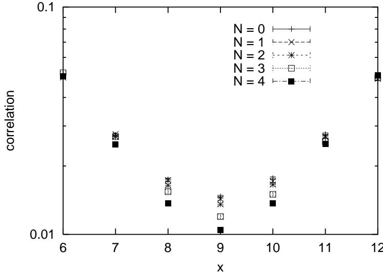  
FIG. 11: The pion propagator in each sector for $m = 0 . 2$ .

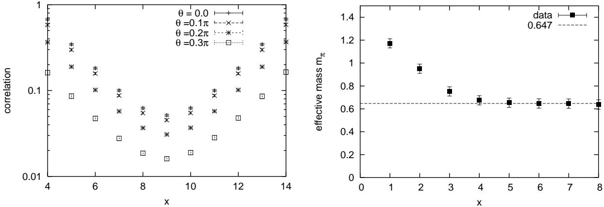  
FIG. 12: The full pion propagators with $m = 0 . 2$ for FIG. 13: The effective mass plot of the pion for $m = 0 . 2$ various $\theta$ are plotted. and $\theta = 0$ . The dotted line shows the result of the fit.

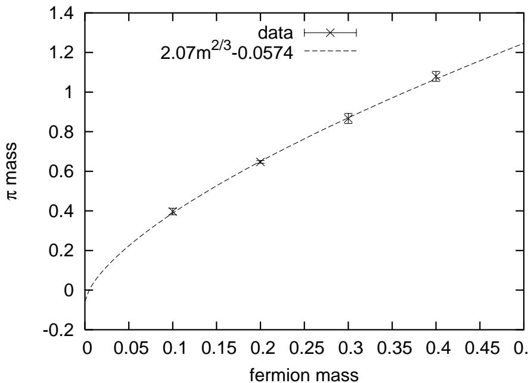  
FIG. 14: The fermion mass dependence of the pion mass for $\theta = 0$ . The crosses are the lattice data and the dotted line is the resul  the with the nction  Eq.(35)The chirl behavio  cnsistn wi thatcntiutey.

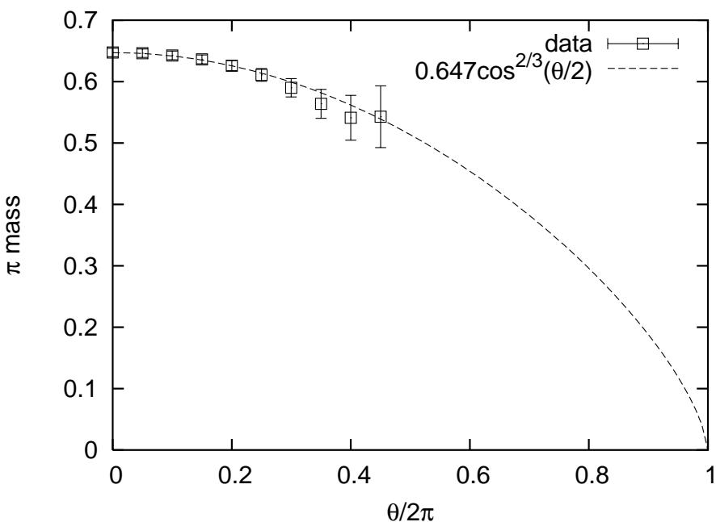  
FIG. 15: $\theta$ dependence of the pion mass at $m = 0 . 2$ . The open symbols are the lattice data. The dotted line is the analytical result of the $\theta$ dependence in the continuum theory, where the normalization is fitted by the lattice results. For $\theta / ( 2 \pi ) < 0 . 5$ , the pion mass is proportional to $\cos ( \theta / 2 ) ^ { 2 / 3 }$ , which is in complete agreement with the continuum results.

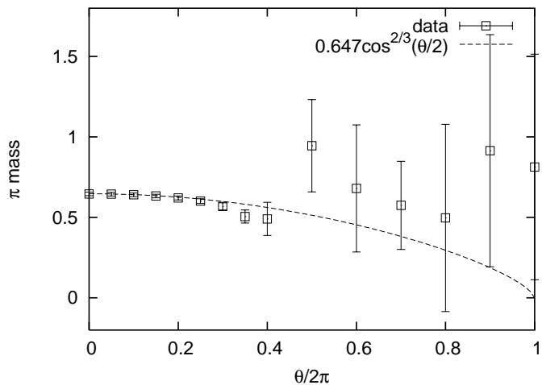  
FIG. 16: $\theta$ dependence of the pion mass obtained by ignoring $S _ { s u b t r } ^ { N } ( \beta ^ { \prime } , m )$ in the reweighting factors.

# B. $\eta$ meson correlator and U(1) problem

As the final subject, we would like to present the result of our exploratory measurement of the $\eta$ meson mass in order to study the topological structure. The $\eta$ propagator consists of two parts;

$$
\langle \eta \eta \rangle = - 2 \langle t r \left( \gamma _ { 3 } \frac { 1 } { D } \gamma _ { 3 } \frac { 1 } { D } \right) \rangle + 4 \langle t r \left( \gamma _ { 3 } \frac { 1 } { D } \right) t r \left( \gamma _ { 3 } \frac { 1 } { D } \right) \rangle ,
$$

where the first term is the same as flavor non-singlet $\pi$ propagator and the second term gives the "hair-pin" or disconectedcontribution to the favor single peratorBecause the numberf physical space-time pointsiy $1 6 \times 1 6$ , we compute the "hair-pin" contribution by brute force, namely by solving the fermion propagator for all points without relying on the noise method[40] or Kuramashi method [41].

Fig. 17 shows the contribution of the second term in each sector, whereas Fig. 19 shows the full (symmetrized) $\eta$ propagator at $m = 0 . 2$ and $\theta \ : = \ : 0$ . We also present effective mass plot in Fig.18. We find that the fall of $\eta$ propagator is steeper than that of $\pi$ which gives qualitatively consistent results with $U ( 1 )$ problem, although it suffers k number of topological sectors.

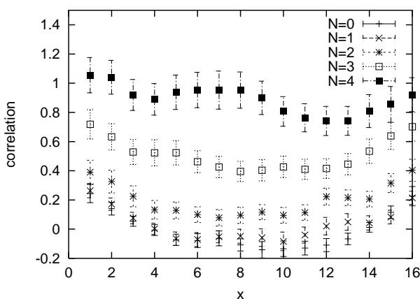  
FIG. 17: The propagator of $\eta$ in each sector at $m = 0 . 2$

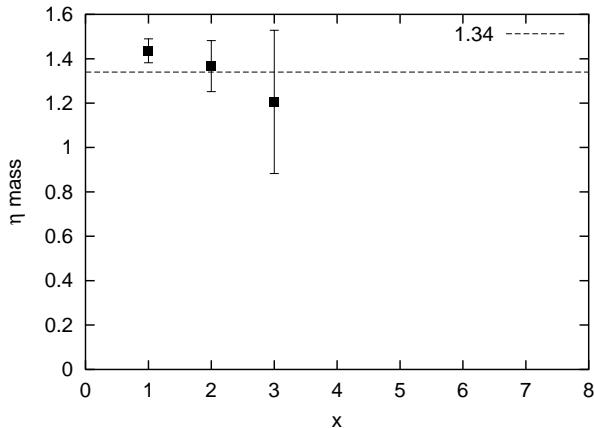  
FIG. 18: The effective mass plot of the full $\eta$ propagator for $m = 0 . 2$ , $\theta = 0$ .

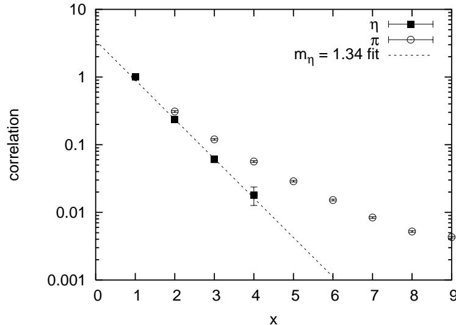  
FIG. 19: The full propagator $\eta$ at $m = 0 . 2$ and $\theta = 0$ ( filled squares ). The pion propagator is also plotted for comparison ( open circles ). The propagators are normalized by the value at $x = 1$ .

# V. SUMMARY AND DISCUSSION

In pae aeeeoinper gage theories by applying Lüscher's action together with domain wall fermions toa numericl simulation  the massive Schwinger model. To investigate the $\theta$ -dependence of the correlators, we have developed a method to sum vr and al the results are consistent with those in the continuum theory, confirming the validity of our method.

We z heat thceagai In Lüe ctn,he el e y ioh pqne ctc hereThean action is not compact;

$$
0 \leq S _ { G } < \infty .
$$

i the same at  n theoryWe an treat he theoryr  the e ren ratha laquettes. According to these features, Lüscher's gauge action has many advantages.

T unphysical configurations are suppressed.(We fnd the suppressioneffect is especially remarkable in quenched approximation as discussed in Appendix.)   
2. We can treat the topological properties of the lattice theories precisely.This exact topological treatment is usefl not only mathematically but also in a practical point of view. In conventional approach, there are two al poelti raliy  s colng n th ow do the toya in unqenched simulation. For the former problem, the improved gauge actions whic suppress the dislocations is proposed. However, in principle the suppression of the dislocations also suppresses the topology change so that the latter problem becomes even more dificult. Our method makes the improvement to the extreme and prohibits both the dislocation and the topology change completely, however by computing each topological sector and its reweighting factor we can reconcile the solutions to the the topology change problem and the dislocation problem at the same time.   
3. Once each topological sector can be computed separately, we can obtain a $\theta$ dependence at once.   
4. Aside from the fact that we must simulate for each sector the typical simulation time needed for the trivial topological sector is no larger than that o usig Wilson's plaquette actionFor the nonzero topologicalharge sector, one can also increase the statistic at wll very effiently, in contrast to the conventional method where one can increase the statistic only by reaching the theralequilrium. In this sense, ur method would have advantages in physical quantities for which the topological sectors with larger instanton numbers give larger contributions.

We tha it wul ot beiflt  yr' y  also QCos. In order to study the $\theta$ vacuum, one should study how the reweighting factors can be computed. Also one should study theeactoindeheattiineoilpery atl QCD on a torus. At least we can recommend the application to the calculation in the exact chiral limit since we ueey z sector reulWeopehendendi the tpogial propertlatti Ci improved by applying Lüscher's admissibility condition.

Finall e ol keo pontt that themeth proo inthis paper ue Lüshe type c an sullhh lattice in the future.

# Acknowledgments

We acknowledge Hideo Matsufuru and Ayumu Sugita for the discussions and help throughout the whole stages this work and Hido Matsufuru also r his careul reading of the manuscipt and his comments.We would als lik ohaoskwuu  is heaWratiz Ma usTnY Kuramashi, YasumichiAokior useul discussions.The authors thank the ukawaInstitute orTheoretical ysi at Kyoto University, where this work was initiated during the YITP-W02-15 on "YITP School on Lattic Field TheoryThe numerical smulations were done Alpha workstation at Yukawa Institte rTheoretical hysin Kyoto University, NEC SX-5 at Research Center for Nuclear Physics in Osaka University, and Hitachi SR800 model F1 supercomputer at KEK.

# Appendix

In e lühe  Ih region, we compare Lüscher's action with Wilson's action ignoring fermion loops. We set lattice size to be $3 2 \times 3 2 \times 5$ and measure pion mass in the zero sector. Gauge coupling $\beta$ is chosen to give the same string tension $\sigma = 0 . 1 8$ ; $\beta = 1 . 0$ for Lüscher's action and $\beta = 3 . 4$ for Wilson's action.

Fig.20 shows evolution of topological charge. In quenched approximation with Wilson action, fermion zero modes are all neglected so there is no suppression n topology changes.As a result, much unphysical confgurations are generated.On the other hand, Lüscher's action never allow topology changes.In Fig.21, the diffrence is clear. Lüscher's action gives consistent pion mass and good chiral limit even in quenched approximation at very strong coupling.

Fortheiclyple tuythe qence wimoe wehoulaksverfrntt H q lhash  zi k wih the mpl xampleIt wl be eary perorm heoicalycmple quenche study by v diffnt tog cpar wi analyesul  whic is predic that the qencief d v different fermion mass dependence from that in the unquenched theory [27].

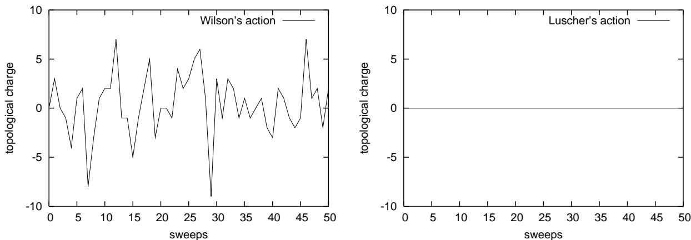  
FIG. TMra W Lücher's gauge action orthe gauge couplings having the same string tension. Let Wilson's gauge action at $\beta = 3 . 4$ . Right: Lüscher's gauge action at $\beta = 1 . 0$ Lüscher's gauge action shows no topology change.

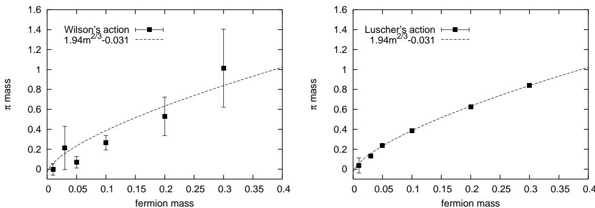  
FIG. action at $\beta = 3 . 4$ . Right: Lüscher's gauge action at $\beta = 1 . 0$ . Wilson's gauge action suffers from large fluctuation while Lüscher's gauge action shows a good chiral behavior. Both of them are calculated by domain-wall fermions.

[17] C. Jung, R. G. Edwards, X. D. Ji and V. Gadiyak, Phys. Rev. D 63, 054509 (2001).   
[18] M. Lüscher, Nucl. Phys. B 568, 162 (2000)   
[19] A. Jaster, arXiv:hep-lat/9605011.   
[20] D. B. Kaplan, Phys. Lett. B 288, 342 (1992)   
[21] Y. Shamir, Nucl. Phys. B 406, 90 (1993); V. Furman and Y. Shamir, Nucl. Phys. B 439, 54 (1995)   
[22] C. R. Gattringer, I. Hip and C. B. Lang, Nucl. Phys. B 508 (1997) 329   
[23] C. R. Gattringer, I. Hip and C. B. Lang, Phys. Lett. B 409 (1997) 371   
[24] C. Gattringer, I. Hip and C. B. Lang, fermions," Phys. Lett. B 466 (1999) 287   
[25] H. Dilger and H. Joos, Nucl. Phys. Proc. Suppl. 34, 195 (1994)   
[26] F. Farchioni, I. Hip and C. B. Lang, Phys. Lett. B 443, 214 (1998)   
[27 S. Dürr and S. R. Sharpe, Phys. Rev. D 62 034506 (2000).   
[28] S. Dürr, Phys. Rev. D 62, 054502 (2000);   
[29] S. Elser, arXiv:hep-lat/0103035.   
[30] P. de Forcrand, J. E. Hetrick, T. Takaishi and A. J. van der Sijs, Nucl. Phys. Proc. Suppl. 63 (1998) 679. [31] P. M. Vranas, Phys. Rev. D 57, 1415 (1998).   
[32] S. Elser and B. Bunk, Nucl. Phys. Proc. Suppl. 53, 953 (1997).   
[33] J. S. Schwinger, Phys. Rev. 128, 2425 (1962).   
[34] S. R. Coleman, R. Jackiw and L. Susskind, Annals Phys. 93, 267 (1975).   
[35] S. R. Coleman, Annals Phys. 101, 239 (1976).   
[36] J. Frohlich and E. Seiler, Helv. Phys. Acta 49, 889 (1976).   
[37] S. Dürr, Nucl. Phys. B (Proc. Suppl.) 106 (2002) 598.   
[38] Numerical Recipes in FORTRAN, Second Edition, W. H. Press, S. A. Teukolsky, W. T. Vetterling, B. P. Fl Cambridge University Press, 1992.   
[39] S. Azakov, Fortsch. Phys. 45, 589 (1997)   
[0 K.Bitar e al. Nucl. Phys. B313, 348 (1989); H. R. Fiebi and R. M. Wolshy, Phys. Rev. D 42, 3250 (1990). [41 Y. Kuramashi et al. Phys. Rev. Lett. 72, 3448 (1994); M. Fukugita et al. Phys. Rev. D 51, 3952 (1995).