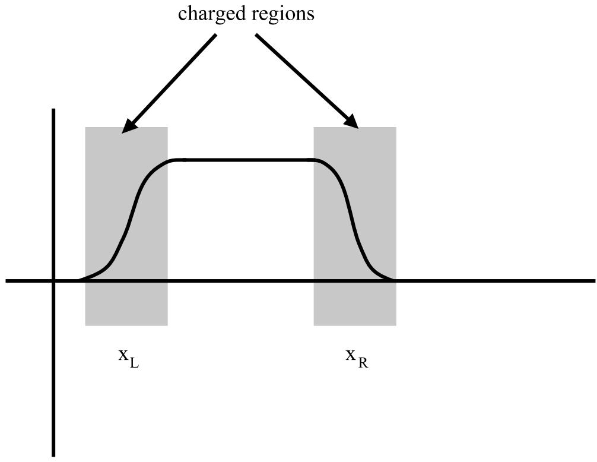
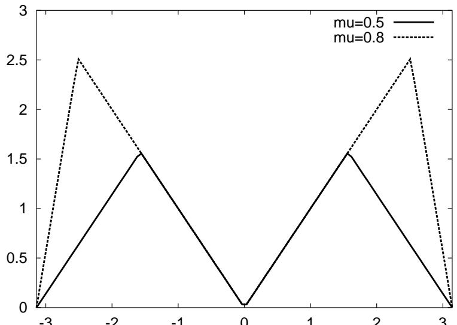
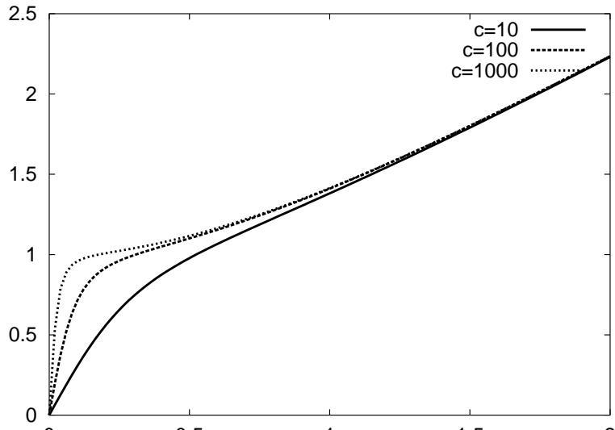
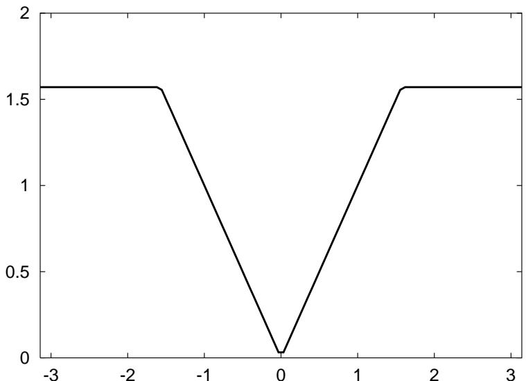

# The Lattice Schwinger Model: Confinement, Anomalies, Chiral Fermions and All That \*

Kirill Melnikov† and Marvin Weinstein $^ \ddag$ Stanford Linear Accelerator Center Stanford University, Stanford, CA 94309

# Abstract

In order to better understand what to expect from numerical CORE computations for two-dimensional massless QED (the Schwinger model) we wish to obtain some analytic control over the approach to the continuum limit for various choices of fermion derivative. To this end we study the Hamiltonian formulation of the lattice Schwinger model (i.e., the theory defined on the spatial lattice with continuous time) in $A _ { 0 } = 0$ gauge. We begin with a discussion of the solution of the Hamilton equations of motion in the continuum, we then parallel the derivation of the continuum solution within the lattice framework for a range of fermion derivatives. The equations of motion for the Fourier transform of the lattice charge density operator show explicitly why it is a regulated version of this operator which corresponds to the pointsplit operator of the continuum theory and the sense in which the regulated lattice operator can be treated as a Bose field. The same formulas explicitly exhibit operators whose matrix elements measure the lack of approach to the continuum physics. We show that both chirality violating Wilson-type and chirality preserving SLAC-type derivatives correctly reproduce the continuum theory and show that there is a clear connection between the strong and weak coupling limits of a theory based upon a generalized SLAC-type derivative.

# I. INTRODUCTION

It was argued in an earlier paper [1] that the Contractor Renormalization Group(CORE) method can be used to map a theory of lattice fermions and gauge fields into an equivalent highly frustrated anti-ferromagnet. Although explicit computations were presented only for the free fermion theory, it was argued that a corresponding mapping must exist for the interacting theory because the space of retained states used for the free theory coincides with the set of lowest energy states of the strongly coupled gauge theory. While this argument is true, it is obviously important to have a better understanding of the details of how the mapping works. In order to get some experience with this process for a theory which is well understood we decided to study the lattice Schwinger model (i.e., two-dimensional QED), since the exact continuum solution of this model exists. Before diving into the CORE computation, however, we first needed to understand the degree to which the lattice model exhibits the interesting features of the continuum theory. This paper is devoted to an analytical treatment of the lattice Schwinger model with an eye to clarifying the physics which underlines the continuum solution and identifying those general features of the model which should provide an ultimate check of the correctness of any numerical solution.

The continuum Schwinger model [27], in addition to being a non-trivial interacting theory of fermions and gauge fields, provides a laboratory for studying a wide range of interesting phenomena. It exhibits: confinement of the fermionic degrees of freedom and the concomitant appearance of a massive boson in the exact spectrum; breaking of chiral symmetry through the axial anomaly; screening of external charges and background electric fields; infinite degeneracy of the vacuum states of the theory (theta parameters); and the ability to produce arbitrary fermionic polarization charge densities by applying an operator of the form $e ^ { i \int \mathrm { d } x \alpha ( x ) j _ { 5 } ^ { 0 } ( x ) }$ to the vacuum state (due to the anomalous commutator of the electric and axial-charge density operators). It is important to ask which of these features can be understood in the lattice theory before taking the continuum limit and how complicated a CORE computation has to be in order to extract this physics. Although the literature contains discussions of various aspects of the model, such as confinement and the axial anomaly [811], we are not aware of any systematic discussion of the theory which attempts to parallel the derivation of the continuum solution within the lattice framework. This is what we do in this paper.

In order to make the physics as transparent as possible we formulate the Hamiltonian version of the theory in $A _ { 0 } = 0$ gauge and only then rewrite it within the super-selected sector of gauge-invariant states. We then study the Hamilton equations of motion for the electric charge density operator, whose form is completely determined by the way in which local gauge invariance is introduced into the lattice theory. Obviously, the form of the operator equations of motion depends upon the specific lattice fermion derivative and so we study this problem for a wide class of different derivatives; in particular, generalizations of the so-called SLAC derivative [13], which explicitly maintain the lattice chiral symmetry and generalizations of the Wilson derivative [12], which break the chiral symmetry for nonzero momenta. We find that all of these approaches produce a satisfactory treatment of the continuum theory, however the detailed physical picture of how things work varies greatly.

We show that a key issue for connecting the lattice theory to the continuum theory is which lattice currents go over to the continuum current operators $j _ { 0 } ( x )$ and $j _ { 0 } ^ { 5 } ( x )$ . Obviously the local lattice charge density operator, whose form is fixed by the way in which one introduces gauge invariance, cannot have this property because the normal ordered version of this operator satisfies the identity $j _ { 0 } ( i ) ^ { 3 } = j _ { 0 } ( i )$ for all values of the lattice spacing (since only the charges $0 , 1 , - 1$ can exist on a single lattice site). On the other hand, as we will show, the Fourier transform $j _ { 0 } ( k )$ can be treated as a boson operator and the the dynamics of the theory tells us that the current operators of the continuum theory are obtained by forming an appropriately regulated version of these lattice operators.

In order to make our discussion essentially self-contained we begin by briefly reviewing the $A _ { 0 } = 0$ gauge treatment of the Hamiltonian version of the continuum Schwinger model. We discuss: the need for imposing a state condition, such as restricting to gauge-invariant states; why only the total $Q = 0$ sector of the theory can exist at finite energy; and why different sectors of gauge-invariant states exist and are labelled by a continuous parameter $- 1 / 2 \geq \epsilon \leq 1 / 2$ , which can be identified as a background electric field. Finally, we review the Hamiltonian derivation of the fact that the electric charge density is a free massive Bose field and the role played by the anomalous commutator of the electric and axial charge density operators in the derivation of this result. After reviewing the continuum theory we set up and discuss the physics of the lattice version of the Schwinger model in $A _ { 0 } ( x ) = 0$ gauge. We then parallel the continuum arguments as closely as possible for a variety of fermion derivatives. A careful treatment of the Hamilton equations of motion for the Fourier transform of the charge density operator leads to an understanding of how regulated versions of these operators go over to the point-split operators of the continuum theory and the sense in which these regulated operators can be treated as Bose fields. The difference between the way in which things work for generalized SLAC-type derivatives and Wilson-type derivatives becomes clear due to this discussion, as does the connection between the strong and weak coupling theory for generalized SLAC-type derivatives.

# II. THE CONTINUUM SCHWINGER MODEL

Hamiltonian formulations of the continuum Schwinger model have been discussed in the literature [6,7]. Our discussion will parallel these discussions to a degree but will differ in important details. Our goal is to allow the reader to understand the important features of the Schwinger model without unnecessary formalism.

As we have already noted, the Schwinger model is simply QED in $1 + 1$ dimensions, and has a Lagrangian density given by:

$$
{ \mathcal { L } } = { \bar { \psi } } ( i \partial _ { \mu } \gamma _ { \mu } + e A _ { \mu } \gamma _ { \mu } ) \psi - { \frac { 1 } { 4 } } F _ { \mu \nu } F ^ { \mu \nu } .
$$

In $1 + 1$ dimensions there are only three anti-commuting $\gamma$ matrices, $\gamma _ { 0 } , \gamma _ { 1 } , \gamma _ { 5 }$ , and so they can be realized in terms of the Pauli $\sigma$ -matrices:

$$
\begin{array} { l } { \gamma _ { 0 } = - i \sigma _ { x } , } \\ { \gamma _ { 1 } = - i \sigma _ { y } , } \\ { \gamma _ { 5 } = \gamma _ { 0 } \gamma _ { 1 } = \sigma _ { z } . } \end{array}
$$

In order to enable us to give the most physical treatment of gauge-invariance of the theory we choose to work in temporal, or $A _ { 0 } ( x ) = 0$ , gauge. Making this choice the Lagrangian density becomes:

$$
\mathcal { L } = \bar { \psi } ( i \partial _ { \mu } \gamma _ { \mu } - e A ( x ) \gamma _ { 1 } ) \psi + \frac { 1 } { 2 } ( \partial _ { 0 } A ( x ) ) ^ { 2 } .
$$

Here, for convenience, we have denoted the spatial component of the vector potential as $A ( x )$ and dropped its subscript. Eq.(3) tells us that the electric field,

$$
E ( x ) = \partial _ { 0 } A ( x ) ,
$$

is the canonical momentum conjugate to $A ( x )$ and it has the usual equal-time commutation relations with $A ( x )$ :

$$
[ E ( x ) , A ( x ^ { \prime } ) ] = - i \delta ( x - x ^ { \prime } ) .
$$

Similarly, the fermion operators satisfy the anti-commutation relations

$$
\{ \psi _ { \alpha } ^ { \dagger } ( x ) , \psi _ { \beta } ( x ^ { \prime } ) \} = \delta ( x - x ^ { \prime } ) \delta _ { \alpha \beta } .
$$

It follows immediately that the Hamiltonian in $A _ { 0 } = 0$ gauge is

$$
H = \int \mathrm { d } x \left[ \frac { E ( x ) ^ { 2 } } { 2 } + \psi ^ { \dagger } ( x ) \left( i \partial _ { 1 } + i e A ( x ) \right) \sigma _ { z } \psi ( x ) \right] .
$$

There is an essential piece of the physics of working in $A _ { 0 } = 0$ gauge which requires discussion. Since we begin by setting $A _ { 0 } = 0$ in the Lagrangian, we cannot vary $\mathcal { L }$ with respect to $A _ { 0 }$ or $\partial _ { 0 } A _ { 0 }$ , and so we do not obtain Gauss' law

$$
G ( x ) = \left( \partial _ { x } E ( x ) - e \psi ^ { \dagger } ( x ) \psi ( x ) \right) = 0
$$

as an operator equation of motion. In fact, using the canonical commutation relation, Eq.(5), we see that

$$
\begin{array} { r l } & { e ^ { - i \int \mathrm { d } y \alpha ( y ) A ( y ) } G ( x ) e ^ { i \int \mathrm { d } y \alpha ( y ) A ( y ) } = \Bigl ( \partial _ { x } ( E ( x ) + \alpha ( x ) ) - e \psi ^ { \dagger } ( x ) \psi ( x ) \Bigr ) } \\ & { \qquad = G ( x ) + \partial _ { x } \alpha ( x ) . } \end{array}
$$

This means that even if we start with a state $| \phi \rangle$ for which

$$
G ( x ) | \phi \rangle = 0 ,
$$

we can generate states of the form

$$
| \phi _ { \alpha } \rangle = e ^ { i \int \mathrm { d } \xi \alpha ( \xi ) A ( \xi ) } | \phi \rangle
$$

for which

$$
G ( x ) | \phi _ { \alpha } \rangle = \partial _ { x } \alpha ( x ) | \phi _ { \alpha } \rangle .
$$

Fortunately, the operators $G ( x )$ (which we identify with the generators of time-independent gauge transformations) commute with one another and with $H$ , and so they can all be simultaneously diagonalized. Thus we are free to impose Eq.(10) as a state condition because the Hamiltonian cannot take us out of this sector of the Hilbert space. Actually, we are free to impose the more general condition of Eq.(12) for any arbitrary function $\alpha ( x )$ . What all this means is that the canonical quantization of the Schwinger model in $A _ { 0 } = 0$ gauge produces not one, but rather an infinite number of theories distinguished from one another by the fact that they have, in addition to the dynamical fermion fields, different static classical background charge distributions $\rho ( x ) _ { \mathrm { c l a s s } } = \partial _ { x } \alpha ( x )$ . This shouldn't be a surprise because one should be able to formulate QED in the presence of an arbitrary distribution of static classical background charges. By quantizing in $A _ { 0 } = 0$ gauge all we are doing is obtaining all of these possibilities at the same time.

Since, on physical grounds, we are not interested in formulating the Schwinger model in the presence of any non-dynamical charge density, it is customary to limit attention to the so-called gauge-invariant states defined by the condition that $\rho ( x ) _ { \mathrm { c l a s s } } = 0$ . Note that this doesn't quite reduce us to a single possibility since all it means is that $\partial _ { x } \alpha ( x ) = 0$ or, in other words, $\alpha ( x )$ can be an arbitrary constant. If we make such a transformation we shift the operators $E ( x )$ by a constant, which means that we are free to formulate the theory in the presence of a constant background field $\epsilon$ . If we worked in finite volume this would amount to allowing for the possiblity that there are non-vanishing classical charges on the boundaries; i.e. the remaining sectors of the theory differ by a choice of boundary conditions. One key question associated with the Schwinger model is whether or not the physics is different for different values of the background field. In particular, does the ground-state energy density, which is certainly different for the free theory, depend upon the value of $\epsilon$ when interacting fermions are introduced into the game.

A simple argument given by Coleman [5] shows that values of $\epsilon$ which differ by an integer must be equivalent to one another. Before giving the details of the argument it is important to note that in one dimension the solution to the equation

$$
\partial _ { x } E ( x ) = \sum _ { j } e _ { j } \delta ( x - x _ { j } )
$$

for a set of charges $e _ { j }$ located at positions $x _ { j }$ only has a finite energy solution when the total charge $\Sigma _ { j } e _ { j } = 0$ . This is so because Eq.(13) tells us that in the regions between the two charges $E ( x )$ is constant and it changes by an amount $e _ { j }$ at each point $x _ { j }$ . If the sum of the $e _ { j }$ 's is not zero then, assuming the field vanishes to the left of the first charge at $x _ { 1 }$ , the field must continue to infinity to the right of the last charge. This means that in order to minimize the field energy $\scriptstyle \int E ^ { 2 } ( x ) / 2$ one or more of the charges must move off to infinity leaving behind a totally neutral system. In particular, if we assume no background field then the energy of a pair of particles with charges $\pm 1$ separated by a distance $s$ is $s / 2$ . In the presence of a background field $\epsilon > 0$ the situation is different. When the field is present, there is a background energy density equal to $\epsilon ^ { 2 } / 2$ . If one now separates a pair of charges oriented so as to reduce the field between the charges to $\epsilon - 1$ , the total change in the energy of the system is given by

$$
\delta \mathcal { E } = \frac { ( - s \epsilon ^ { 2 } + s ( \epsilon - 1 ) ^ { 2 } ) } { 2 } = \frac { s ( 1 - 2 \epsilon ) } { 2 } ,
$$

where the term $- s \epsilon ^ { 2 }$ occurs because in the region of length $s$ we have replaced the original background field $\epsilon$ by $\epsilon - 1$ . From Eq.(14) it follows that for $\epsilon < 1 / 2$ increasing the separation between the charges costs energy, while for $\epsilon > 1 / 2$ separating the charges will gain energy (i.e., by moving the charges off to infinity one reduces the background field to $\epsilon ^ { ' } = \epsilon - 1$ and gains an infinite amount of energy). Clearly with that kind of energy gain nothing can stop this process from happening and, since the only change in the problem is that now there will be pairs of charges at $\pm \infty$ , it will continue until the background field is reduced to the region $- 1 / 2 \le \epsilon \le 1 / 2$ . For historical reasons this reduced range of $\epsilon$ is usually parametrized by an angle $\theta = 2 \pi \epsilon$ and is one of the two angles which label the exact solutions to the continuum Schwinger model [3,5].

If we work in the sector of physical states for which

$$
Q _ { \mathrm { t o t } } | \phi \rangle = e \int _ { - \infty } ^ { \infty } \mathrm { d } \xi \rho ( \xi ) | \phi \rangle = 0 ,
$$

we can solve for $E ( x )$ in terms of $\rho ( x )$

$$
E = e \int \mathrm { d } \xi \rho ( \xi ) , \quad Q _ { \mathrm { t o t } } = e \int \displaylimits _ { - \infty } ^ { \infty } \mathrm { d } \xi \rho ( \xi ) = 0 .
$$

Substituting this into the Hamiltonian we obtain

$$
H = \int \mathrm { d } x \tilde { \psi } ^ { \dag } ( x ) i \partial _ { x } \sigma _ { z } \tilde { \psi } ( x ) - \frac { e ^ { 2 } } { 4 } \int \mathrm { d } x \mathrm { d } y \tilde { \rho } ( x ) | x - y | \tilde { \rho } ( y ) ,
$$

where $\tilde { \psi } ( x ) = e ^ { - i \int _ { - \infty } ^ { x } \mathrm { d } \xi A ( \xi ) } \psi ( x )$   
$A ( x )$ from the Hamiltonian and simultaneously preserve the canonical commutation relations of operators $\psi ( x )$ , $\psi ^ { \dagger } ( x )$ . It is important to observe that even if we had not been able to eliminate $E ( x )$ from the Hamiltonian we could have still made this definition but it would not have been particularly useful since in that case $E ( x )$ would have non-trivial equal time commutators with the fermion fields and we couldn't use the canonical quantization rules to carry out computations. Note, in what follows we will, by abuse of notation, drop the tilde and simply write $\tilde { \psi } ( x )$ as $\psi ( x )$ .

The content of the exact solution of this model is that it is the theory of a free boson of mass $m ^ { 2 } = e ^ { 2 } / \pi$ and, moreover, the charge density operator $\rho ( x )$ can be used as an interpolating field for this particle because it satisfies a free field equation with the same mass. To see how this happens all we need to do is derive the Heisenberg equations of motion for $\rho ( x )$ .

The time derivative of $\rho ( x )$ is

$$
\partial _ { 0 } \rho ( x ) = { \frac { 1 } { i } } [ \rho ( x ) , H ] .
$$

Since $\rho ( x )$ commutes with itself, we use canonical equal time anti-commutation relations for the fermionic fields Eq.(6) and obtain:

$$
\partial _ { 0 } \rho ( x ) = \partial _ { x } j ( x ) ,
$$

where $j ( x ) = \psi ^ { \dagger } ( x ) \sigma _ { z } \psi ( x )$ . Eq.(19) simply states that divergence of the vector current vanishes; i.e., the vector current is conserved.

The second derivative of the charge density operator is now given by

$$
\partial _ { 0 } ^ { 2 } \rho ( x ) = \frac { 1 } { i } [ \partial _ { x } j ( x ) , H ] ,
$$

which evaluates to

$$
\mathrm { \Sigma } ( x ) = \partial _ { x } ^ { 2 } \rho ( x ) - \frac { e ^ { 2 } } { 4 } \int \mathrm { d } y _ { 1 } \mathrm { d } y _ { 2 } | y _ { 1 } - y _ { 2 } | \left( \rho ( y _ { 1 } ) [ - i \partial _ { x } j ( x ) , \rho ( y _ { 2 } ) ] + [ - i \partial _ { x } j ( x ) , \rho ( y _ { 1 } ) ] \rho ( y _ { 2 } ) \right)
$$

The key point in the solution of the Schwinger model is the commutator of $j ( x )$ and $\rho ( x ^ { \prime } )$ . It is known that this commutator acquires a Schwinger term which we will compute by considering Fourier components of the currents:

$$
\rho ( x ) = \int \frac { \mathrm { d } k } { 2 \pi } e ^ { - i k x } \rho _ { k } , ~ j ( x ) = \int \frac { \mathrm { d } k } { 2 \pi } e ^ { - i k x } j _ { k } .
$$

By introducing creation and annihilation operators for the upper $u _ { k }$ and lower $d _ { k }$ components of the fermion fields with standard anticommutation relations:

$$
\{ u _ { k } ^ { \dagger } , u _ { q } \} = 2 \pi \delta ( k - q ) , ~ \{ d _ { k } ^ { \dagger } , d _ { q } \} = 2 \pi \delta ( k - q ) ,
$$

one obtains:

$$
[ j _ { k } , \rho _ { q } ] = \int \frac { \mathrm { d } l } { 2 \pi } ( u _ { l - k } ^ { \dagger } \ u _ { l + q } - u _ { l - k - q } ^ { \dagger } \ u _ { l } - ( u  d ) ) .
$$

At first sight, this is zero, since the integration momenta $l$ can be shifted $l \to l - q$ in the first term of the integrand. This, however, is not true. The problem is that the momenta shifts can be safely done only in the operators that are normal ordered with respect to the vacuum state, otherwise the difference of two infinite $c$ -numbers appears. Since, in this basis, the $e = 0$ Hamiltonian $H _ { 0 }$ reads:

$$
H _ { 0 } = \int \frac { \mathrm { d } k } { 2 \pi } k \left( u _ { k } ^ { \dagger } u _ { k } - d _ { k } ^ { \dagger } d _ { k } \right) ,
$$

the vacuum (the lowest energy eigenstate of $H _ { 0 }$ ) is otained byfillingall negative energy states

$$
| \mathrm { v a c } \rangle = \prod _ { k < 0 } u _ { k } ^ { \dagger } \prod _ { k > 0 } d _ { k } ^ { \dagger } | 0 \rangle ,
$$

where $| 0 \rangle$ is the state annihilated by the $u _ { k }$ 's and $d _ { k }$ 's. One may see, that for $q \ne - k$ in Eq.(23), the right hand side annihilates the vacuum and hence momenta shifts are allowed. For $k = - q$ , however, this is not the case, and that can be easily seen by considering $[ j _ { k } , \rho _ { - k } ] | \mathrm { v a c } \rangle$ . One finally obtains:

$$
[ j _ { k } , \rho _ { q } ] = \frac { k } { \pi } 2 \pi \delta ( k + q ) ,
$$

which translates to:

$$
[ j ( x ) , \rho ( x ^ { \prime } ) ] = \frac { i } { \pi } \partial _ { x } \delta ( x - x ^ { \prime } ) .
$$

Consequently

$$
[ - i \partial _ { x } j ( x ) , \rho ( x ^ { \prime } ) ] = \frac { 1 } { \pi } \partial _ { x } ^ { 2 } \delta ( x - x ^ { \prime } ) ,
$$

and we obtain:

$$
\partial _ { 0 } ^ { 2 } \rho ( x ) = \partial _ { x } ^ { 2 } \rho ( x ) - \frac { e ^ { 2 } } { 2 \pi } \int \mathrm { d } y _ { 1 } \mathrm { d } y _ { 2 } | y _ { 1 } - y _ { 2 } | \rho ( y _ { 1 } ) \partial _ { x } ^ { 2 } \delta ( y _ { 2 } - x ) .
$$

Integrating by parts twice and using $\partial _ { x } ^ { 2 } | x - x ^ { \prime } | = 2 \delta ( x - x ^ { \prime } )$ , we obtain:

$$
\partial _ { 0 } ^ { 2 } \rho = \partial _ { x } ^ { 2 } \rho - \frac { e ^ { 2 } } { \pi } \rho .
$$

We see therefore, that the charge density operator $\rho ( t , x )$ satisfies the equation for the free field with the mass $\mu ^ { 2 } = e ^ { 2 } / \pi$ .

Let us take another look at the role of the anomalous commutation relation and the gauge invariance in the exact solution of the Schwinger model. First consider the case $e = 0$ . The equations of motion

$$
[ \rho _ { k } , H _ { 0 } ] = k j _ { k } , \quad [ j _ { k } , H _ { 0 } ] = k \rho _ { k } ,
$$

allow us to write the free fermion Hamiltonian as a quadratic polynomial in $\rho _ { k }$ and $j _ { k }$

$$
H _ { 0 } = \frac { 1 } { 2 } \intop _ { 0 } ^ { \infty } \mathrm { d } k \left( \rho _ { k } \rho _ { - k } + j _ { k } j _ { - k } \right) ,
$$

since, combined with the anomalous commutator Eq.(26), it produces exactly the same Heisenberg equations of motion. Since the gauge invariance of the theory allowed us to eliminate $A ( x )$ from the Hamiltonian once $E ( x )$ was replaced by the Coulomb interaction written in terms of the operators $\rho _ { k }$ alone, the full Hamiltonian is obtained by adding the operator

$$
H _ { I } = e ^ { 2 } \int _ { 0 } ^ { \infty } { \frac { \mathrm { d } k } { 2 \pi } } { \frac { \rho _ { k } \rho _ { - k } } { k ^ { 2 } } }
$$

to $H _ { 0 }$ . Obviously, $H _ { I }$ is also a quadratic polynomial in $\rho _ { k }$ and therefore, thanks to the equations of motion, the anomalous commutator of the spatial and temporal components of the vector current and the gauge invariance, the total Hamiltonian is quadratic in $\rho _ { k }$ and $j _ { k }$ . This makes the theory completely solvable in the continuum. We will discuss just how much of this picture survives when one moves from the continuum to lattice version of the theory in the next section.

To complete the usual bosonization of the theory we observe that $\rho _ { k }$ and $j _ { k }$ don't satisfy canonical commutation relations, however a simple rescaling remedies this problem and at the same time casts the Hamiltonian into a more familiar form. To be precise, since $\rho _ { k }$ has no $k = 0$ term1, we can define

$$
\sigma _ { k } = \frac { \sqrt \pi } { k } \rho _ { k } , \Pi _ { k } = \sqrt \pi j _ { k } .
$$

Then, using Eq.(26), we see that

$$
[ \Pi _ { k } , \sigma _ { q } ] = 2 \pi \delta ( k + q ) ,
$$

and the Hamiltonian takes the form

$$
H = \int _ { 0 } ^ { \infty } \frac { \mathrm { d } k } { 2 \pi } \left( \Pi _ { k } \Pi _ { - k } + ( k ^ { 2 } + \frac { e ^ { 2 } } { \pi } ) \sigma _ { k } \sigma _ { - k } \right) .
$$

Given the canonical commutation relations for $\Pi _ { k }$ and $\sigma _ { k }$ and this form of the Hamiltonian, it is obvious that we are dealing with the theory of a free massive Bose field.

Let us now turn to the question of the dependence of the theory on the background electric field, or rather to the more general question of what happens in the Schwinger model if we introduce static classical charges. The remarkable property of the Schwinger model is that independent of their magnitude these charges are screened completely. Understanding how this occurs will fully answer the question of how the theory depends upon a background electric field, since we already noted that having a background field of magnitude $- 1 / 2 \leq$ $\epsilon \leq 1 / 2$ corresponds to having classical charges of magnitude $\pm \epsilon$ on the boundaries (or equivalently at $\pm \infty$ ).

From the solution of the theory in terms of $j ( x )$ it is easy to understand the screening phenomena, since it follows immediately from Eq.(30). Let us consider the Schwinger model with two external charges of the opposite sign:

$$
\rho _ { \mathrm { e x t } } ( x ) = e Q _ { \mathrm { e x t } } \left( \delta ( x - x _ { 1 } ) - \delta ( x - x _ { 2 } ) \right) .
$$

As we have seen already, Eq.(10) gets modified to include the external charge density. For this reason the part of the Hamiltonian corresponding to the Coulomb interaction acquires an additional term and the new equation of motion becomes:

$$
\partial _ { 0 } ^ { 2 } \rho = \partial _ { x } ^ { 2 } \rho - \mu ^ { 2 } \left( \rho ( x ) + \rho _ { \mathrm { e x t } } ( x ) \right) ,
$$

where $\mu ^ { 2 } = e ^ { 2 } / \pi$ . This equation implies that there is now a classical, time-independent component of the charge density operator induced by the external charge which satisfies:

$$
\rho _ { \mathrm { i n d } } ( x ) = - \mu ^ { 2 } e Q _ { \mathrm { e x t } } \int \frac { \mathrm { d } k } { 2 \pi } \frac { \cos ( k | x - x _ { 1 } | ) } { k ^ { 2 } + \mu ^ { 2 } } - ( x _ { 1 }  x _ { 2 } ) .
$$

Computing the integral, we obtain for the induced charge density:

$$
\rho _ { \mathrm { i n d } } = - \frac { e Q _ { \mathrm { e x t } } \mu } 2 \left( e ^ { - \mu | x - x _ { 1 } | } - e ^ { - \mu | x - x _ { 2 } | } \right) ,
$$

which, as advertised, screens the external charge densities. One interesting feature of the screening is that two external charges get screened independently from each other [7]. Note also that the screening occurs on the scales $\Delta x \sim 1 / \mu$ , which for small coupling constant can be rather large. Nevertheless, if we now move the external charges off to infinity, so as to go over to the sector which in the free theory would have an external background field, we see that this field is totally screened in the groundstate of the interacting theory. Moreover, since all of the screening takes place within a finite distance of the boundary, there is no contribution to the groundstate energy density coming from the background field.

We should point out that while the previous computation makes it clear that there shouldn't be a change in the energy density of the groundstate, it is not at all obvious that there isn't a finite change in the energy of the state due to the regions surrounding the screened external charge. In fact, there clearly is such a change when the external charges are located at a finite distance from one another; however, the question of what happens as one moves these charges to plus and minus infinity is a bit subtle. The crux of the issue has to do with a definition of the limiting process. As will become apparent in a moment the conventional treatment of the Schwinger model amounts to a prescription in which one defines the Hamiltonian of the system as a limit

$$
H = \operatorname* { l i m } _ { \Omega \to \infty } H _ { \Omega } = \operatorname* { l i m } _ { \Omega \to \infty } \int \mathrm { d } \xi H ( \xi )
$$

where $\Omega$ is the closed finite interval $\Omega = [ - \omega , \omega ]$ . With this definition in mind the usual prescription is to first take the classical background charges to plus and minus infinity and then to take the limit $\Omega \to \infty$ . Given this prescription it is clear that the total Hamiltonian defined in this way never sees the classical screened charges and therefore there is no change in the vacuum energy. In order to see that this is the usual prescription which follows from bosonization of the model let us go back to Eq.(36) and modify it to include the possibility of having an arbitrary external classical charge density $\rho _ { \mathrm { e x t } } ( x )$ . In configuration space we obtain:

$$
H = \int \mathrm { d } x \left( \frac { 1 } { 2 } \Pi ( x ) ^ { 2 } + \frac { 1 } { 2 } ( \partial _ { x } \sigma ( x ) ) ^ { 2 } + \frac { e ^ { 2 } } { \pi } ( \sigma ( x ) + \epsilon ( x ) ) ^ { 2 } \right) ,
$$

where $\epsilon ( x )$ is the function which satisfies the equation

$$
\rho _ { \mathrm { e x t } } ( x ) = \frac { 1 } { \sqrt { \pi } } \partial _ { x } \epsilon ( x ) .
$$

Now, if we set $\epsilon ( x )$ equal to a constant $\epsilon$ we see that all we have to do is define $\tilde { \sigma } ( x ) = \sigma ( x ) { + } \epsilon$ and the Hamiltonian becomes identical to the one without a background field:

$$
H = \int \mathrm { d } x \left( \frac 1 2 \tilde { \Pi } ( x ) ^ { 2 } + \frac 1 2 ( \partial _ { x } \tilde { \sigma } ( x ) ) ^ { 2 } + \frac { e ^ { 2 } } \pi \tilde { \sigma } ( x ) ^ { 2 } \right) .
$$

This is the usual way of handling this issue and so we see that this treatment says that the groundstate energy is independent of the external constant background field, which corresponds to the prescription we gave above.

To complete our discussion of the continuum Schwinger model we present another way of seeing the screening of the classical background field which doesn't require working with the exact solution to the problem, but only the anomalous commutation relation of $\rho ( x )$ and $j ( x )$ . The key to this discussion is the introduction of the conserved gauge-dependent current

$$
\tilde { j } ( x ) = j ( x ) + \frac { e } { \pi } A ( x ) .
$$

Obviously, since $A ( x )$ doesn't commute with the gauge-generators $G ( x )$ defined in Eq.(8), this current mixes states which satisfy different forms of the general state-condition defined in Eq.(11). This means that we should think of $\tilde { j } ( x )$ as operating in the full Hilbert space of the theory obtained by canonical quantization in $A _ { 0 } = 0$ gauge without imposing any gauge condition. To show that $\tilde { j } ( x )$ is conserved we commute it with the Hamiltonian to obtain

$$
\partial _ { 0 } \tilde { j } ( x ) = \frac { 1 } { i } \left[ \tilde { j } , H \right] = \frac { 1 } { i } \left[ j ( x ) , H \right] + \frac { e } { i \pi } \left[ A ( x ) , H \right] .
$$

Now, a slight rewrite of the derivation of Eq.(30) gives

$$
\frac { 1 } { i } \left[ j ( x ) , H \right] = \partial _ { 0 } j ( x ) = \partial _ { x } \rho ( x ) - \frac { e ^ { 2 } } { \pi } \partial _ { x } ^ { - 1 } \rho ( x ) = \partial _ { x } \rho ( x ) - \frac { e } { \pi } E ( x )
$$

and since by construction $\partial _ { o } A ( x ) = E ( x )$ , we obtain

$$
\partial _ { 0 } \tilde { j } ( x ) - \partial _ { x } \rho ( x ) = 0 ,
$$

which means the current is conserved. Integrating this equation over all space we obtain, under the usual assumptions about surface terms, that

$$
\left[ \int \mathrm { d } x \tilde { j } ( x ) , H \right] = 0 ,
$$

a fact we will use in a moment.

To understand the significance of the fact that $\tilde { j } ( x )$ is conserved imagine that we start in a sector of the theory whose lowest energy state satisfies $\langle 0 | G ( x ) | 0 \rangle = 0$ . Next consider the transformed state

$$
U ( \alpha ) | 0  = e ^ { i \int \mathrm { d } \xi \alpha ( \xi ) ( j ( \xi ) + \frac { e } { \pi } A ( \xi ) ) } \big | 0  .
$$

We already saw in Eq.(11) and Eq.(12) that the effect of the term proportional to $A ( \xi )$ in the exponent is to shift the field $E ( x )$ so that

$$
\langle 0 | U ^ { \dagger } ( \alpha ) G ( x ) U ( \alpha ) | 0 \rangle = \frac { e } { \pi } \partial _ { x } \alpha ( x ) .
$$

This equation says that $U ( \alpha )$ takes us from a state with no background charge density to one with background charge density equal to $e \partial _ { x } \alpha ( x ) / \pi$ . Similarly, it follows from the commutations relations of $\rho ( x )$ and $j ( x )$ and an integration by parts, that

$$
\langle 0 | U ^ { \dagger } ( \alpha ) \rho ( x ) U ( \alpha ) | 0 \rangle = - \frac { e } { \pi } \partial _ { x } \alpha ( x ) .
$$

Thus, the total effect of applying $U ( \alpha )$ to the vacuum of sector of the theory with no classical charges is to map this state into a sector which has a non-vanishing classical charge density and at the same time to produce a fermionic charge polarization which cancels it exactly. Now imagine that $\alpha ( x )$ is chosen as in Fig.1. Since $\partial _ { x } \alpha ( x )$ vanishes except in the two narrow regions around $x _ { L }$ and $x _ { R }$ we see that the effect of this operator is to map the original state into one which has equal and opposite classical charge densities around $x _ { L }$ and $x _ { R }$ and induced cancelling fermionic polarization charge densities. As we move $x _ { L }$ and $x _ { R }$ to minus and plus infinity respectively the function $\alpha ( x )$ becomes a constant and in the limit, the fact that $U ( \alpha )$ commutes with $H$ implies that

$$
\langle 0 | U ^ { \dagger } H U | 0 \rangle = \langle 0 | H | 0 \rangle .
$$

Hence, the energy of the vacuum of the sector with an arbitrary background field is the same as the energy of the vacuum of the sector with no background field, which agrees with the previous argument for the bosonized version of the theory.

# III. THE LATTICE SCHWINGER MODEL

Let us now discuss the Hamiltonian version of the Schwinger model on a lattice. In the Hamiltonian formalism time is continuous and space is taken to be an infinite lattice whose points are separated by a distance $a$ . As in the continuum, we work in $A _ { 0 } = 0$ gauge. Furthermore, we introduce fermionic variables $\psi _ { n } ^ { \dagger }$ and $\psi _ { n }$ associated with each site on the spatial lattice and replace the continuous fields $A ( x )$ and $E ( x )$ by conjugate variables $A _ { n }$ and $E _ { n }$ associated with the link $( n , n + 1 )$ joining the sites $n$ and $n + 1$ . This leads to a lattice Hamiltonian of the form

$$
H = H _ { E } + H _ { f } ,
$$

where

$$
H _ { E } = \frac { a } { 2 } \sum _ { n } E _ { n } ^ { 2 } , H _ { f } = \sum _ { n , n ^ { \prime } } ( \psi _ { n } ^ { \dagger } ) ^ { \alpha } K ( n - n ^ { ' } ) _ { \alpha \beta } e ^ { - i e \sum _ { j = n } ^ { n ^ { ' } - 1 } A _ { j } } ( \psi _ { n ^ { ' } } ) ^ { \beta } .
$$

Here the kinetic term $K ( n - n ^ { ' } ) _ { \alpha \beta }$ is a two-by-two matrix for each value of $n { - } n ^ { ' }$ , the fermion fields satisfy the anti-commutation relations

$$
\left\{ ( \psi _ { n } ^ { \dagger } ) ^ { \alpha } , ( \psi _ { n ^ { \prime } } ) ^ { \beta } \right\} = \delta _ { n , n ^ { \prime } } \delta _ { \alpha , \beta }
$$

and the link fields satisfy the usual harmonic oscillator commutation relations

$$
[ A _ { n } , E _ { n ^ { \prime } } ] = i \delta _ { n , n ^ { \prime } } .
$$

Note that the fermion fields are dimensionless and in order to make the connection to continuum fields we will have to rescale them by a factor of $1 / \sqrt { a }$ to give them dimensions of mass $1 / 2$ . In direct analogy to the continuum theory, the eigenvalue of the operator $E _ { n }$ is the electric flux carried by the link $( n , n + 1 )$ . Since, as we have seen, the operator $e ^ { - i e A _ { n } }$ shifts the flux on the link $( n , n + 1 )$ by $e$ it follows that if we define the normal ordered charge density operator to be

$$
\rho _ { n } = : ( \psi _ { n } ^ { \dagger } \psi _ { n } ) : ,
$$

then the operators

$$
G ( n ) = E _ { n + 1 } - E _ { n } - e \rho _ { n }
$$

commute with the Hamiltonian. Hence, similar to the continuum, we are free to impose the discrete version of Gauss' law

$$
G ( n ) \left| \phi \right. = \rho _ { n } ^ { \mathrm { c l a s s } } \left| \phi \right.
$$

as a general state condition. Therefore we see that the lattice and continuum versions of the Schwinger model are essentially the same, in that canonical quantization in $A _ { 0 } = 0$ gauge gives not one version of two-dimensional QED but rather an infinite number of versions of the theory corresponding to quantizing in the presence of an arbitrary classical background charge distribution. Note that the form of Gauss' law expressed in Eq.(60) requires us to use the local charge density operator $\rho _ { n }$ as the lattice analog of the continuum charge density operator.

Paralleling the discussion of the continuum theory as closely as possible, we focus attention on the zero charge sector of the space of gauge-invariant states; i.e., the ones that satisfy the state condition

$$
G ( n ) | \phi \rangle = 0 .
$$

Once again, in this sector we can explicitly solve for $E _ { n }$ in terms of $\rho _ { n }$ and eliminate the factors of $e ^ { i e A _ { n } }$ by incorporating them in the definition of $\psi _ { n }$ . In this way, in the $Q = 0$ sector of gauge-invariant states, the lattice Hamiltonian can be written as:

$$
H = H _ { f } - \frac { e ^ { 2 } a } { 4 } \sum _ { n , m } \rho _ { n } | n - m | \rho _ { m } .
$$

Because the kinetic term $K ( n - n ^ { ' } ) _ { \alpha \beta }$ is a function of the difference of $n$ and $n ^ { ' }$ we can write the Hamiltonian in momentum space as:

$$
H = \int _ { - \pi / a } ^ { \pi / a } \frac { \mathrm { d } k } { 2 \pi } \psi _ { k } ^ { \dagger } \left\{ Z _ { k } \sigma _ { z } + X _ { k } \sigma _ { x } \right\} \psi _ { k } + \frac { e ^ { 2 } a ^ { 2 } } { 4 } \int _ { - \pi / a } ^ { \pi / a } \frac { \mathrm { d } k } { 2 \pi } \frac { \rho _ { k } \rho _ { - k } } { 1 - \cos a k } .
$$

Here we have rewritten the Fourier transform of $K ( n - n ^ { ' } ) _ { \alpha \beta }$ in terms of two functions $Z _ { k }$ and $X _ { k }$ , allowing for a very general class of fermion derivatives. Note that in Eq.(63) and all the equations to follow we have adopted the convention that all momentum space operators are normalized in a way that the continuum limit is reproduced by taking $a  0$ without any additional field renormalization. For example:

$$
\{ ( \psi _ { k } ^ { \dagger } ) ^ { \alpha } , ( \psi _ { q } ) ^ { \beta } \} = 2 \pi \delta ( k - q ) \delta _ { \alpha \beta } .
$$

Taking our clue from the discussion of the continuum theory we now turn to the derivation of the Heisenberg equations of motion for the current $\rho _ { n }$ . The first step, namely computing

$$
\partial _ { 0 } \rho _ { n } = \frac { 1 } { i } \left[ \rho _ { n } , H \right] ,
$$

leads us to identify the result of this computation with the divergence of the spatial component of the vector current (or, alternatively, the time component of the axial-vector current) $j _ { n }$ . Since the discussion to follow is necessarily a bit detailed it is helpful to summarize what it will show us in advance. First, we will see that unlike the charge density operator the current $j _ { n }$ is intrinsically point-split as a consequence of the equations of motion. Second, as in the continuum, the important part of the computation of $\partial _ { 0 } j _ { n }$ , by taking its commutator with $H$ , involves commuting the $j _ { n }$ and $\rho _ { n }$ . This computation will show that one cannot solve the lattice Schwinger model exactly for any finite value of the lattice spacing $a$ because this lattice commutation relation is not the same as its continuum counterpart. Note that this feature is related to the properties of the free lattice Hamiltonian rather than being a consequence of the interaction. The same computation will show that the continuum limit of the naive commutators does not approach the continuum values for the Schwinger model; from this we will see why, on dynamical grounds, one has to study what amounts to a point-split version of $\rho _ { n }$ in order to get the correct physics.

For the purpose of illustration, let us consider explicit forms of $X _ { k }$ and $Z _ { k }$ corresponding to a number of popular fermion derivatives. In the case of the naive fermion derivative $Z _ { k } = \sin ( k a ) / a$ , $X _ { k } = 0$ ; in the case of the Wilson fermion derivative $Z _ { k } = \sin ( k a ) / a , X _ { k } =$ $r / a \ ( 1 - \cos ( a k ) )$ ; and for the SLAC derivative one has $Z _ { k } = k , \quad X _ { k } = 0$ . Given any one of these derivatives it is easy to find the one-particle energy levels of the non-interacting Hamiltonian $H _ { f }$ by rotating the fields:

$$
\chi _ { k } = U _ { k } \psi _ { k } ,
$$

where

$$
U _ { k } = e ^ { i \frac { \theta } { 2 } \sigma _ { y } } = \cos \left( \frac { \theta } { 2 } \right) + i \sigma _ { y } \sin \left( \frac { \theta } { 2 } \right) ,
$$

and

$$
\cos \theta _ { k } = \frac { Z _ { k } } { E _ { k } } , \qquad \sin ( \theta _ { k } ) = \frac { X _ { k } } { E _ { k } } , \qquad E _ { k } = \sqrt { X _ { k } ^ { 2 } + Z _ { k } ^ { 2 } } .
$$

This unitary transformation diagonalizes the Hamiltonian:

$$
H _ { f } = \int _ { - \pi / a } ^ { \pi / a } \frac { \mathrm { d } k } { 2 \pi } E _ { k } \ \chi _ { k } ^ { \dagger } \sigma _ { z } \chi _ { k } ,
$$

and if we introduce creation and annihilation operators for the $\chi$ -fields

$$
\chi _ { k } = \left( \begin{array} { c } { { u _ { k } } } \\ { { d _ { k } } } \end{array} \right) ,
$$

with $\{ u _ { k } ^ { \dagger } , u _ { q } \} = 2 \pi \delta ( k - q )$ and $\{ d _ { k } ^ { \dagger } , d _ { q } \} = 2 \pi \delta ( k - q )$ , we obtain:

$$
H _ { f } = \int _ { - \pi / a } ^ { \pi / a } \frac { \mathrm { d } k } { 2 \pi } E _ { k } \left( u _ { k } ^ { \dagger } u _ { k } - d _ { k } ^ { \dagger } d _ { k } \right) .
$$

Finally, the vacuum state of the free theory is obtained by flling the negative energy sea; i.e.,

$$
| \mathrm { v a c } \rangle = \prod _ { - \pi / a < k < \pi / a } d _ { k } ^ { \dagger } | 0 \rangle .
$$

Given these equations it is a straightforward matter to compute the commutator of $H$ with $\rho _ { n }$ to obtain $\partial _ { 0 } \rho _ { n }$ :

$$
\partial _ { 0 } \rho _ { n } = \frac { 1 } { i } [ \rho _ { n } , H ] ,
$$

which in the continuum theory is equal to $\partial _ { x } j ( x )$ (where $j ( x )$ is identified as the spatial component of the vector current, or the time component of the axial-vector current). Computing the commutator of $H$ with $\rho _ { n }$ is straightforward but we must say a few words about how we identify $j _ { n }$ . Basically, in order to maintain the parallel to the continuum discussion we define the quantity equal to $\partial _ { 0 } \rho _ { n }$ as the lattice derivative of $j _ { n }$ ; i.e.,

$$
\partial _ { 0 } \rho _ { n } = \frac { 1 } { a } \left( j _ { n + 1 } - j _ { n } \right) .
$$

With this identification, the algebra of $\gamma$ matrices in two dimensions ensures that the spatial component of the vector current coincides with the temporal component of the axial current, and therefore all the currents we are going to work with appear to be defined. Clearly, different lattice fermion derivatives will produce different definitions of the spatial component of the vector current operator, an inescapable consequence of the Heisenberg equations of motion.

To derive an explicit form for $j _ { n }$ , we Fourier transform Eq.(73). Defining

$$
\rho _ { k } = \sum _ { n } \rho _ { n } e ^ { i k a n } ,
$$

we obtain:

$$
\partial _ { 0 } \rho _ { k } = \frac { 1 } { i } [ \rho _ { k } , H ] .
$$

Writing the right hand side of this equation as:

$$
{ \frac { 1 } { a } } \sum _ { n } \left( j _ { n + 1 } - j _ { n } \right) e ^ { i k a n } = { \frac { - 2 i \sin ( a k / 2 ) e ^ { - i k a / 2 } } { a } } j _ { k } ,
$$

defines the Fourier transform of the spatial component of the vector current. Explicit computation of $\rho _ { k }$ yields:

$$
\rho _ { k } = \int _ { - \pi / a } ^ { \pi / a } \frac { \mathrm { d } k _ { 1 } } { 2 \pi } \frac { \mathrm { d } k _ { 2 } } { 2 \pi } \psi _ { k _ { 1 } } ^ { \dagger } \psi _ { k _ { 2 } } 2 \pi \delta ^ { \mathrm { l a t } } ( k _ { 1 } + k - k _ { 2 } ) ,
$$

where $\delta ^ { \mathrm { l a t } } ( q )$ is the lattice $\delta$ -function which implies the momentum conservation modulo $2 \pi / a$ . Focusing, for the sake of definiteness, on momenta $k > 0$ , one finds:

$$
\rho _ { k } = \int _ { - \pi / a } ^ { \pi / a - k } \frac { \mathrm { d } k _ { 1 } } { 2 \pi } \psi _ { k _ { 1 } } ^ { \dagger } \psi _ { k _ { 1 } + k } + \int _ { \pi / a - k } ^ { \pi / a } \frac { \mathrm { d } k _ { 1 } } { 2 \pi } \psi _ { k _ { 1 } } ^ { \dagger } \psi _ { k _ { 1 } + k - 2 \pi / a } .
$$

It is now a straightforward matter to compute the spatial component of the vector current using Eq.(75):

$$
= \frac { a e ^ { i k a / 2 } } { 2 \sin ( a k / 2 ) } \left[ \int _ { - \pi / a } ^ { \pi / a - k } \frac { \mathrm { d } k _ { 1 } } { 2 \pi } \psi _ { k _ { 1 } } ^ { \dagger } M ( k _ { 1 } , k ) \psi _ { k _ { 1 } + k } . + \int _ { \pi / a - k } ^ { \pi / a } \frac { \mathrm { d } k _ { 1 } } { 2 \pi } \psi _ { k _ { 1 } } ^ { \dagger } M ( k _ { 1 } , k ) \psi _ { k _ { 1 } + k - 2 \pi / a } . \right]
$$

where

$$
M ( k _ { 1 } , k ) = \left\{ \left( Z _ { k + k _ { 1 } } - Z _ { k _ { 1 } } \right) \sigma _ { z } + \left( X _ { k + k _ { 1 } } - X _ { k _ { 1 } } \right) \sigma _ { x } \right\}
$$

and we have used the fact that $Z _ { k }$ and $X _ { k }$ are periodic functions with the period $2 \pi / a$ .

From the continuum solution of the Schwinger model it is clear that we should focus on the Schwinger term appearing in the commutator $[ j _ { k } ^ { \dagger } , \rho _ { q } ]$ , since it is the source of the anomalous Heisenberg equation of motion and the reason for the mass of the photon being non-zero. As we saw in the previous section it suffices to take the vacuum expectation value $\langle \mathrm { v a c } | [ j _ { k } ^ { \dagger } , \rho _ { q } ] | \mathrm { v a c } \rangle$ in order to compute the Schwinger term. Direct computation yields the following result:

$$
\langle \mathrm { v a c } | [ j _ { k } ^ { \dagger } , \rho _ { q } ] | \mathrm { v a c } \rangle = 2 \pi \delta ( k - q ) ~ W ( k ) ,
$$

where the function $W$ is:

$$
{ \frac { a e ^ { - i k a / 2 } } { 2 \sin ( a k / 2 ) } } \left[ { \int } \int \displaylimits _ { - \pi / a } ^ { \pi / a } { \frac { { \mathrm { d } } k _ { 1 } } { 2 \pi } } \left( 2 Z _ { k _ { 1 } } - Z _ { k _ { 1 } - k } - Z _ { k _ { 1 } + k } \right) \cos \theta _ { k _ { 1 } } + \left( 2 X _ { k _ { 1 } } - X _ { k _ { 1 } - k } - X _ { k _ { 1 } + k } \right) \cos \theta _ { k _ { 2 } } \right] = 0 ,
$$

To compare the result of this computation with the continuum result we take the limit $a \to 0$ , in which case Eq.(82) simplifies and one obtains:

$$
\operatorname* { l i m } _ { a k \to 0 } W = \frac { k } { \pi } \left[ \intop _ { 0 } ^ { \pi } \mathrm { d } \xi \left( \frac { \mathrm { d } ^ { 2 } Z _ { \xi } } { \mathrm { d } \xi ^ { 2 } } \cos ( \theta _ { \xi } ) + \frac { \mathrm { d } ^ { 2 } X _ { \xi } } { \mathrm { d } \xi ^ { 2 } } \sin ( \theta _ { \xi } ) \right) \right] .
$$

This equation gives the $a  0$ limit of the anomalous commutator for a general lattice fermion Hamiltonian and is therefore useful for the analysis of the continuum limit of the

various choices for the fermion derivative. To get a feeling for how things work let us consider several specific examples.

Let us begin with the case of the naive lattice fermion derivative, where $Z _ { \xi } = \sin \xi$ $X _ { \xi } = 0$ , $E _ { \xi } = | \sin \xi |$ . In this case we obtain:

$$
\operatorname* { l i m } _ { a k \to 0 } W = - { \frac { k } { \pi } } \int _ { 0 } ^ { \pi } \mathrm { d } \xi \sin \xi = - { \frac { 2 k } { \pi } } .
$$

This shows that the anomalous commutator is two times larger than the continuum result, which implies that in the $a  0$ limit the mass of the photon is two times larger than in the continuum theory. In principle, this result should have been expected since the lattice theory with the naive fermion derivative has an exact $S U ( 2 )$ symmetry for all values of $a$ and as a consequence of this symmetry the fermion spectrum is doubled as is evident from the form of $E _ { k }$ . Thus, it follows that the continuum limit of the naive theory is not the original Schwinger model, but rather an $S U ( 2 )$ -Schwinger model which is known to have a photon mass which is $2 e ^ { 2 } / \pi$ .

In case of Wilson fermions we have $Z _ { \xi } = \sin \xi$ , $X _ { \xi } = r ( 1 - \cos \xi )$ and $E _ { \xi } = \sqrt { Z _ { \xi } ^ { 2 } + X _ { \xi } ^ { 2 } }$ . By explicit calculation one finds:

$$
\operatorname * { l i m } _ { a k \to 0 } W = - \frac { 2 k } { \pi } ,
$$

Once again the result is two times larger than the continuum one2, but in this case the low energy spectrum is clearly undoubled and the reason for the discrepancy between the lattice and continuum results must be different.

In order to clarify the underlying physics, it is instructive to consider somewhat unconventional fermion derivatives. Let us begin by considering a modified SLAC fermion derivative [11]. Consider the free fermion Hamiltonian defined by ( $k > 0$ , $Z _ { - k } = - Z _ { k }$ ):

$$
Z _ { k } = k \theta \left( \mu \frac { \pi } { a } - k \right) + \frac { \mu } { \mu - 1 } \left( \frac { \pi } { a } - k \right) \theta \left( k - \mu \frac { \pi } { a } \right) , ~ X _ { k } = 0 ,
$$

and $E _ { k }$ is equal to $\lvert Z _ { k } \rvert$ . A plot of $E _ { k }$ is shown in Fig.2. Computing the second derivative of $Z _ { k }$ one obtains:

$$
- \frac { \mathrm { d } ^ { 2 } Z _ { \xi } } { \mathrm { d } \xi ^ { 2 } } = \delta \left( \mu \frac { \pi } { a } - \xi \right) + \frac { \mu } { 1 - \mu } \delta \left( \xi - \mu \frac { \pi } { a } \right) ,
$$

2The fact that the anomalous commutator for Wilson fermions is $r$ -independent in the $a  0$ limit is a bit of a miracle and we do not quite understand the reason for that. Note however, that a similar situation has been observed in earlier calculations of the chiral anomaly in the lattice Schwinger model with Wilson fermions [9]. It is generally accepted that the continuum limit of the Schwinger model with Wilson fermions gives correct anomaly and correctly reproduces all other continuum results. However, there is no direct contradiction with our statement since, as we explained and as our result seem to illustrate, different currents lead to different results.

and the anomalous commutator becomes:

$$
\operatorname* { l i m } _ { a k \to 0 } W = { \frac { - k } { \pi } } \left( 1 + { \frac { \mu } { 1 - \mu } } \right) .
$$

To understand the information encoded in this form of the anomalous commutator let us consider what happens in the continuum limit. It is clear from the plot of $E _ { k }$ for this modified SLAC derivative that two species of fermions survive in the limit $a \to 0$ . Note however that $\mathrm { d } E _ { k } / \mathrm { d } k$ is quite different for the two linear regions of the spectrum, which means that the two species propagate with very different speeds. The anomalous commutator is really the sum of two contributions: one coming from $0 < k < \mu \pi / a$ and the other from $\mu \pi / a < k < \pi / a$ and these contributions can be easily identified with the different fermions. Since both fermions are charged, they both contribute to the anomalous commutator and to the mass gap.

Given the simple nature of this fermion derivative it is clear how to separate the contributions of the two fermion species to the total current. The easiest way to do this is to put a sharp momentum cut-off somewhere below and above the turning point $\mu \pi / a$ . With this prescription we write the charge density operator as a sum of three contributions:

$$
\rho _ { k } = \rho _ { k } ^ { ( 1 ) } + \rho _ { k } ^ { ( 2 ) } + \rho _ { k } ^ { ( 3 ) } ,
$$

where

$$
\rho _ { k } ^ { ( 1 ) } = \int _ { - \mu _ { 1 } \pi / a } ^ { \mu _ { 1 } \pi / a } \frac { \mathrm { d } k _ { 1 } } { 2 \pi } \psi _ { k _ { 1 } } ^ { \dagger } \psi _ { k _ { 1 } + k } , \quad \rho _ { k } ^ { ( 3 ) } = \int _ { | k _ { 1 } | > \mu _ { 2 } \pi / a } \frac { \mathrm { d } k _ { 1 } } { 2 \pi } \psi _ { k _ { 1 } } ^ { \dagger } \psi _ { k _ { 1 } + k } + \int _ { \pi / a - k } ^ { \pi / a } \frac { \mathrm { d } k _ { 1 } } { 2 \pi } \psi _ { k _ { 1 } } ^ { \dagger } \psi _ { k _ { 1 } + k - 2 }
$$

and µ1 < µ < µ2. The ρ(2) provides for the remaining contribution to the charge density and it is only sensitive to fermions with momenta $\mu _ { 1 } \pi / a < | k | < \mu _ { 2 } \pi / a$ . Now, following our previous argument, we define the corresponding spatial components of the vector current by explicitly commuting the above charge densities with the Hamiltonian.

A straightforward computation shows that in the limit of vanishingly small lattice spacin the anomalous commutators of the above currents are given by:

$$
\begin{array} { l } { { { [ \left( j _ { k } ^ { ( 1 ) } \right) ^ { \dag } , \rho _ { q } ^ { ( 1 ) } ] = - \displaystyle \frac { k } { \pi } 2 \pi \delta ( k - q ) , } } } \\ { { { [ \left( j _ { k } ^ { ( 2 ) } \right) ^ { \dag } , \rho _ { q } ^ { ( 2 ) } ] = 0 , } } } \\ { { { [ \left( j _ { k } ^ { ( 3 ) } \right) ^ { \dag } , \rho _ { q } ^ { ( 3 ) } ] = - c \displaystyle \frac { k } { \pi } 2 \pi \delta ( k - q ) , } } } \end{array}
$$

where we introduced $c = \mu / ( 1 - \mu )$ , which is the velocity of the fermions in the region $k \sim \pi$ . Note that in all of these formulas there are also non-vanishing normal-ordered operators coming from large momentum excitations which we have not displayed. These operators annihilate the vacuum and one can argue that they are unimportant for small $k$ physics. This final point, which is intimately related to the sense in which $j _ { k }$ can be treated as a boson operator, merits elaboration and we will return to it immediately after completing our discussion of the equations of motion.

P $\rho _ { k } ^ { ( 1 ) }$ and $\rho _ { k } ^ { ( 3 ) }$ we obtain:

$$
\begin{array} { l } { { \displaystyle - \partial _ { 0 } ^ { 2 } \rho _ { k } ^ { ( 1 ) } = k ^ { 2 } \rho _ { k } ^ { ( 1 ) } + \frac { e ^ { 2 } } { \pi } \rho _ { k } ^ { \mathrm { t o t } } , } } \\ { { \displaystyle - \partial _ { 0 } ^ { 2 } \rho _ { k } ^ { ( 3 ) } = c ^ { 2 } k ^ { 2 } \rho _ { k } ^ { ( 3 ) } + c \frac { e ^ { 2 } } { \pi } \rho _ { k } ^ { \mathrm { t o t } } , } } \end{array}
$$

where the total charge density operator appears on the right hand side of these equations and so ρ( is still included. Consistent with the point made above and subject to the discussion to follow we will set it to zero, since for small energies fermions with such high momenta are not excited.

$\rho _ { k } ^ { ( 3 ) }$ is not canonically liz $\tilde { \rho } _ { k } ^ { 3 } = 1 / \sqrt { c } \rho _ { k } ^ { ( 3 ) }$ an its commutation relation with the corresponding current becomes canonical. The equations of motion become:

$$
\begin{array} { l } { { \displaystyle - \partial _ { 0 } ^ { 2 } \rho _ { k } ^ { ( 1 ) } = k ^ { 2 } \rho _ { k } ^ { ( 1 ) } + \frac { e ^ { 2 } } { \pi } \left( \rho _ { k } ^ { ( 1 ) } + \sqrt { c } \tilde { \rho } _ { k } ^ { ( 3 ) } \right) , } } \\ { { \displaystyle - \partial _ { 0 } ^ { 2 } \tilde { \rho } _ { k } ^ { ( 3 ) } = c ^ { 2 } k ^ { 2 } \tilde { \rho } _ { k } ^ { ( 3 ) } + \frac { e ^ { 2 } } { \pi } \left( \sqrt { c } \rho _ { k } ^ { ( 1 ) } + c \tilde { \rho } _ { k } ^ { ( 3 ) } \right) . } } \end{array}
$$

The energies of elementary excitations can be determined from the eigenvalues of the matrix

$$
\mathcal { M } = \left( \begin{array} { c c } { { k ^ { 2 } + e ^ { 2 } / \pi } } & { { \sqrt { c } e ^ { 2 } / \pi } } \\ { { \sqrt { c } e ^ { 2 } / \pi } } & { { c ^ { 2 } k ^ { 2 } + c e ^ { 2 } / \pi } } \end{array} \right) .
$$

The matrix is easily analyzed in the limit of large $c$ which corresponds to the large slope of the fermion derivative in the region $k \sim \pi$ . Note that the original SLAC fermion derivative corresponds to $c \to \infty$ limit.

It is then easy to see that there are two different limits in this equation. For smal momenta $c k ^ { 2 } \ll e ^ { 2 } / \pi$ , there are two eigenvalues:

$$
E _ { 1 } = \sqrt { c } k , ~ E _ { 2 } = \sqrt { 1 + c } \frac { e } { \pi } .
$$

Hence there is a zero mass eigenstate which is the Goldstone boson of the theory. The other excitation is the massive one. If we consider the limit $c \to \infty$ , the region of momenta sensitive to the Goldstone mode shrinks to zero (see Fig.3) and the mass of the other excitation goes to infinity.

For larger momenta, $c k ^ { 2 } \gg e ^ { 2 } / \pi$ , the mixing of two states becomes small, they propagate independently and their energies are given by:

$$
E _ { 1 } = \sqrt { k ^ { 2 } + \frac { e ^ { 2 } } { \pi } } , ~ E _ { 2 } = \sqrt { c ^ { 2 } k ^ { 2 } + c \frac { e ^ { 2 } } { \pi } } .
$$

In this momentum region the energy of the lower excitation approaches the result of the continuum theory of a bosonic field with the mass $e ^ { 2 } / \pi$ , the other excitation becomes infinitely heavy and decouples explicitly (see Ref. [11]). Hence, as we approach the limit $c  \infty$ (which is equivalent to the orginal form of the SLAC derivative), the continuum limit of the theory has a massive boson of mass $m ^ { 2 } = e ^ { 2 } / \pi$ and an isolated state at $k = 0$ which can be identified with a seized Goldstone mode [4].

Since the main purpose of this paper is to provide an analytic framework for CORE computations to follow we should point out that the fact that there is a Goldstone mode when $e ^ { 2 } / \pi \gg c k ^ { 2 }$ is quite significant since it relates to the whole question of how the strongcoupling limit of the model connects to the weak coupling theory and whether one can get the correct physics by projecting onto the sector spanned by the $e  \infty$ eigenstates. We will have more to say about this point in the conclusions, but first we should complete our discussion of terms we ignored in the commutator of $[ j _ { k } , \rho _ { q } ]$ .

While this preceding argument leading to Eq.(92) makes the lattice discussion look remarkably like the continuum Schwinger model, we are not really finished. The issue which still needs discussion relates to the interpretation of $\rho _ { k }$ and $j _ { k }$ as boson fields. This is more than an academic issue. Although, as we have shown, the vacuum expectation value of the commutator of $j _ { k }$ and $\rho _ { q }$ gives the required Schwinger term, computation of the full commutator contains an extra piece which, if it has non-vanishing matrix elements between states whose energy remains finite in the $a \to 0$ limit, ruins the interpretation of $j _ { k }$ and $\rho _ { q }$ as boson fields. This is the issue which we will now address.

The commutation relation for $j _ { k }$ and $\rho _ { q }$ , which is valid for arbitrary lattice spacing, reads:

$$
[ \left( j _ { k } ^ { ( 1 ) } \right) ^ { \dagger } , \rho _ { q } ^ { ( 1 ) } ] = \frac { e ^ { i k a / 2 } a k } { 2 \sin ( k a / 2 ) } \left( - 2 \pi \delta ( k - q ) \frac { k } { \pi } + O ( q , k ) \right) ,
$$

where the normal ordered operator $O ( k , q )$ has the form:

$$
q ) = \theta ( k - q ) \left\{ \underset { \mu _ { 1 } \pi / a - k } { \overset { \mu _ { 1 } \pi / a } { \sum } } \frac { \mathrm { d } k _ { 1 } } { 2 \pi } : \psi _ { k _ { 1 } + k } ^ { \dagger } \sigma _ { z } \psi _ { k _ { 1 } + q } : + \underset { - \mu _ { 1 } \pi / a - q } { \overset { - \mu _ { 1 } \pi / a } { \sum } } \frac { \mathrm { d } k _ { 1 } } { 2 \pi } : \psi _ { k _ { 1 } + k } ^ { \dagger } \sigma _ { z } \psi _ { k _ { 1 } + q } : \right\} + ( q , k , q ) = p _ { k } ,
$$

We will now argue that even though the term $O ( k , q )$ is not explicitly suppressed by a power of $a$ , nevertheless this operator does not contribute to the dynamics of any state whose energy remains finite as $a  0$ ; in particular, any state which can be created by applying arbitrary powers of $\rho _ { k }$ to the groundstate of the theory. As we pointed out in the Introduction, the operator $\rho _ { n }$ cannot be considered a boson operator since $\rho _ { n } ^ { 3 } = \rho _ { n }$ , thus arbitrary powers of $\rho _ { n }$ can produce at most three linearly independent states when they are aplid he tateThe is qu if $\rho _ { k } ^ { ( 1 ) }$ and $\rho _ { k } ^ { ( 3 ) }$ which are sums of $\rho _ { n }$ 's and therefore, for an infinite lattice, will not satisfy an identity of this type.

The argument begins by considering the non-interacting theory and thinking of $O ( k , q )$ as acting on a Hilbert space constructed by applying polynomials in the current operators to the groundstate of the free theory. For values of $k$ and $q$ which are small compared to $\pi / a$ , the operator $O ( k , q )$ can only act on the part of a state which contains left and right moving fermions with momenta $k \approx \pm \mu _ { 1 } \pi / a$ since it has to first absorb a high momentum fermion and create another one with a momentum which differs by a small amount. This means that in order to have a matrix element of this operator between states generated by polynomials in $\rho _ { k } ^ { ( 1 ) }$ and $\rho _ { k } ^ { ( 3 ) }$ high momenta. Thus, we have to ask how such components can be generated?

Both $\rho _ { k } ^ { ( 1 ) }$ and $\rho _ { k } ^ { ( 3 ) }$ normal ordered, can only absorb a fermion at one momentum and create a replacement at another momentum. Generically these operators are of the general form:

$$
\rho _ { k } ^ { ( i ) } = \int \frac { \mathrm { d } k _ { 1 } } { 2 \pi } \left( u _ { k _ { 1 } } ^ { \dagger } u _ { k _ { 1 } + k } + d _ { k _ { 1 } } ^ { \dagger } d _ { k _ { 1 } + k } \right)
$$

and since for the modified SLAC derivative $X _ { k } = 0$ , the vacuum, as in the continuum, is given by Eq.(25). If we now, for the sake of definiteness, consider

$$
\rho _ { k > 0 } ^ { ( 1 ) } \vert \mathrm { v a c } \rangle = \rho _ { k } ^ { ( 1 ) } \prod _ { k < 0 } u _ { k } ^ { \dagger } \prod _ { k > 0 } d _ { k } ^ { \dagger } \vert 0 \rangle
$$

we see that almost all terms in $\rho _ { k } ^ { ( i ) }$ annihilate the vacuum state. The only terms which act non-trivially are ones were either $d _ { k _ { 1 } } ^ { \dagger }$ $u _ { k _ { 1 } + k }$ or $d _ { k _ { 1 } + k }$ $k > 0$ can absorb a particle and then either onl the $d _ { k _ { 1 } }$ terms can act, since if $k _ { 1 } < 0$ $u _ { k _ { 1 } } ^ { \dagger }$ or and $k _ { 1 } + k > 0$ then $d _ { k _ { 1 } + k }$ can absorb a $d$ from the vacuum state and $d _ { k _ { 1 } } ^ { \dagger }$ can create a $d$ . The $u _ { k }$ terms cannot act non-trivially because in order for $\boldsymbol u _ { \boldsymbol k _ { 1 } + \boldsymbol k }$ to absorb a particle, $k _ { 1 } + k$ has to be less than zero, in which case $k _ { 1 } < 0$ and therefore $u _ { k _ { 1 } } ^ { \dagger }$ annihilates the resulting state. If, however, $k < 0$ then it is the $u _ { k _ { 1 } } ^ { \dagger } u _ { k _ { 1 } + k }$ term which acts non-trivially and the corresponding $d$ term annihilates the state. In either event the important point is that the $\rho _ { k } ^ { ( i ) }$ only creates and absorbs particles from the vacuum which are within a distance $| k |$ of the top of the negative energy sea (i.e., the fermi-surface) thus creating a particle anti-particle pair.

The next step is to see what happens if we apply $\rho _ { k } ^ { ( i ) }$ to the state we just generated. What we get is

$$
{ \bf \Lambda } _ { k } ^ { ( i ) ^ { 2 } } | \mathrm { v a c } \rangle = \frac { 1 } { ( 2 \pi ) ^ { 2 } } \int \mathrm { d } k _ { 1 } \mathrm { d } k _ { 2 } ~ \left( u _ { k _ { 2 } } ^ { \dagger } u _ { k _ { 2 } + k } + d _ { k _ { 2 } } ^ { \dagger } d _ { k _ { 2 } + k } \right) ~ \left( u _ { k _ { 1 } } ^ { \dagger } u _ { k _ { 1 } + k } + d _ { k _ { 1 } } ^ { \dagger } d _ { k _ { 1 } + k } \right) | \mathrm { v a c } \rangle .
$$

It should be clear that for almost all k1 and k2 in the allowed region ρ (i)2 creates two low momentum particle anti-particle pairs and in fact for given allowed $k _ { 1 }$ and $k _ { 2 }$ there are 2! ways of getting the same two-pair state; however, for a given $k _ { 1 }$ there is exactly one value of $k _ { 2 }$ for which one can create a higher energy one-pair state by absorbing one of the particles in $\rho _ { k } ^ { ( i ) }$ and promoting t hihermomntu. From this it follows that the factor needed to normalize this state is greater than $1 / { \sqrt { 2 ! } }$ . Similarly, if one hits this state with another power of $\rho _ { k } ^ { ( i ) }$ almost all of the terms would create three low energy particle anti-particle pairs and each of these three pair states would be created 3! times. As in the previous case however there would be a single term which could promote the previous single higher energy one-pair state to yet higher energy. Note, however, that since the normalization of this state would have to be larger than $1 / { \sqrt { 3 ! } }$ (which we are beginning to recognize as the normalization factor which goes with a three boson state) the coeffient of this hi $\rho ^ { ( i ) } { } _ { k } ^ { 3 }$ out this process $p$ -times the argument generalizes in the obvious way. The state obtained by applying $p$ powers of $\rho _ { k } ^ { ( i ) }$ to $| \mathrm { v a c } \rangle$ is going to be mostly made of $p$ different low-energy particle anti-particle states, each of which will be arrived at in $p$ ! ways. Furthermore, there will be a single particle anti-particle pair state with individual momenta $p$ times larger than $k$ . Since now the normalization factor of this state is bigger than $p !$ , the coefficient of this single higher energy pair state is getting very small relative to the part of the wavefunction made of $p$ low energy pair states. A more careful discussion of this point would also take into account the fact that the same procedure will generate two-pair, three-pair, etc., parts of the wavefunction. However, the point is that if we keep $k \leq \Lambda$ , where $\Lambda$ is a maximal energy we wish to consider and $\Lambda a  0$ in the continuum limit, then in order to achieve the fermionic level with momenta $\mu _ { 1 } \pi / a$ , one should create a state $j _ { k } ^ { N } \left| \mathrm { v a c } \right.$ with

$$
N \sim \frac { \mu _ { 1 } \pi } { a k } \sim \frac { \mu _ { 1 } \pi } { a \Lambda }  \infty .
$$

The energy of this bosonic state is $\sim E _ { \mathrm { t y p } } \sim \mu _ { 1 } \pi / a  \infty$ ; and it is easy to see that the probability of finding a single high momentum pair state equals to $1 / N !  0$ . The factors of $p$ ! which appear in the normalization of the $j ^ { p } | \mathrm { v a c } \rangle$ states thus produce the explanation of both why we can think of $\rho _ { k } ^ { ( i ) }$ as a boson operator and why $O ( k , q )$ has no significant matrix elements between normalized states generated by applying arbitrary powers of $\rho _ { k } ^ { ( i ) }$ to $| \mathrm { v a c } \rangle$ .

The main point of the above discussion is that as we approach the continuum limit the essential physics of the model is taking place near the top of the negative energy sea and so it is useful to limit our attention to modified operators $\rho _ { k } ^ { ( i ) }$ that only have support in these regions. For the model based upon a modified SLAC derivative we saw that, since the low energy spectrum of the theory was explicitly doubled, the non-split fermion current really was made up of two parts: the first, coming from states near $k \sim 0$ and the other from $k \sim \pi$ . Leaving aside the complications related to the existence of the Goldstone mode, we see that the dynamics of the theory tells us that the current constructed out of the fermionic fields with small momenta is essentially the current with the correct continuum limit. The large momentum part of the current decouples from the continuum limit after the limit $c \to \infty$ is taken. From this point of view, we see that the dynamics of the lattice model tells us that in order to take the continuum limit of the theory we have to restrict attention to only a part of the unregulated lattice current. This is essentially equivalent to adopting a point-splitting procedure for defining the current in the continuum theory.

Though these peculiarities have been made obvious because of the explicit doubling, our calculation of the anomalous commutation relation shows that for the non-point-split currents the large momentum modes do not decouple automatically, even without fermion doubling. To have explicit decoupling one has to construct the currents by explicitly cutting off the region of large momentum. If in the small momentum region the fermion derivative is sufficiently continuum-like (i.e., linear) then we are assured that: the current constructed in this way will have correct anomalous commutation relations modulo corrections suppressed by inverse cut-off; the equations of motion for this current will be free equations of motion with an additional source term given by high momentum fermionic modes; if the cut-off is sufficiently large in physical energy units (as opposed to lattice units), such a current operator will correspond to a continuum bosonic degree of freedom for all low-energy purposes.

To conclude this section let us consider a simple example of what we will refer to as a perfect Wilson model for the fermion derivative. It is defined by

$$
= k \theta \left( { \frac { \pi } { 2 a } } - k \right) + { \frac { \pi } { 2 a } } \sin \left( \pi - k a \right) \theta \left( k - { \frac { \pi } { 2 a } } \right) , \quad \quad X _ { k } = { \frac { \pi } { 2 a } } \cos \left( \pi - k a \right) \theta \left( k - { \frac { \pi } { 2 a } } \right)
$$

where we have defined $Z _ { k }$ and $X _ { k }$ for $k > 0$ , and assumed that $Z _ { - k } = Z _ { k }$ and $X _ { - k } = X _ { k }$ .   
The one-particle energy spectrum is shown in Fig.4.

One may easily check (using our general result for the anomalous commutator) that for this model, in the limit $a \to 0$ , the commutator for the non-split currents $[ j _ { k } , \rho _ { q } ]$ differs from the continuum limit, even though in this case there is no doubling and the theory remains continuum-like up to momenta $k \sim \pi / ( 2 a )$ . Note, however, that if we construct a low energy current by restricting to the linear region of the derivative function, as in the case of the modified SLAC derivative, we can guarantee that the high momenta modes do not have an influence on the dynamics of the low energy current and we can verify that this low-energy current and its time derivative satisfy the desired anomalous commutation relations. Once we establish this fact we can proceed to derive the Heisenberg equations of motion for this low-energy (or regulated) version of the current and make the connection to the continuum theory. Conceptually, our example of the perfect Wilson fermion derivative is very close to Wilson's original proposal. All we have done is to enlarge the region of momentum space in which the lattice derivative looks identical to the continuum derivative so as to make it easier to see why this type of fermion derivative works once the proper current operators have been identified.

# IV. CONCLUSIONS

As we have said in the Introduction our aim is to use the lattice Schwinger model to test the idea that one can use CORE methods to map gauge theories into highly frustrated spin antiferromagnerst and then use the same methods to study these spin systems. The Schwinger model is a very good place to test this notion since the continuum model exhibits a rich spectrum of physical phenomena, anomalous commutators, background electric fields, charge screening, etc., and so it is important that any numerical treatment of this model be able to see these effects. We had several major goals in this paper: first, to get some analytic control over the physics of the lattice Schwinger model in order to understand which features of the continuum theory we might expect to emerge easily from a numerical computation and which might be difficult to obtain; second, to gain a feeling for how much of this physics we might hope to see if we first use CORE to map the lattice Schwinger model into a highly-frustrated generalized antiferromagnet and then to analyze the physics of that spin system before carrying out detailed numerical computations; third, to get a better understanding of how the low-energy physics of the lattice system depends upon the choice of fermion derivative and why, on dynamical grounds, the lattice currents of interest are those which correspond to continuum point-split currents.

To accomplish our goals we studied Hamiltonian formulations of both the continuum and lattice Schwinger model and then, by paralleling the solution of the continuum version of the theory in the lattice framework, identified those features of the lattice theory which differ from the continuum theory and identified the operators of the lattice theory which go over smoothly to their continuum counterparts. It became apparent from the treatment of the equations of motion for the various forms of the charge density in the lattice theory that getting the right behavior involves showing that one is close enough to the continuum limit so that the appropriately defined currents act as bosons; in other words, it is not sufficient to only show that there is a gap between the vacuum state and the first excited state and that it numerically appears to be of the order of $e / \sqrt { \pi }$ . At a minimum one should be able to show that the operators $O ( k , q )$ have negligible matrix elements between the computed low-lying states of the theory.

A surprising outcome of this work was the fact that almost any fermion derivative works for the study of the Schwinger model. As we have seen, the $c  \infty$ limit of the chirality conserving modified SLAC derivative and the perfect Wilson derivative had essentially the same low-energy behavior. The interesting fact was that the dynamics of the system, while different for the two cases, managed to automatically eliminate spurious degrees of freedom. Basically this says that we can use any short-range derivative, either chirality preserving or chirality violating, to carry out numerical studies of the lattice Schwinger model and by comparing them get additional control over how well the numerical methods can be expected to converge.

Finally, and most pertinent to our eventual goal, is the fact that the discussion of the modified SLAC derivative shows that the trick of using CORE to map the system into a frustrated generalized antiferromagnet will preserve the relevant low energy physics. The reason for this is that the CORE method is based on defining the set of retained states to be those states which have zero energy in the limit $e \to \infty$ . This, of course, requires that for these states the Coulomb term vanishes. In other words, these are the states for which the normal ordered charge density operator $\rho _ { n }$ is zero identically. (This set of states is generated by selecting from the four possible states per site, only the two states having zero charge and then taking tensor products of all of these states.) Note that for large $e ^ { 2 }$ these states are all degenerate to order $e ^ { 2 }$ and this degeneracy is lifted by the kinetic term which acts on them by creating a pair of separated charges and then acting a second time to bring them back to a neutral state. A second order degenerate perturbation theory calculation shows that the low energy theory in the large $e ^ { 2 }$ limit is that of a Heisenberg anti-ferromagnet, which means that in this limit the theory is that of a massless particle. Going back to Eq.(93) we see that perturbing in the kinetic term is the same as taking $e ^ { 2 } / \pi$ to be much greater than $k ^ { 2 }$ and $c k ^ { 2 }$ . But this is exactly the situation in which we have one massive and one massless mode in the theory and the low energy physics is that of a massless boson. This matching of the two results at large $e ^ { 2 }$ would imply that the space of retained states must have a non-vanishing overlap with the true low lying states of the theory for finite values of $e ^ { 2 }$ which is all that is needed to show that the CORE method must work.

# REFERENCES

[1] C. J. Morningstar and M. Weinstein, Phys. Rev. Lett. 73, 1873 (1994); C. J. Morningstar and M. Weinstein, Phys. Rev. D 54, 4131 (1996).   
[2] J. Schwinger, Phys. Rev. D128, 2425 (1962).   
[3] J. Lowenstein and A. Swieca, Ann. Phys. 68, 72 (1971). [4] J. Kogut and L. Susskind, Phys. Rev. D11, 3594 (1975).   
[5] S. Coleman, Ann. Phys.101, 239 (1976).   
[6] N.S. Manton, Ann Phys. 159, 220 (1985).   
[7] S. Iso and H. Murayama, All about the massless Schwinger model, University of Tokyo preprint UT-533, July 1988, unpublished.   
[8] T. Banks, L. Susskind, J. Kogut, Phys.Rev.D13, 1043 (1976).   
[9] J. Ambjorn, J. Greensite and G. Peterson, Nucl.Phys. B221, 381 (1983).   
[10] G.T. Bodwin and E.V. Kovacs, Phys.Rev. D35, 3198 (1987), erratum-ibid. D36, 1281 (1987).   
[11] P. Nason, Nucl. Phys. B260, 269 (1985).   
[12] K.G. Wilson, Phys. Rev. D10, 2445 (1974) and in New Phenomena in subnuclear Physics, ed. by A. Zichichi, Erice 1975 (Plenum, New York, 1977).   
[13] M. Weinstein, S. D. Drell, B. Svetitsky, H. Quinn, Phys. Rev. D22, 1190 (1980).

  
FIG. 1.

  
FIG. 2. The energies of one-particle states (in units of $1 / a$ ) for modified SLAC derivative for two different values of $\mu$ .

  
FIG. 3TA of $c$ .

  
FIG. 4. The energies of one-particle states (in units of $1 / a$ ) for modified Wilson derivative.